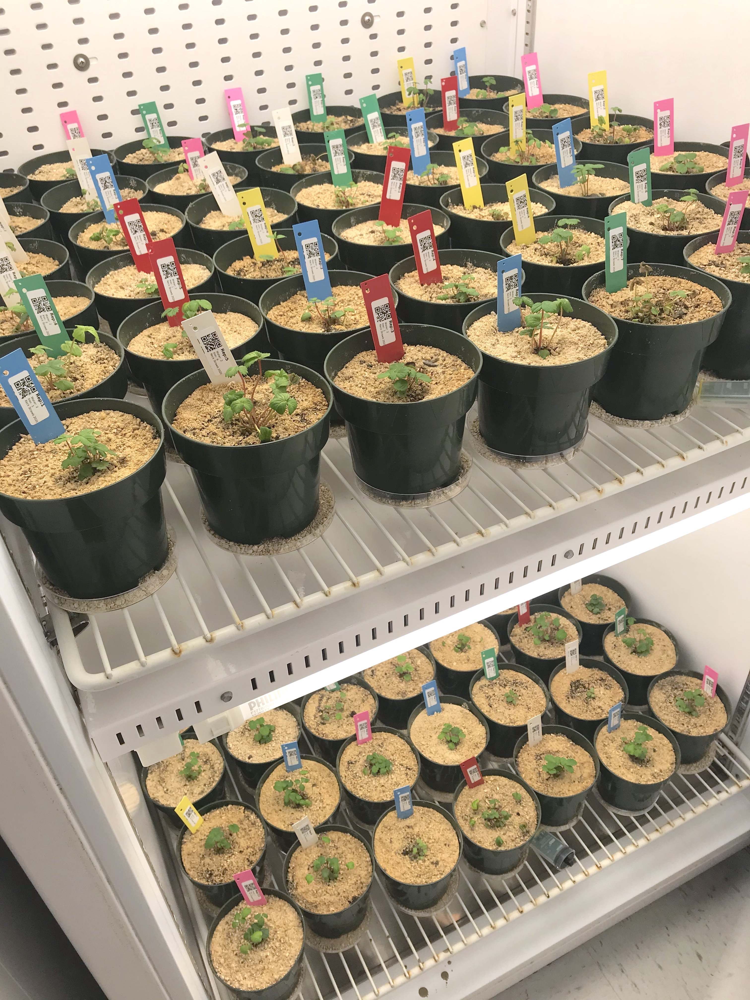
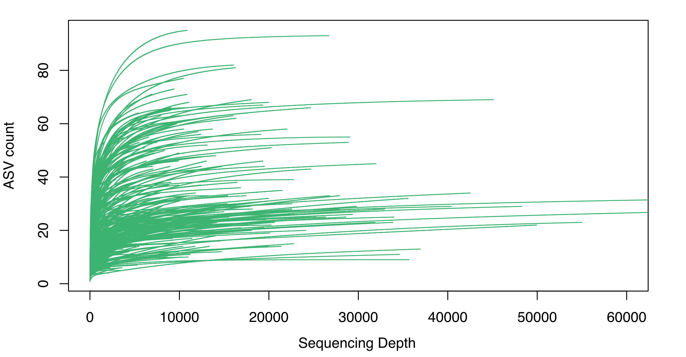

## Project overview
  
Our project tested the influence of microbial communities on plant performance and how "home advantages" and environmental pressures alter plant-microbe interactions across a water resource gradient in Waimea Valley on the north shore of O'ahu, Hawai'i. We used the following inoculum sources:   
1. low precipitation environment = `dry inoculum source`.   
2. intermediate precipitation environment = `moderate inoculum source`.   
3. high precipitation environment = `wet inoculum source`.   
   
We used the inoculum sources from the natural elevation-precipitation gradient in a factorial design experiment where plants were exposed to collected soil inocula and subjected to varying watering regimes.    
  
To accompish this, we used axenically cloned model plant system (strawberry, *Fragaria virginiana*) grown in sterile soil, inoculated with soil slurries from each of those sites, and subjected plants to reciprocal water treatments imposed at three levels of watering (dry, moderate, wet) based on the average precipitation of the inoculum source environment.   

<center>  
  
{width=50%}

</center>. 
  
*We hypothesized* that plants inoculated with soil microbes would outperform non-inoculated plants across all treatments and microbes from the low elevation site would be the most beneficial for plant growth under all water conditions. In testing the “home advantage” hypothesis, we expected plants from each inoculum source would perform best in their familiar water environment (e.g., low-water site inocula source plants would grow best under dry-water conditions, high-water inocula source plants would grow best under wet-water conditions).

```{r setup chunk, include=FALSE, cache=FALSE, message=FALSE, warning=FALSE, collapse=TRUE}
knitr::opts_chunk$set(message=FALSE, warning=FALSE, collapse=TRUE)

# load packages
if (!require("pacman")) install.packages("pacman") # for rapid install if not in library

# use pacman to load all the packages you are missing!
pacman::p_load("car", "lme4", "lmerTest", "pbkrtest", "emmeans", "ggplot2", "tidyverse", "dplyr", "labdsv", "grid", "gridExtra", "patchwork", "plyr", "mctoolsr", "vegan", "car", "metacoder", "multcompView", "patchwork", "pairwiseAdonis", "labdsv", "eulerr", "ggthemes", "remotes", "brglm2", "cowplot", "microbiome", "mia", "BiocManager", "phyloseq", "devtools", "tibble", "ggVennDiagram", "eulerr", "brglm2", "remotes", "effects")

#BiocManager::install("phyloseq")
#if (!requireNamespace("BiocManager", quietly = TRUE))
#    install.packages("BiocManager")

#BiocManager::install("microbiome")
#remotes::install_github("leffj/mctoolsr")
#remotes::install_github("pmartinezarbizu/pairwiseAdonis/pairwiseAdonis")
```

### Plant Biomass
We assessed total biomass in plants, as well as the proportion of biomass in the roots and the shoots.
Code here will:  
- load root/shoot graph codes here. 
- make total biomass plots and root and shoot biomass proportion graphs

```{r plant biomass load, message=FALSE, warning=FALSE, results='hide', collapse=TRUE}
### Pair down raw data 
# raw data import
shootrootwithcontrol<-read.csv('data/strawberries_raw_full_data.csv',header=TRUE)
shootrootwithcontrol %>% drop_na()

#### # subset everything unnecessary

shootroot_step1removal<-subset(shootrootwithcontrol,TimePoint!="T0"&TimePoint!="Control"&Type!="Control")
shootroot_final<-shootroot_step1removal %>% drop_na()
shootroot_inoc23removed<-subset(shootroot_final,Inoculum!="2"&Inoculum!="3")
shootroot_inoc23removed$Inoculum<-as.factor(shootroot_inoc23removed$Inoculum)
shootroot_inoc23removed$Inoculum<-factor(shootroot_inoc23removed$Inoculum,levels=c("Dry Inoculation","Medium Inoculation","Wet Inoculation","No Inoculation"))

# rename levels
levels(shootroot_inoc23removed$Inoculum) <- list(
  Dry="Dry Inoculation", Moderate="Medium Inoculation", Wet="Wet Inoculation", Control="No Inoculation")

shootroot_inoc23removed$Water<-as.factor(shootroot_inoc23removed$Water)
shootroot_inoc23removed$Water<-factor(shootroot_inoc23removed$Water,levels=c("Low","Medium","High"))

# rename one level
levels(shootroot_inoc23removed$Water)[levels(shootroot_inoc23removed$Water)=="Medium"] <- "Moderate"

# final data for biomass 
write.csv(shootroot_inoc23removed, "data//final data_published/strawberries_final_data.csv")

shootsonlywithcontrol<-subset(shootroot_inoc23removed,Type!="Root")
rootsonlywithcontrol<-subset(shootroot_inoc23removed,Type!="Shoot")

# export the final subset data
write.csv(shootsonlywithcontrol, "output/shootsonlywithcontrol_final.csv")
write.csv(rootsonlywithcontrol, "output/rootsonlywithcontrol_final.csv")
```

We take the root biomass (g) and the shoot biomass (g) to = total biomass, then express the proportion of the biomass for the roots and the shoots relative to total biomass of the plant.  

Stats for proportion above and belowground plant biomass
Run models linear models (Type II SS) for *proportion root or shoot biomass*  
- First we will run the linear model as `lm(mass ~ Water*Inoculation)`  
- Then run post-hoc contrasts through `emmeans` (if significant effects observed)   

#### Total Biomass
Make a graph of total biomass and proportion of root and shoot biomass  
- Make a plot of total biomass  **This is FIGURE S2**.   
- For shoots : `shoot biomass (g) / total biomass (g)`  **This is FIGURE 1a**.   
- For roots : `root biomass (g) / total biomass (g)`   **This is FIGURE 1b**.   

```{r total biomass, fig.dim=c(5,4), fig.align='center', results='hide', fig.cap="**Figure S2.** Boxplots of plant total biomass after inoculation and water treatment."}

shootsonlywithcontrol <- shootsonlywithcontrol %>% 
       dplyr::rename("shoot.mass..g" = "WeightGrams")
rootsonlywithcontrol <- rootsonlywithcontrol %>% 
       dplyr::rename("root.mass..g" = "WeightGrams")
shootsonly_premerge<-subset(shootsonlywithcontrol,select = -c(SampleID,TimePoint,Type,SampleNotes,Water,Inoculum,Replicate,PlantNotes,SampleType,Sample_or_Control))
rootshoot_merge <- merge(shootsonly_premerge,rootsonlywithcontrol,by="PlantID")

#View(rootshoot_merge)
rootshoot_merge <-subset(rootshoot_merge, select = -c(Type,SampleNotes,PlantNotes))
rootshoot_merge$total.biomass..g<-rootshoot_merge$shoot.mass..g+rootshoot_merge$root.mass..g
rootshoot_merge$shoot.prop<-rootshoot_merge$shoot.mass..g/rootshoot_merge$total.biomass..g
rootshoot_merge$root.prop<-rootshoot_merge$root.mass..g/rootshoot_merge$total.biomass..g

#########
### From here with rootshoot_merge, you can redo all the above to see what the data looks like

#hist(rootshoot_merge$root.prop)
#hist(rootshoot_merge$shoot.prop)

#View(rootshoot_merge)
longer_data <- rootshoot_merge %>%
  pivot_longer(shoot.prop:root.prop, names_to = "Type", values_to = "response")

longer_data$Type<-factor(longer_data$Type, levels=c("shoot.prop", "root.prop"))


# total biomass
## figure
total.biomass<-ggplot(longer_data, aes(Water, total.biomass..g, fill=Inoculum)) +
  geom_boxplot(outlier.size = 0.7, alpha=0.6)+
  ylim(0,1)+
  ylab("Total biomass (g)") +
  #scale_fill_manual(values=c("orangered2", "goldenrod", "darkolivegreen3", "mistyrose2"))+
  scale_fill_brewer(palette="Dark2")+
  theme_bw()+ theme(
    axis.text = element_text(color='black',size=10),
    axis.title = element_text(color='black',size=10),
    axis.ticks = element_line(color='black'),
    legend.title = element_text(size=18),
    legend.key = element_rect(color=NA, fill=NA),
    panel.grid = element_blank())

total.biomass 
dev.copy(pdf, "figures/FigS2.total.biomass.pdf", height=6, width=6)
dev.off()
```

```{r biomass prop figure, fig.dim=c(7,5), fig.align='center', results='hide', fig.cap="**Figure 1.** Boxplots of the proportion of strawberry total biomass in shoots (a) and roots (b) after inoculation and water treatment in grams/grams (g/g)."}

########## figure
prop.biomass<-ggplot(longer_data, aes(Water, response, fill=Inoculum)) +
  facet_wrap(.~Type)+
  geom_boxplot(outlier.size = 0.7, alpha=0.6)+
  ylab("Proportion of total biomass (g/g)") +
  ylim(0,1)+
  #scale_fill_manual(values=c("orangered2", "goldenrod", "darkolivegreen3", "mistyrose2"))+
  scale_fill_brewer(palette="Dark2")+
  theme_bw() + theme(
    axis.text = element_text(color='black',size=10),
    axis.title = element_text(color='black',size=12),
    axis.ticks = element_line(color='black'),
    legend.title = element_text(size=18),
    legend.key = element_rect(color=NA, fill=NA),
    panel.grid = element_blank())


prop.biomass
ggsave("figures/Fig1.prop.biomass.pdf", height=6, width=10)
```

Run models linear models (Type II SS) for total biomass, proportion of total biomass as shoots and roots
- First we will run the linear model as `lm(prop mass ~ Water*Inoculation)` using 4 inoculations (3 sources, control)
- Then run a model of inoculation presence absence (effect of inoculation relative to controls)
  
- Overall...Total biomass only affected by water. 
- Prop. roots and shoots: Effects of water and inoculation (no interaction) for 4 inoculation tests. 
   
**This is Table S1a-part1 output**. 
Run models for total biomass in all 4 inoculations (3 sources and control)
```{r total biomass 4 inocs, warning=FALSE, message=FALSE}
## This is table S1A
totalbiomass.mod<-lm(total.biomass..g~Water*Inoculum,data=rootshoot_merge)
Anova(totalbiomass.mod,type=2)

total.bio<-emmeans(totalbiomass.mod,pairwise~Inoculum)
#multcomp::cld(total.bio, Letters=letters)
```
  
**This is Table S1a-part2 output**. 
Run models for total biomass in all presence or absence of inoculation 
```{r total biomass pres.abs}
#### if we test for inoculated vs. non-inoculated comparison
rootshoot_merge$Inoc.pres.abs<-ifelse(rootshoot_merge$Inoculum=="Control", "Non.inoc", "Inoc")
totalbiomass.mod.PresAbs<-lm(total.biomass..g~Inoc.pres.abs,data=rootshoot_merge)
Anova(totalbiomass.mod.PresAbs) # no  effect
```

#### Shoot Biomass Proportion (g/g)
Model output for proportion biomass in shoots

**This is Table S1b-part1 output** 
Run models for shoot biomass in all 4 inoculations (3 sources and control) 
- Effect of water and inoculation
```{r prop shoots 4.inoc, warning=FALSE, message=FALSE}
## This is table S1A
shoot.prop.mod<-lm(shoot.prop~Water*Inoculum,data=rootshoot_merge)
Anova(shoot.prop.mod,type=2)

shoot.prop.wat<-emmeans(shoot.prop.mod,pairwise~Water)
#multcomp::cld(shoot.prop.wat, Letters=letters)

shoot.prop.inoc<-emmeans(shoot.prop.mod,pairwise~Inoculum)
#multcomp::cld(shoot.prop.inoc, Letters=letters)
```

*Shoots*: Run models for shoot biomass in all inoculation presence/absence. *This is Table S1b-part2 output*
```{r prop shoots pres.abs, fig.align='center', fig.cap="**Figure.** Differences between inocualted and control plant shoot biomass proportion.", fig.dim=c(5,4)}
#### if we test for inoculated vs. non-inoculated comparison
shoot.prop.mod.PresAbs<-lm(shoot.prop~Inoc.pres.abs,data=rootshoot_merge)
Anova(shoot.prop.mod.PresAbs) # different effect
plot(allEffects(shoot.prop.mod.PresAbs)) # higher in non-inoculated plants
```
  
#### Root Biomass Proportion (g/g)
Model output for proportion biomass in roots. 

**This is Table S1c-part1 output**   
Run models for root biomass in all 4 inoculations (3 sources and control)  
- Effect of water and inoculation
```{r prop roots 4inoc, warning=FALSE, message=FALSE}
## This is table S1B
root.prop.mod<-lm(root.prop~Water*Inoculum,data=rootshoot_merge)
Anova(root.prop.mod,type=2)

# roots: Water posthoc
root.posthoc.wat<-emmeans(root.prop.mod, ~Water)
#multcomp::cld(root.posthoc.wat, Letters=letters)

root.posthoc.inoc<-emmeans(root.prop.mod, ~Inoculum)
#multcomp::cld(root.posthoc.inoc, Letters=letters)
```

**This is Table S1c-part2 output**. 
Run models for root biomass in all inoculation presence/absence.
```{r prop roots pres.abs, fig.align='center', fig.wdth=7, fig.cap="**Figure.** Differences between inocualted and control plant root biomass proportion.", fig.dim=c(5,4)}
#### if we test for inoculated vs. non-inoculated comparison
root.prop.mod.PresAbs<-lm(root.prop~Inoc.pres.abs,data=rootshoot_merge)
Anova(root.prop.mod.PresAbs) # different effect
plot(allEffects(root.prop.mod.PresAbs)) # higher in inoculated plants
```


### Plant Survival 
At the end of the experiment (following inoculation and a period of water treatments) we assessed plant survival. Data was analyzed using a bias-reduced logistic regression.  

**This is Figure S2 and analysis output in Table S2**  
- First test treatment effects using all 4 inoculation (3 sources and control) treatments
- Then test for effect of inoculation vs. uninoculated controls

```{r survival import and subset, results='hide',echo=FALSE}
library(dplyr) # may need to unload-reload if get an error here, plyr and dplyr don't play well 

library(brglm2) # use this (bias-reduced logistic regression) due to complete separation
# Complete separation occurs in logistic (and binomial, and Poisson) regression when some categories contain 100% failures (or zero counts) or (in the logistic/binomial cases) 100% successes.

mortality.df<-read.csv("data/mortality_data_raw.csv",header=TRUE)
mortality.df$mort.binary<- ifelse(mortality.df$mortality=="alive", 1, 0) # make binary
mortality.df<-subset(mortality.df,Inoculum!="2"&Inoculum!="3") # remove other inoculations
mortality.df$Inoculum=as.factor(mortality.df$Inoculum)
mortality.df$Water=as.factor(mortality.df$Water)
mortality.df$Inoc.pres.abs<-ifelse(mortality.df$Inoculum=="Control", "Non.inoc", "Inoc")

# export
write.csv(mortality.df, "data/final data_published/mortality.final.csv")

# full model
set.seed(138)
glm.mort.full<-glm(mort.binary ~ Water*Inoculum, family=binomial, data=mortality.df, method=brglmFit)
#summary(glm.mort.full)
anova(glm.mort.full, test="Chisq") # p=0.009 for Inoculum
```

Test differences in survival in inoculated vs. control plants (presence/absence). This pools all the inoculated plants and tests differences between presence-absence of source inoculation.
```{r survival pres.abs, message=FALSE, warning=FALSE}
# as presence absence
glm.mort.pres.abs<-glm(mort.binary ~ Inoc.pres.abs, family=binomial, data=mortality.df, method=brglmFit)
#summary(glm.mort.pres.abs)
anova(glm.mort.pres.abs, test="Chisq") # p=0.009 for Inoculum
```

**This is Figure S3**. 
Make a plot of survival data. 
```{r survival prop data smithing, results='hide', message=FALSE}
### final mortality data here


# can view aggregated data here
# aggregate(mort.binary ~ Inoculum, data=mortality.df, FUN=sum)

mortality_prop_data<-mortality.df %>%
  dplyr::group_by(Water, Inoculum) %>% 
  dplyr::summarize(prop = sum(mortality=="alive") / n())

mortality_prop_data$Water<-factor(mortality_prop_data$Water,
                                  levels=c("Low","Moderate","High"))

mortality_prop_data$Inoculum<-factor(mortality_prop_data$Inoculum,
                                        levels=c("Dry","Moderate","Wet","Control"))
```


```{r survival prop data, fig.dim=c(5,4), fig.align='center', results='hide', fig.cap="**Figure S3.** The proportion of surviving strawberry plants inoculated with three different soil inoculum sources (dry, moderate, wet) and uninoculated controls after exposure to three water availability treatments (T1; low, moderate, high)."}
### plot it
survival<-ggplot(mortality_prop_data,aes(Inoculum,prop,fill=Inoculum))+
  geom_bar(stat="identity", color="black", linewidth=0.3, alpha=0.7)+
  facet_wrap(.~Water)+
  ylab("Proportion Survival") +
  #scale_fill_manual(values=c("orangered2", "goldenrod", "darkolivegreen3", "mistyrose2"))+
  scale_fill_brewer(palette="Dark2")+
  xlab("Inoculum")+
  theme_bw() + theme(
    axis.text.x=element_text(color='black',size=8),
    axis.title = element_text(color='black',size=10),
    axis.ticks = element_line(color='black'),
    legend.position = "none",
    panel.grid = element_blank())

survival
ggsave("figures/FigS3.Survivorship.pdf", height=6, width=6)
```

### Fungi amplicon sequences
We will use the code chunks here to coherse and subset the data in and outsid of phyloseq to produce measures of alpha and beta diversity (total species richness and species turnover/community composition, respectively).
- Import data and export a final csv of the OTU table
```{r, message=FALSE, warning=FALSE, results='hide', collapse=TRUE}
input <- load_taxa_table("data/ASV_table_postfiltering.txt", "data/map_loaded_strawberries.txt")
# 538 samples, 1894 ASVs

### all samples
otuTAB.all<-input$data_loaded
otuTAB.all <- as.data.frame(otuTAB.all)
otuTAB.transp.all<-t(otuTAB.all)
write.csv(otuTAB.all, "output/OTU.tab/otuTAB.all.csv")

#remove inoculum that we're not using, 350 samples remaining
input2 =filter_data(input, 'Inoculum', filter_vals = '2') #1619 ASVs
input3 =filter_data(input2, 'Inoculum', filter_vals = '3') #1379 ASVs, 350 samples

########### final data with treatments + controls to be used in analyses (= Inoculum 1, 4, 5, 6)
ASV.data.contr<-input3

### no inoc 2 and 3 but controls remain -- this is for SRA archive
otuTAB.winnowed<-ASV.data.contr$data_loaded
otuTAB.winnowed <- as.data.frame(otuTAB.winnowed)
otuTAB.transp.winn<-t(otuTAB.winnowed)
write.csv(otuTAB.transp.winn, "output/OTU.tab/otuTAB.winnow.csv")
```

Produce a rarefaction curve for fungi sequences, this is for T0 and T1, roots and shoots.  
**This is Figure S1**
- this takes some time, so for ease it is not run here in the markdown knitr
- refer to jpeg of output here. 

```{r all sample rarefac, fig.cap="**Figure S1.** ASV (amplicon sequence variant) accumulation curves showing the number of ASVs and sequencing depth across all plant samples (shoot, root) and time points (pre- and post-water manipulation treatments (T0 and T1).", collapse=TRUE, eval=FALSE}
# can be memory intensive, set to eval false for now
# make a rarefaction curve of winnowed data: excluding treatment 2 and 3 not used in the study, retaining the "controls"

# set to eval =FALSE since can take some time to run
rarecurve(otuTAB.transp.winn, xlab = "Sequencing Depth", col="mediumseagreen", ylab = "ASV count", label = FALSE, xlim=c(0,60000))

dev.copy(pdf, "figures/FigS1.T1T0.depth.pdf", height=5, width=8)
dev.off() 
```

<center>  
  
{width=80%}

</center>


```{r final OTU tab, message=FALSE, warning=FALSE, results='hide', collapse=TRUE}
########## remove any controls (treatments only 1,4,5,6)
ASV.data = filter_data(ASV.data.contr, 'TimePoint', filter_vals = 'Control') 
#346 samples remaining

otuTAB.final<-ASV.data$data_loaded
otuTAB.final <- as.data.frame(otuTAB.final)
otuTAB.tranp.final<-t(otuTAB.final)
write.csv(otuTAB.tranp.final, "data/final data_published/otuTAB.final.csv")

# individual files
write.csv(ASV.data$data_loaded, "data/final data_published/ASV.data_loaded_final.csv")
write.csv(ASV.data$map_loaded, "data/final data_published/ASV.map_loaded_final.csv")
write.csv(ASV.data$taxonomy_loaded, "data/final data_published/ASV.tax_loaded_final.csv")

# final data with treatments to be used in analyses 'ASV.data'

#keep only time point1, 284 samples
ASV.T0.sh = filter_data(ASV.data, 'TimePoint', keep_vals = 'T0') # 62 samples
ASV.T1 = filter_data(ASV.data, 'TimePoint', keep_vals = 'T1') # 284 samples
ASV.T1.rt = filter_data(ASV.T1, 'Type', keep_vals = 'Root') # 143 samples
ASV.T1.sh = filter_data(ASV.T1, 'Type', keep_vals = 'Shoot')# 141 samples

# all T1 data (post stress, roots and shoot)
T1.root.shoot<-ASV.T1

otuTAB.T1.root.shoot<-T1.root.shoot$data_loaded
otuTAB.T1.root.shoot <- as.data.frame (otuTAB.T1.root.shoot)
otuTAB.transp.t1.root.shoot<-t(otuTAB.T1.root.shoot)


#using pack: labdsv
# Hellinger Transformation. Be sure to filter first and then do the transformation

#Let's separate into roots and shoots for separate dataframes, valuable in analyses later on
roots_post_stress = filter_data(T1.root.shoot, 'Type', keep_vals = 'Root')
shoots_post_stress = filter_data(T1.root.shoot, 'Type', keep_vals = 'Shoot')

otuTAB.rootT1<-roots_post_stress$data_loaded
otuTAB.rootT1 <- as.data.frame (otuTAB.rootT1)
otuTABtranspose.root.T1<-t(otuTAB.rootT1)

hell.root.T1<-hellinger(otuTABtranspose.root.T1)
#View(hell)

roots_post_stress$data_loaded<-t(hell.root.T1)

### shoot T1 df
otuTAB.shootT1<-shoots_post_stress$data_loaded
otuTAB.shootT1 <- as.data.frame (otuTAB.shootT1)
otuTABtranspose.shoot.T1<-t(otuTAB.shootT1)
hell.shoot.T1<-hellinger(otuTABtranspose.shoot.T1)
#View(hell)

shoots_post_stress$data_loaded<-t(hell.shoot.T1)
```


#### T0 Shoot amplicon
Let's look at T0 only. These are the Shoots, as roots were not sampled early on.  

**Figure S4: shoots T0 NMDS**
- Shoot fungal microbiomes prior to the start of water stress. 
```{r shoot T0 NMDS, results='hide', collapse=TRUE}
#Let's view the original input map first
#View(input$map_loaded)

# final data with treatments to be used in analyses 'ASV.data'

#keep only time point0, 62 samples
ASV.T0 = filter_data(ASV.data, 'TimePoint', keep_vals = 'T0')

# all T0 data (pre stress shoots)
shoot.T0<-ASV.T0
otuTAB.T0.shoot <- as.data.frame (shoot.T0$data_loaded)
otuTAB.transp.T0.shoot<-t(otuTAB.T0.shoot)

### transform
hell.T0<-hellinger(otuTAB.transp.T0.shoot)

#View(hell)
shoot.T0$data_loaded<-t(hell.T0)

shoot.T0.mds<-metaMDS(t(shoot.T0$data_loaded))
shoot.T0.NMDS.df <- as.data.frame(scores(shoot.T0.mds)$sites) 
shoot.T0.NMDS.df$Water <- as.factor(shoot.T0$map_loaded$Water)
shoot.T0.NMDS.df$Inoculum <- as.factor(shoot.T0$map_loaded$Inoculum)


# change levels...
shoot.T0.NMDS.df$Inoculum <- as.factor(shoot.T0.NMDS.df$Inoculum)
levels(shoot.T0.NMDS.df$Inoculum)<-list(Dry="1", Moderate="4", Wet="5", Control="6")

# change levels...
shoot.T0.NMDS.df$Water <- as.factor(shoot.T0.NMDS.df$Water)
levels(shoot.T0.NMDS.df$Water) <- list(Low="1", Moderate="2", High="3")
```

```{r shoot T0 NMDS plot, fig.dim=c(6,5), fig.align='center', results='hide', fig.cap="**Figure S4.** NMDS representing fungal community composition in shoots of strawberry plants subject to three different inoculum sources (dry, moderate, wet) and uninoculated controls prior to exposure to three water availability treatments (Time 0, T0)"}
# make the NMDS plot

Shoots.T0.NMDS<-ggplot(data=shoot.T0.NMDS.df,aes(x=NMDS1,y=NMDS2,color=Inoculum)) + 
  scale_color_brewer(palette="Dark2")+
  geom_point(data=shoot.T0.NMDS.df,
             aes(x=NMDS1,y=NMDS2,color=Inoculum), alpha=0.8) + 
  stat_ellipse(data=shoot.T0.NMDS.df,aes(x=NMDS1,y=NMDS2,color=Inoculum))+
  theme_bw() + theme(
    axis.text = element_text(color='black',size=10),
    axis.title = element_text(color='black',size=12),
    axis.ticks = element_line(color='black'),
    legend.title = element_text(size=8),
    panel.grid = element_blank(),
    legend.key = element_rect(color=NA, fill=NA))

Shoots.T0.NMDS
ggsave("figures/FigS4.Shoots.T0.NMDS.pdf", height=6, width=5.5)
```

Run PERMANOVA to test differeces among treatments in T0 Shoots (prior to start of water treatment).  
*Table S3. T0 shoot fungal microbiome*
```{r shoot T0 microbiome}
library(vegan)

#make the model
otuTAB <- as.data.frame (ASV.T0$data_loaded)
otuTABtranspose<-t(otuTAB)
mta.sh.T0<-ASV.T0$map_loaded

#do as factor, no water treatment at T0
mta.sh.T0$Inoculum <- as.factor(mta.sh.T0$Inoculum)

set.seed(138)
model.sh.T0<-adonis2(otuTABtranspose~Inoculum,data=mta.sh.T0,permutations=999,method="bray")
model.sh.T0 # no effects
```

#### T1 Shoot and Root amplicon
Analyze the shoots and roots for T1 (at experiment end), following the exposure of plants to water treatments.  

**Shoots** amplicon at T1
**This is Table 2** PERMANOVA testing water treatment and inoculum source effects on plant-associated fungal communities in shoot and root biomass.  
- Shoot NMDS and Permanova first. 

```{r shoot T1 permanova, collapse=TRUE}
########### SHOOTS
#you need to first load the data and make it a data frame. Then transpose the data frame. Add the map loaded too
otuTAB.sh.T1 <- as.data.frame(shoots_post_stress$data_loaded)
otuTAB.transp.sh.T1<-t(otuTAB.sh.T1)
mta.sh.T1<-shoots_post_stress$map_loaded

#do as factor
mta.sh.T1$Water <- as.factor(mta.sh.T1$Water)
mta.sh.T1$Inoculum <- as.factor(mta.sh.T1$Inoculum)

## using vegan
#make the model
set.seed(567)
model1.sh.T1<-adonis2(otuTAB.transp.sh.T1~Water*Inoculum,data=mta.sh.T1,permutations=999,method="bray")
model1.sh.T1 # interaction signif
```

```{r shoot T1 posthoc, results='hide'}
#posthocs in pairwise adonis
mtapairwise.sh.T1<-tidyr::unite(mta.sh.T1,c='water_inoculum',c('Water','Inoculum'),sep='-')

pair.mod.water.sh.T1<-pairwise.adonis(otuTAB.transp.sh.T1, factors=c(mtapairwise.sh.T1$water_inoculum))
pair.mod.water.sh.T1

# option if main effects were key
# pair.mod.sh.T1<-pairwise.adonis2(otuTAB.transp.sh.T1~Water/Inoculum, data=mta.sh.T1)
```

This is **Figure S5. Shoot NMDS at T1**. 
- run NMDS ordination for T1
```{r NMDS shoots T1 run, message=FALSE, warning=FALSE, results='hide'}
# NMDS for shoots
shoot.mds.T1<-metaMDS(t(shoots_post_stress$data_loaded))
shoot.T1<-scores(shoot.mds.T1)
shoot.T1.NMDS.df <- as.data.frame(shoot.T1$sites) 
shoot.T1.NMDS.df$Water <- shoots_post_stress$map_loaded$Water
shoot.T1.NMDS.df$Inoculum <- shoots_post_stress$map_loaded$Inoculum


# Shoot T1 NMDS plot
# change levels...
shoot.T1.NMDS.df$Inoculum <- as.factor(shoot.T1.NMDS.df$Inoculum)
levels(shoot.T1.NMDS.df$Inoculum)<-list(Dry="1", Moderate="4", Wet="5", Control="6")

# change levels...
shoot.T1.NMDS.df$Water <- as.factor(shoot.T1.NMDS.df$Water)
levels(shoot.T1.NMDS.df$Water) <- list(Low="1", Moderate="2", High="3")
```


```{r NMDS shoots T1 plot, fig.dim=c(6,5), message=FALSE, warning=FALSE, fig.align='center', fig.cap="**Figure S5** NMDS representing fungal community composition in shoots of strawberry plants inoculated with three different soil inoculum sources (dry, moderate, wet) and an uninoculated control indicated by color after being exposed to three water availability treatments (low, moderate, high) indicated by shapes and line type."}
### plot
Shoots.T1.NMDS<-ggplot(data=shoot.T1.NMDS.df,
                  aes(x=NMDS1,y=NMDS2,shape=Water,color=Inoculum)) + 
  scale_color_brewer(palette="Dark2")+
  ggtitle("Shoots T1")+
  geom_point(data=shoot.T1.NMDS.df,
             aes(x=NMDS1,y=NMDS2,shape=Water,color=Inoculum), alpha=0.8) + 
  # add the point markers
  stat_ellipse(data=shoot.T1.NMDS.df,aes(x=NMDS1,y=NMDS2,lty=Water,color=Inoculum))+
  scale_linetype_manual(values=c(1,2,3)) +
   theme_bw() + theme(
    axis.text = element_text(color='black',size=10),
    axis.title = element_text(color='black',size=12),
    axis.ticks = element_line(color='black'),
    legend.title = element_text(size=8),
    legend.key = element_rect(fill=NA),
    panel.grid = element_blank())

Shoots.T1.NMDS
ggsave("figures/FigS5.Shoot.T1.NMDS.pdf", height=6, width=6)
```

**Roots** amplicon at T1. 
- Now run the same model testing for root NMDS and Permanova at T1.
```{r T1 root Permanova, collapse =TRUE}
########### ROOTS
#you need to first load the data and make it a data frame. Then transpose the data frame. Add the map loaded too
otuTAB.ro.T1 <- as.data.frame (roots_post_stress$data_loaded)
otuTAB.transp.ro.T1<-t(otuTAB.ro.T1)
mta.ro.T1<-roots_post_stress$map_loaded

#do as factor
mta.ro.T1$Water <- as.factor(mta.ro.T1$Water)
mta.ro.T1$Inoculum <- as.factor(mta.ro.T1$Inoculum)

#make the model
set.seed(214)
model1.ro.T1<-adonis2(otuTAB.transp.ro.T1~Water*Inoculum,data=mta.ro.T1,permutations=999,method="bray")
model1.ro.T1
```

```{r T1 root posthoc, collapse=TRUE, results='hide'}
mtapairwise.ro.T1<-tidyr::unite(mta.ro.T1,c='water_inoculum',c('Water','Inoculum'),sep='-')

# water pairwise
pair.mod.water.ro.T1<-pairwise.adonis(otuTAB.transp.ro.T1, factors=c(mta.ro.T1$Water))
pair.mod.water.ro.T1

# inoc pairwise
pair.mod.inoc.ro.T1<-pairwise.adonis(otuTAB.transp.ro.T1, factors=c(mta.ro.T1$Inoculum))
pair.mod.inoc.ro.T1
```

```{r roots only T1 for posthoc, results='hide', echo=FALSE, collapse = TRUE}
# separate models for each type (shoot and root) at T1, effect of water within inoculum.
# Run pairwise comparisosn for each inoculum to compare where there are differences in water treatments.
# *This is Table S4*

####### separate by inoculum

################# Roots, T1
##### #inoc 1 
rt.T1.inoc1 = filter_data(ASV.T1.rt, 'Inoculum', keep_vals = '1') 
otuTAB.rt.T1.inoc1 <- as.data.frame (rt.T1.inoc1$data_loaded)
otuTAB.transp.rt.T1.inoc1<-t(otuTAB.rt.T1.inoc1)
mta.rt.T1.inoc1<-rt.T1.inoc1$map_loaded

#do as factor
mta.rt.T1.inoc1$Water <- as.factor(mta.rt.T1.inoc1$Water)
mta.rt.T1.inoc1$Inoculum <- as.factor(mta.rt.T1.inoc1$Inoculum)


##### #inoc 4
rt.T1.inoc4 = filter_data(ASV.T1.rt, 'Inoculum', keep_vals = '4') 
otuTAB.rt.T1.inoc4 <- as.data.frame (rt.T1.inoc4$data_loaded)
otuTAB.transp.rt.T1.inoc4<-t(otuTAB.rt.T1.inoc4)
mta.rt.T1.inoc4<-rt.T1.inoc4$map_loaded

#do as factor
mta.rt.T1.inoc4$Water <- as.factor(mta.rt.T1.inoc4$Water)
mta.rt.T1.inoc4$Inoculum <- as.factor(mta.rt.T1.inoc4$Inoculum)


###### #inoc 5
rt.T1.inoc5 = filter_data(ASV.T1.rt, 'Inoculum', keep_vals = '5') 
otuTAB.rt.T1.inoc5 <- as.data.frame (rt.T1.inoc5$data_loaded)
otuTAB.transp.rt.T1.inoc5<-t(otuTAB.rt.T1.inoc5)
mta.rt.T1.inoc5<-rt.T1.inoc5$map_loaded

#do as factor
mta.rt.T1.inoc5$Water <- as.factor(mta.rt.T1.inoc5$Water)
mta.rt.T1.inoc5$Inoculum <- as.factor(mta.rt.T1.inoc5$Inoculum)


######## #inoc 6
rt.T1.inoc6 = filter_data(ASV.T1.rt, 'Inoculum', keep_vals = '6') 
otuTAB.rt.T1.inoc6 <- as.data.frame (rt.T1.inoc6$data_loaded)
otuTAB.transp.rt.T1.inoc6<-t(otuTAB.rt.T1.inoc6)
mta.rt.T1.inoc6<-rt.T1.inoc6$map_loaded

#do as factor
mta.rt.T1.inoc6$Water <- as.factor(mta.rt.T1.inoc6$Water)
mta.rt.T1.inoc6$Inoculum <- as.factor(mta.rt.T1.inoc6$Inoculum)


####### Permanova, roots, separated by inoculum, T1

######### Inoc 1
#make the model
set.seed(213)
model1.ro.T1.inoc1<-adonis2(otuTAB.transp.rt.T1.inoc1~Water,data=mta.rt.T1.inoc1,
                      permutations=999,method="bray")
model1.ro.T1.inoc1

# water pairwise
pair.mod.water.ro.T1.inoc1<-pairwise.adonis(otuTAB.transp.rt.T1.inoc1, factors=c(mta.rt.T1.inoc1$Water),
                                            p.adjust.m = "hochberg")
pair.mod.water.ro.T1.inoc1


######### Inoc 4
#make the model
set.seed(808)
model1.ro.T1.inoc4<-adonis2(otuTAB.transp.rt.T1.inoc4~Water,data=mta.rt.T1.inoc4,
                      permutations=999,method="bray")
model1.ro.T1.inoc4

# water pairwise
pair.mod.water.ro.T1.inoc4<-pairwise.adonis(otuTAB.transp.rt.T1.inoc4, factors=c(mta.rt.T1.inoc4$Water),
                                            p.adjust.m = "hochberg")
pair.mod.water.ro.T1.inoc4


######### Inoc 5
#make the model
set.seed(999)
model1.ro.T1.inoc5<-adonis2(otuTAB.transp.rt.T1.inoc5~Water,data=mta.rt.T1.inoc5,
                      permutations=999,method="bray")
model1.ro.T1.inoc5

# water pairwise
pair.mod.water.ro.T1.inoc5<-pairwise.adonis(otuTAB.transp.rt.T1.inoc5, factors=c(mta.rt.T1.inoc5$Water),
                                            p.adjust.m = "hochberg")
pair.mod.water.ro.T1.inoc5

######### Inoc 6
#make the model
set.seed(138)
model1.ro.T1.inoc6<-adonis2(otuTAB.transp.rt.T1.inoc6~Water,data=mta.rt.T1.inoc6,
                      permutations=999,method="bray")
model1.ro.T1.inoc6

# water pairwise
pair.mod.water.ro.T1.inoc6<-pairwise.adonis(otuTAB.transp.rt.T1.inoc6, factors=c(mta.rt.T1.inoc6$Water),
                                            p.adjust.m = "hochberg")
pair.mod.water.ro.T1.inoc6
```


*Figure 2. Root NMDS at T1*. 
Now run NMDS and plot ordination for fungal communities in ROOTS at T1, following the water treatment at experiment's end.

```{r root T1, results='hide', message=FALSE, warning=FALSE, collapse=TRUE}
# NMDS for roots
root.mds.T1<-metaMDS(t(roots_post_stress$data_loaded))
root.T1<-scores(root.mds.T1)
root.T1.NMDS.df <- as.data.frame(root.T1$sites) 
root.T1.NMDS.df$Water <- as.factor(roots_post_stress$map_loaded$Water)
root.T1.NMDS.df$Inoculum <- as.factor(roots_post_stress$map_loaded$Inoculum)

# change levels...
root.T1.NMDS.df$Inoculum <- as.factor(root.T1.NMDS.df$Inoculum)
levels(root.T1.NMDS.df$Inoculum)<-list(Dry="1", Moderate="4", Wet="5", Control="6")

# change levels...
root.T1.NMDS.df$Water <- as.factor(root.T1.NMDS.df$Water)
levels(root.T1.NMDS.df$Water) <- list(Low="1", Moderate="2", High="3")
```

```{r root T1 plot, fig.dim=c(6,5), results='hide', fig.align='center', message=FALSE, warning=FALSE, fig.cap="**Figure 2.** NMDS representing changes in fungal community composition in shoots of strawberry plants inoculated with fungi originating from dry (a), moderate (b) and wet (c) environments within the Waimea watershed along with uninoculated controls (d) before (T0) and after (T1) being exposed to three water availability treatments (low, moderate and high)"}
### root T1 NMDS
Roots.T1.NMDS<-ggplot(data=root.T1.NMDS.df,
                      aes(x=NMDS1,y=NMDS2,shape=Water,color=Inoculum)) + 
  scale_color_brewer(palette="Dark2")+
  stat_ellipse(data=root.T1.NMDS.df,aes(x=NMDS1,y=NMDS2,lty=Water,color=Inoculum))+
  scale_linetype_manual(values=c(1,2,3)) +
  ggtitle("Roots T1")+
  geom_point(data=root.T1.NMDS.df,
             aes(x=NMDS1,y=NMDS2,shape=factor(Water),color=factor(Inoculum)), alpha=0.8) + 
  # add the point markers
 theme_bw() + theme(
    axis.text = element_text(color='black',size=10),
    axis.title = element_text(color='black',size=12),
    axis.ticks = element_line(color='black'),
    legend.title = element_text(size=8),
    legend.key = element_rect(fill=NA),
    panel.grid = element_blank())

Roots.T1.NMDS
ggsave("figures/Fig2.Root.T1.NMDS.pdf", height=6, width=6)
```


#### T0-T1 Shoots vector NMDS
Refilter time. Select only shoots, compare how they change from T0 to T1.
- reformat and subset the data. 
- check levels for each treatment and how they are called
- once data has been subset we can run PERMANOVA

```{r, results='hide', message=FALSE}
#Let's view the original input map first
#View(input$map_loaded)
#Start by removing all roots. We can only do a time one with shoots

# final data with treatments to be used in analyses 'ASV.data'

shoot.T0T1 = filter_data(ASV.data, 'Type', keep_vals = 'Shoot') 

### Then, let's set up the data for the NMDS plot:

#View(shoot.T0T1$map_loaded)
shoot.T0T1.mds<-metaMDS(t(shoot.T0T1$data_loaded))
shoot.T0T1.NMDS.df <- as.data.frame(scores(shoot.T0T1.mds)$sites) 

shoot.T0T1.NMDS.df$Water <- as.factor(shoot.T0T1$map_loaded$Water)
shoot.T0T1.NMDS.df$Inoculum <- as.factor(shoot.T0T1$map_loaded$Inoculum)
shoot.T0T1.NMDS.df$TimePoint <- as.factor(shoot.T0T1$map_loaded$TimePoint)
shoot.T0T1.NMDS.df$PlantID <- shoot.T0T1$map_loaded$PlantID

#envfit
shoot.T0T1$map_loaded<-subset(shoot.T0T1$map_loaded, select = -c(WeightGrams,SampleNotes, PlantNotes))
shoot.T0T1$map_loaded$Water<-as.factor(shoot.T0T1$map_loaded$Water)
shoot.T0T1$map_loaded$Inoculum<-as.factor(shoot.T0T1$map_loaded$Inoculum)
shoot.T0T1$map_loaded$TimeWater <- paste(shoot.T0T1$map_loaded$TimePoint,shoot.T0T1$map_loaded$Water)
shoot.T0T1$map_loaded$TimeInoculum <- paste(shoot.T0T1$map_loaded$TimePoint,shoot.T0T1$map_loaded$Inoculum)

waterfinalvf <- envfit(shoot.T0T1.mds~TimeWater, data=shoot.T0T1$map_loaded, perm = 999)
water.scrs.final <- as.data.frame(scores(waterfinalvf, display = "factors"))

inocfinalvf <- envfit(shoot.T0T1.mds~TimeInoculum, data=shoot.T0T1$map_loaded, perm = 999)
inoc.scrs.final <- as.data.frame(scores(inocfinalvf, display = "factors"))

############
# change levels...
shoot.T0T1.NMDS.df$Inoculum <- as.factor(shoot.T0T1.NMDS.df$Inoculum)
levels(shoot.T0T1.NMDS.df$Inoculum)<-list(Dry="1", Moderate="4", Wet="5", Control="6")

# change levels...
shoot.T0T1.NMDS.df$Water <- as.factor(shoot.T0T1.NMDS.df$Water)
levels(shoot.T0T1.NMDS.df$Water) <- list(Low="1", Moderate="2", High="3")

#########################
#shoots: T0 to T1
#you need to first load the data and make it a data frame. Then transpose the data frame. Add the map loaded too
otuTAB.sh.T0T1 <- as.data.frame(shoot.T0T1$data_loaded)
otuTAB.transp.sh.T0T1<-t(otuTAB.sh.T0T1)
mta.sh.T0T1<-shoot.T0T1$map_loaded

#do as factor
mta.sh.T0T1$Water <- as.factor(mta.sh.T0T1$Water)
mta.sh.T0T1$Inoculum <- as.factor(mta.sh.T0T1$Inoculum)
mta.sh.T0T1$TimePoint <- as.factor(mta.sh.T0T1$TimePoint)


####### separate by inoculum
inputshootsonly = filter_data(ASV.data, 'Type', keep_vals = 'Shoot') 

## #inoc 1
sh.T0T1.inoc1 = filter_data(inputshootsonly, 'Inoculum', keep_vals = '1') 
otuTAB.sh.T0T1.inoc1 <- as.data.frame (sh.T0T1.inoc1$data_loaded)
otuTAB.transp.sh.T0T1.inoc1<-t(otuTAB.sh.T0T1.inoc1)
mta.sh.T0T1.inoc1<-sh.T0T1.inoc1$map_loaded

mta.sh.T0T1.inoc1$Water.T0.T1<-as.factor(ifelse(
              mta.sh.T0T1.inoc1$TimePoint=="T1" & mta.sh.T0T1.inoc1$Water=="1", "Low",
                ifelse(mta.sh.T0T1.inoc1$TimePoint=="T1" & mta.sh.T0T1.inoc1$Water=="2", "Moderate",
                  ifelse(mta.sh.T0T1.inoc1$TimePoint=="T1" & mta.sh.T0T1.inoc1$Water=="3", "High",
                    ifelse(mta.sh.T0T1.inoc1$TimePoint=="T0" & mta.sh.T0T1.inoc1$Water=="1", "T0",
              ifelse(mta.sh.T0T1.inoc1$TimePoint=="T0" & mta.sh.T0T1.inoc1$Water=="2", "T0", "T0"))))))
#do as factor
make.fac<-c("Water", "Inoculum", "TimePoint", "Water.T0.T1")
mta.sh.T0T1.inoc1[make.fac]<-lapply(mta.sh.T0T1.inoc1[make.fac], factor)

mta.sh.T0T1.inoc1$Water.T0.T1 <- factor(mta.sh.T0T1.inoc1$Water.T0.T1, levels=c("T0", "Low", "Moderate", "High"))


### inoc 4
sh.T0T1.inoc4 = filter_data(inputshootsonly, 'Inoculum', keep_vals = '4')
otuTAB.sh.T0T1.inoc4 <- as.data.frame (sh.T0T1.inoc4$data_loaded)
otuTAB.transp.sh.T0T1.inoc4<-t(otuTAB.sh.T0T1.inoc4)
mta.sh.T0T1.inoc4<-sh.T0T1.inoc4$map_loaded

mta.sh.T0T1.inoc4$Water.T0.T1<-as.factor(ifelse(
              mta.sh.T0T1.inoc4$TimePoint=="T1" & mta.sh.T0T1.inoc4$Water=="1", "Low",
                ifelse(mta.sh.T0T1.inoc4$TimePoint=="T1" & mta.sh.T0T1.inoc4$Water=="2", "Moderate",
                  ifelse(mta.sh.T0T1.inoc4$TimePoint=="T1" & mta.sh.T0T1.inoc4$Water=="3", "High",
                    ifelse(mta.sh.T0T1.inoc4$TimePoint=="T0" & mta.sh.T0T1.inoc4$Water=="1", "T0",
              ifelse(mta.sh.T0T1.inoc4$TimePoint=="T0" & mta.sh.T0T1.inoc4$Water=="2", "T0", "T0"))))))

mta.sh.T0T1.inoc4[make.fac]<-lapply(mta.sh.T0T1.inoc4[make.fac], factor)

mta.sh.T0T1.inoc4$Water.T0.T1 <- factor(mta.sh.T0T1.inoc4$Water.T0.T1, levels=c("T0", "Low", "Moderate", "High"))


## #inoc 5
sh.T0T1.inoc5 = filter_data(inputshootsonly, 'Inoculum', keep_vals = '5')
otuTAB.sh.T0T1.inoc5 <- as.data.frame (sh.T0T1.inoc5$data_loaded)
otuTAB.transp.sh.T0T1.inoc5<-t(otuTAB.sh.T0T1.inoc5)
mta.sh.T0T1.inoc5<-sh.T0T1.inoc5$map_loaded

mta.sh.T0T1.inoc5$Water.T0.T1<-as.factor(ifelse(
              mta.sh.T0T1.inoc5$TimePoint=="T1" & mta.sh.T0T1.inoc5$Water=="1", "Low",
                ifelse(mta.sh.T0T1.inoc5$TimePoint=="T1" & mta.sh.T0T1.inoc5$Water=="2", "Moderate",
                  ifelse(mta.sh.T0T1.inoc5$TimePoint=="T1" & mta.sh.T0T1.inoc5$Water=="3", "High",
                    ifelse(mta.sh.T0T1.inoc5$TimePoint=="T0" & mta.sh.T0T1.inoc5$Water=="1", "T0",
              ifelse(mta.sh.T0T1.inoc5$TimePoint=="T0" & mta.sh.T0T1.inoc5$Water=="2", "T0", "T0"))))))

mta.sh.T0T1.inoc5[make.fac]<-lapply(mta.sh.T0T1.inoc5[make.fac], factor)

mta.sh.T0T1.inoc5$Water.T0.T1 <- factor(mta.sh.T0T1.inoc5$Water.T0.T1, levels=c("T0", "Low", "Moderate", "High"))

### inoc 6
sh.T0T1.inoc6 = filter_data(inputshootsonly, 'Inoculum', keep_vals = '6') 
otuTAB.sh.T0T1.inoc6 <- as.data.frame (sh.T0T1.inoc6$data_loaded)
otuTAB.transp.sh.T0T1.inoc6<-t(otuTAB.sh.T0T1.inoc6)
mta.sh.T0T1.inoc6<-sh.T0T1.inoc6$map_loaded

mta.sh.T0T1.inoc6$Water.T0.T1<-as.factor(ifelse(
              mta.sh.T0T1.inoc6$TimePoint=="T1" & mta.sh.T0T1.inoc6$Water=="1", "Low",
                ifelse(mta.sh.T0T1.inoc6$TimePoint=="T1" & mta.sh.T0T1.inoc6$Water=="2", "Moderate",
                  ifelse(mta.sh.T0T1.inoc6$TimePoint=="T1" & mta.sh.T0T1.inoc6$Water=="3", "High",
                    ifelse(mta.sh.T0T1.inoc6$TimePoint=="T0" & mta.sh.T0T1.inoc6$Water=="1", "T0",
              ifelse(mta.sh.T0T1.inoc6$TimePoint=="T0" & mta.sh.T0T1.inoc6$Water=="2", "T0", "T0"))))))

mta.sh.T0T1.inoc6[make.fac]<-lapply(mta.sh.T0T1.inoc6[make.fac], factor)

mta.sh.T0T1.inoc6$Water.T0.T1 <- factor(mta.sh.T0T1.inoc6$Water.T0.T1, levels=c("T0", "Low", "Moderate", "High"))
```

Data looks good! Now run a Permanova and posthoc tests for shoot fungal communities, for each of the inocula, and run pairwise tests (with hochberg corrections) to see which groups differ.  

**Dry inoculum source** = inoc 1
```{r T0T1 shoots Permanova and posthoc inoc1}
############ inoc 1
mod1.sh.T0T1.inoc1<-adonis2(otuTAB.transp.sh.T0T1.inoc1~Water.T0.T1,data=mta.sh.T0T1.inoc1,permutations=999,method="bray")
mod1.sh.T0T1.inoc1

#use pack pairwiseAdonis
set.seed(777)
pair.mod.sh.T1<-pairwise.adonis(otuTAB.transp.sh.T0T1.inoc1,factors=mta.sh.T0T1.inoc1$Water.T0.T1, 
                                p.adjust.m = "hochberg")
pair.mod.sh.T1
```

**Moderate inoculum source** = inoc 4
```{r T0T1 shoots Permanova and posthoc inoc4}
############ inoc 4
mod1.sh.T0T1.inoc4<-adonis2(otuTAB.transp.sh.T0T1.inoc4~Water.T0.T1,data=mta.sh.T0T1.inoc4,permutations=999,method="bray")
mod1.sh.T0T1.inoc4

#use pack pairwiseAdonis
set.seed(808)
pair.mod.sh.T4<-pairwise.adonis(otuTAB.transp.sh.T0T1.inoc4,factors=mta.sh.T0T1.inoc4$Water.T0.T1, 
                                p.adjust.m = "hochberg")
pair.mod.sh.T4
```

**Wet inoculum source** = inoc 5
```{r T0T1 shoots Permanova and posthoc inoc5}
########### inoc 5
mod1.sh.T0T1.inoc5<-adonis2(otuTAB.transp.sh.T0T1.inoc5~Water.T0.T1,data=mta.sh.T0T1.inoc5,permutations=999,method="bray")
mod1.sh.T0T1.inoc5

#use pack pairwiseAdonis
set.seed(805)
pair.mod.sh.T5<-pairwise.adonis(otuTAB.transp.sh.T0T1.inoc5,factors=mta.sh.T0T1.inoc5$Water.T0.T1,
                                p.adjust.m = "hochberg")
pair.mod.sh.T5
```

**Control inoculum source** = inoc 6 (the uninoculated plants)
```{r T0T1 shoots Permanova and posthoc inoc6, results='hide', }
### inoc 6
mod1.sh.T0T1.inoc6<-adonis2(otuTAB.transp.sh.T0T1.inoc6~Water.T0.T1,data=mta.sh.T0T1.inoc6,permutations=999,method="bray")
mod1.sh.T0T1.inoc6

#use pack pairwiseAdonis
set.seed(972)
pair.mod.sh.T6<-pairwise.adonis(otuTAB.transp.sh.T0T1.inoc6,factors=mta.sh.T0T1.inoc6$Water.T0.T1,
                                p.adjust.m = "hochberg")
```

Now make NMDS for each inoculum and plot an NMDS with vectors connecting centroids
```{r, results='hide'}
inputshootsonly = filter_data(ASV.data, 'Type', keep_vals = 'Shoot') 

inoc1NMDSmovement =filter_data(inputshootsonly, 'Inoculum', keep_vals = '1')
inoc4NMDSmovement =filter_data(inputshootsonly, 'Inoculum', keep_vals = '4')
inoc5NMDSmovement =filter_data(inputshootsonly, 'Inoculum', keep_vals = '5')
inoc6NMDSmovement =filter_data(inputshootsonly, 'Inoculum', keep_vals = '6')

###### make otu dataframes for each inoculum (shoots only)

otuTAB<-inoc1NMDSmovement$data_loaded
otuTAB <- as.data.frame (otuTAB)
otuTABtranspose<-t(otuTAB)
hell<-hellinger(otuTABtranspose)
inoc1NMDSmovement$data_loaded<-t(hell)

otuTAB<-inoc4NMDSmovement$data_loaded
otuTAB <- as.data.frame (otuTAB)
otuTABtranspose<-t(otuTAB)
hell<-hellinger(otuTABtranspose)
inoc4NMDSmovement$data_loaded<-t(hell)

otuTAB<-inoc5NMDSmovement$data_loaded
otuTAB <- as.data.frame (otuTAB)
otuTABtranspose<-t(otuTAB)
hell<-hellinger(otuTABtranspose)
inoc5NMDSmovement$data_loaded<-t(hell)

otuTAB<-inoc6NMDSmovement$data_loaded
otuTAB <- as.data.frame (otuTAB)
otuTABtranspose<-t(otuTAB)
hell<-hellinger(otuTABtranspose)
inoc6NMDSmovement$data_loaded<-t(hell)

######## #NMDS for each inoculum, shoots only
inoc1.mds<-metaMDS(t(inoc1NMDSmovement$data_loaded))
inoc1<-scores(inoc1.mds)
data.scoresinoc1 <- as.data.frame(inoc1$sites) 
data.scoresinoc1$Water <- inoc1NMDSmovement$map_loaded$Water
data.scoresinoc1$Inoculum <- inoc1NMDSmovement$map_loaded$Inoculum
data.scoresinoc1$TimePoint <- inoc1NMDSmovement$map_loaded$TimePoint
data.scoresinoc1$PlantID <- inoc1NMDSmovement$map_loaded$PlantID
inoc1NMDSmovement$map_loaded$TimeWater <- paste(inoc1NMDSmovement$map_loaded$TimePoint,inoc1NMDSmovement$map_loaded$Water)
inoc1vf <- envfit(inoc1.mds~TimeWater, data=inoc1NMDSmovement$map_loaded, perm = 999)
inoc1.scrs <- as.data.frame(scores(inoc1vf, display = "factors"))

inoc4.mds<-metaMDS(t(inoc4NMDSmovement$data_loaded))
inoc4<-scores(inoc4.mds)
data.scoresinoc4 <- as.data.frame(inoc4$sites) 
data.scoresinoc4$Water <- inoc4NMDSmovement$map_loaded$Water
data.scoresinoc4$Inoculum <- inoc4NMDSmovement$map_loaded$Inoculum
data.scoresinoc4$TimePoint <- inoc4NMDSmovement$map_loaded$TimePoint
data.scoresinoc4$PlantID <- inoc4NMDSmovement$map_loaded$PlantID
inoc4NMDSmovement$map_loaded$TimeWater <- paste(inoc4NMDSmovement$map_loaded$TimePoint,inoc4NMDSmovement$map_loaded$Water)
inoc4vf <- envfit(inoc4.mds~TimeWater, data=inoc4NMDSmovement$map_loaded, perm = 999)
inoc4.scrs <- as.data.frame(scores(inoc4vf, display = "factors"))

inoc5.mds<-metaMDS(t(inoc5NMDSmovement$data_loaded))
inoc5<-scores(inoc5.mds)
data.scoresinoc5 <- as.data.frame(inoc5$sites) 
data.scoresinoc5$Water <- inoc5NMDSmovement$map_loaded$Water
data.scoresinoc5$Inoculum <- inoc5NMDSmovement$map_loaded$Inoculum
data.scoresinoc5$TimePoint <- inoc5NMDSmovement$map_loaded$TimePoint
data.scoresinoc5$PlantID <- inoc5NMDSmovement$map_loaded$PlantID
inoc5NMDSmovement$map_loaded$TimeWater <- paste(inoc5NMDSmovement$map_loaded$TimePoint,inoc5NMDSmovement$map_loaded$Water)
inoc5vf <- envfit(inoc5.mds~TimeWater, data=inoc5NMDSmovement$map_loaded, perm = 999)
inoc5.scrs <- as.data.frame(scores(inoc5vf, display = "factors"))

inoc6.mds<-metaMDS(t(inoc6NMDSmovement$data_loaded))
inoc6<-scores(inoc6.mds)
data.scoresinoc6 <- as.data.frame(inoc6$sites) 
data.scoresinoc6$Water <- inoc6NMDSmovement$map_loaded$Water
data.scoresinoc6$Inoculum <- inoc6NMDSmovement$map_loaded$Inoculum
data.scoresinoc6$TimePoint <- inoc6NMDSmovement$map_loaded$TimePoint
data.scoresinoc6$PlantID <- inoc6NMDSmovement$map_loaded$PlantID
inoc6NMDSmovement$map_loaded$TimeWater <- paste(inoc6NMDSmovement$map_loaded$TimePoint,inoc6NMDSmovement$map_loaded$Water)
inoc6vf <- envfit(inoc6.mds~TimeWater, data=inoc6NMDSmovement$map_loaded, perm = 999)
inoc6.scrs <- as.data.frame(scores(inoc6vf, display = "factors"))
```

**Figure 3. NMDS for each inoculum (separate) by water treatment and vectors from T0 to T1**
```{r, fig.dim=c(8,7), fig.align='center', message=FALSE, warning=FALSE, fig.cap="**Figure 3.** NMDS representing changes in fungal community composition in shoots of strawberry plants inoculated with fungi originating from dry (a), moderate (b) and wet (c) environments within the Waimea watershed along with uninoculated controls (d) before (T0) and after (T1) being exposed to three water availability treatments (low, moderate and high). Black circles represent communities for each inoculum at T0, colored triangles at T1"}

# combine all NMDS dataframes
all.NMDS.inoc<-as.data.frame(rbind(data.scoresinoc1, data.scoresinoc4, data.scoresinoc5, data.scoresinoc6))

# set structure
make.fac<-c("Water", "Inoculum", "TimePoint")
all.NMDS.inoc[make.fac] <- lapply(all.NMDS.inoc[make.fac], factor) # make all these factors
all.NMDS.inoc$TimePoint<-factor(all.NMDS.inoc$TimePoint, levels=c("T0", "T1"))


# change levels...
all.NMDS.inoc$Inoculum <- as.factor(all.NMDS.inoc$Inoculum)
levels(all.NMDS.inoc$Inoculum)<-list(Dry="1", Moderate="4", Wet="5", Control="6")

# change levels...
all.NMDS.inoc$Water <- as.factor(all.NMDS.inoc$Water)
levels(all.NMDS.inoc$Water) <- list(Low="1", Moderate="2", High="3")


# make new level
all.NMDS.inoc$Water.T0.T1<-as.factor(ifelse(
              all.NMDS.inoc$TimePoint=="T1" & all.NMDS.inoc$Water=="Low", "Low",
                ifelse(all.NMDS.inoc$TimePoint=="T1" & all.NMDS.inoc$Water=="Moderate", "Moderate",
                  ifelse(all.NMDS.inoc$TimePoint=="T1" & all.NMDS.inoc$Water=="High", "High",
                    ifelse(all.NMDS.inoc$TimePoint=="T0" & all.NMDS.inoc$Water=="Low", "T0",
              ifelse(all.NMDS.inoc$TimePoint=="T0" & all.NMDS.inoc$Water=="Moderate", "T0", "T0"))))))


all.NMDS.inoc$Water.T0.T1 <- factor(all.NMDS.inoc$Water.T0.T1, levels=c("T0", "Low", "Moderate", "High"))
                                       
####### Inoculum 1 centroids
NMDS1.mean.inoc1<-aggregate(NMDS1~ Water*TimePoint, data=data.scoresinoc1, FUN=mean)
NMDS2.mean.inoc1<-aggregate(NMDS2~ Water*TimePoint, data=data.scoresinoc1, FUN=mean)
centroid.inoc1<-as.data.frame(cbind(NMDS1.mean.inoc1, NMDS2.mean.inoc1[3]))
centroid.inoc1$TimePoint<-factor(centroid.inoc1$TimePoint, levels=c("T0", "T1"))
centroid.inoc1$Water<-as.factor(centroid.inoc1$Water)

# centroid for Water 0
NMDS1.W0.inoc1<-aggregate(NMDS1~ TimePoint, data=data.scoresinoc1, FUN=mean)
NMDS2.W0.inoc1<-aggregate(NMDS2~ TimePoint, data=data.scoresinoc1, FUN=mean)
centroid.W0.inoc1<-as.data.frame(cbind(NMDS1.W0.inoc1, NMDS2.W0.inoc1[2]))

# plot
inoc1.trajectory<-ggplot(subset(all.NMDS.inoc, Inoculum %in% "Dry"),
                         aes(x=NMDS1,y=NMDS2,shape=factor(TimePoint),color=factor(Water.T0.T1))) + 
  ggtitle("Dry Inoculum")+
  geom_point(aes(x=NMDS1,y=NMDS2,shape=factor(TimePoint),color=factor(Water.T0.T1))) +
  stat_ellipse(aes(x=NMDS1,y=NMDS2,color=factor(Water.T0.T1),linetype=factor(TimePoint)))+
  ylim(-2.2,2)+
  xlim(-2,2)+
  scale_color_manual(values=c("black", "paleturquoise3", "steelblue2", "skyblue4"))+
  scale_linetype_manual(values=c(2,1))+
  geom_segment(aes(x = centroid.W0.inoc1[1,2], xend = centroid.inoc1[4,3], 
                   y = centroid.W0.inoc1[1,3], yend = centroid.inoc1[4,4]), arrow = arrow(), colour = "paleturquoise3") +
  geom_segment(aes(x = centroid.W0.inoc1[1,2], xend = centroid.inoc1[5,3], 
                   y = centroid.W0.inoc1[1,3], yend = centroid.inoc1[5,4]),arrow = arrow(), colour = "steelblue2") +
  geom_segment(aes(x = centroid.W0.inoc1[1,2], xend = centroid.inoc1[6,3], 
                   y = centroid.W0.inoc1[1,3], yend = centroid.inoc1[6,4]),arrow = arrow(), colour = "skyblue4") +
  theme_bw() + theme(
    axis.text = element_text(color='black',size=10),
    axis.title = element_text(color='black',size=12),
    axis.ticks = element_line(color='black'),
    legend.title = element_text(size=8),
    panel.grid = element_blank(),
    legend.key = element_rect(fill=NA),
    legend.position = "none")
###

####### Moderate 4
NMDS1.mean.inoc4<-aggregate(NMDS1~ Water*TimePoint, data=data.scoresinoc4, FUN=mean)
NMDS2.mean.inoc4<-aggregate(NMDS2~ Water*TimePoint, data=data.scoresinoc4, FUN=mean)
centroid.inoc4<-as.data.frame(cbind(NMDS1.mean.inoc4, NMDS2.mean.inoc4[3]))
centroid.inoc4$TimePoint<-factor(centroid.inoc4$TimePoint, levels=c("T0", "T1"))
centroid.inoc4$Water<-as.factor(centroid.inoc4$Water)

# centroid for Water 0
NMDS1.W0.inoc4<-aggregate(NMDS1~ TimePoint, data=data.scoresinoc4, FUN=mean)
NMDS2.W0.inoc4<-aggregate(NMDS2~ TimePoint, data=data.scoresinoc4, FUN=mean)
centroid.W0.inoc4<-as.data.frame(cbind(NMDS1.W0.inoc4, NMDS2.W0.inoc4[2]))

#plot
inoc4.trajectory<-ggplot(subset(all.NMDS.inoc, Inoculum %in% "Moderate"),
                         aes(x=NMDS1,y=NMDS2,shape=factor(TimePoint),color=factor(Water.T0.T1))) + 
  ggtitle("Moderate Inoculum")+
  geom_point(aes(x=NMDS1,y=NMDS2,shape=factor(TimePoint),color=factor(Water.T0.T1))) + 
  stat_ellipse(aes(x=NMDS1,y=NMDS2,color=factor(Water.T0.T1),linetype=factor(TimePoint)))+
  ylim(-2.2,2)+
  xlim(-2,2)+
  scale_color_manual(values=c("black", "paleturquoise3", "steelblue2", "skyblue4"))+ 
  scale_linetype_manual(values=c(2,1))+
  geom_segment(aes(x = centroid.W0.inoc4[1,2], xend = centroid.inoc4[4,3], 
                   y = centroid.W0.inoc4[1,3], yend = centroid.inoc4[4,4]),arrow = arrow(), colour = "paleturquoise3") +
  geom_segment(aes(x = centroid.W0.inoc4[1,2], xend = centroid.inoc4[5,3], 
                   y = centroid.W0.inoc4[1,3], yend = centroid.inoc4[5,4]),arrow = arrow(), colour = "steelblue2") +
  geom_segment(aes(x = centroid.W0.inoc4[1,2], xend = centroid.inoc4[6,3], 
                   y = centroid.W0.inoc4[1,3], yend = centroid.inoc4[6,4]),arrow = arrow(), colour = "skyblue4") +
  theme_bw() + theme(
    axis.text = element_text(color='black',size=10),
    axis.title = element_text(color='black',size=12),
    axis.ticks = element_line(color='black'),
    legend.title = element_text(size=8),
    legend.key = element_rect(fill=NA),
    panel.grid = element_blank())

###

######### Inoculum 5

NMDS1.mean.inoc5<-aggregate(NMDS1~ Water*TimePoint, data=data.scoresinoc5, FUN=mean)
NMDS2.mean.inoc5<-aggregate(NMDS2~ Water*TimePoint, data=data.scoresinoc5, FUN=mean)
centroid.inoc5<-as.data.frame(cbind(NMDS1.mean.inoc5, NMDS2.mean.inoc5[3]))
centroid.inoc5$TimePoint<-factor(centroid.inoc5$TimePoint, levels=c("T0", "T1"))
centroid.inoc5$Water<-as.factor(centroid.inoc5$Water)

# centroid for Water 0
NMDS1.W0.inoc5<-aggregate(NMDS1~ TimePoint, data=data.scoresinoc5, FUN=mean)
NMDS2.W0.inoc5<-aggregate(NMDS2~ TimePoint, data=data.scoresinoc5, FUN=mean)
centroid.W0.inoc5<-as.data.frame(cbind(NMDS1.W0.inoc5, NMDS2.W0.inoc5[2]))

# plot
inoc5.trajectory<-ggplot(subset(all.NMDS.inoc, Inoculum %in% "Wet"),
                         aes(x=NMDS1,y=NMDS2,shape=factor(TimePoint),color=factor(Water.T0.T1))) + 
  ggtitle("Wet Inoculum")+
  geom_point(aes(x=NMDS1,y=NMDS2,shape=factor(TimePoint),color=factor(Water.T0.T1))) + 
  stat_ellipse(aes(x=NMDS1,y=NMDS2,color=factor(Water.T0.T1),linetype=factor(TimePoint)))+
  ylim(-2.2,2)+
  xlim(-2,2)+
  scale_color_manual(values=c("black", "paleturquoise3", "steelblue2", "skyblue4"))+ 
  scale_linetype_manual(values=c(2,1))+
  geom_segment(aes(x = centroid.W0.inoc5[1,2], xend = centroid.inoc5[4,3], 
                   y = centroid.W0.inoc5[1,3], yend = centroid.inoc5[4,4]),arrow = arrow(), colour = "paleturquoise3") +
  geom_segment(aes(x = centroid.W0.inoc5[1,2], xend = centroid.inoc5[5,3], 
                   y = centroid.W0.inoc5[1,3], yend = centroid.inoc5[5,4]),arrow = arrow(), colour = "steelblue2") +
  geom_segment(aes(x = centroid.W0.inoc5[1,2], xend = centroid.inoc5[6,3], 
                   y = centroid.W0.inoc5[1,3], yend = centroid.inoc5[6,4]),arrow = arrow(), colour = "skyblue4") +
  theme_bw() + theme(
    axis.text = element_text(color='black',size=10),
    axis.title = element_text(color='black',size=12),
    axis.ticks = element_line(color='black'),
    legend.title = element_text(size=8),
    legend.key = element_rect(fill=NA),
    panel.grid = element_blank(),
    legend.position = "none")

##

######### Inoculum 6

NMDS1.mean.inoc6<-aggregate(NMDS1~ Water*TimePoint, data=data.scoresinoc6, FUN=mean)
NMDS2.mean.inoc6<-aggregate(NMDS2~ Water*TimePoint, data=data.scoresinoc6, FUN=mean)
centroid.inoc6<-as.data.frame(cbind(NMDS1.mean.inoc6, NMDS2.mean.inoc6[3]))
centroid.inoc6$TimePoint<-factor(centroid.inoc6$TimePoint, levels=c("T0", "T1"))
centroid.inoc6$Water<-as.factor(centroid.inoc6$Water)

# centroid for Water 0
NMDS1.W0.inoc6<-aggregate(NMDS1~ TimePoint, data=data.scoresinoc6, FUN=mean)
NMDS2.W0.inoc6<-aggregate(NMDS2~ TimePoint, data=data.scoresinoc6, FUN=mean)
centroid.W0.inoc6<-as.data.frame(cbind(NMDS1.W0.inoc6, NMDS2.W0.inoc6[2]))

# plot
inoc6.trajectory<-ggplot(subset(all.NMDS.inoc, Inoculum %in% "Control"),
                         aes(x=NMDS1,y=NMDS2,shape=factor(TimePoint),color=factor(Water.T0.T1))) + 
  ggtitle("Control")+
  geom_point(aes(x=NMDS1,y=NMDS2,shape=factor(TimePoint),color=factor(Water.T0.T1))) + 
  stat_ellipse(aes(x=NMDS1,y=NMDS2,color=factor(Water.T0.T1),linetype=factor(TimePoint)))+
  ylim(-2.2,2)+
  xlim(-2,2)+
  scale_color_manual(values=c("black", "paleturquoise3", "steelblue2", "skyblue4"))+ 
  scale_linetype_manual(values=c(2,1))+
  geom_segment(aes(x = centroid.W0.inoc6[1,2], xend = centroid.inoc6[4,3], 
                   y = centroid.W0.inoc6[1,3], yend = centroid.inoc6[4,4]),arrow = arrow(), colour = "paleturquoise3") +
  geom_segment(aes(x = centroid.W0.inoc6[1,2], xend = centroid.inoc6[5,3], 
                   y = centroid.W0.inoc6[1,3], yend = centroid.inoc6[5,4]),arrow = arrow(), colour = "steelblue2") +
  geom_segment(aes(x = centroid.W0.inoc6[1,2], xend = centroid.inoc6[6,3], 
                   y = centroid.W0.inoc6[1,3], yend = centroid.inoc6[6,4]),arrow = arrow(), colour = "skyblue4") +
  theme_bw() + theme(
    axis.text = element_text(color='black',size=10),
    axis.title = element_text(color='black',size=12),
    axis.ticks = element_line(color='black'),
    legend.title = element_text(size=8),
    legend.key = element_rect(fill=NA),
    panel.grid = element_blank(),
    legend.position = "none")


library(patchwork)
inocalone<-(inoc1.trajectory+inoc4.trajectory)/(inoc5.trajectory+inoc6.trajectory)

inocalone
ggsave("figures/Fig3.T0T1.vector.pdf", height=8, width=8)
```


**Now run a test of beta dispersion** for each of the NMDS ordinations to see how dispersions changes from T0 to T1. Since we don't have water treatments at T0 we are only comparing a change in beta dispersion over time in the shoots, pooled by each water treatment. Run betadisp, then pairwise comparisons.  

Beta dispersion: Shoots T0 and T1 for 4 inoculums, **This is Table 3**. 

**Beta dispersion for inoculation 1 = dry source inocula**
```{r beta dispersion T0 to T1 inoc 1}
#### T0 and T1 shoots

# dry inoc
inoc1.dataframe <- as.data.frame(t(inoc1NMDSmovement$data_loaded))
groups <- inoc1NMDSmovement$map_loaded$TimePoint 
disinoc1 <- vegdist(inoc1.dataframe,method="bray")
bdinoc1<-betadisper(disinoc1,groups)
anova(bdinoc1)

# pairwise comparison
set.seed(123)
pairwise.beta.disper.results.inoc1 <- permutest(bdinoc1, pairwise = TRUE, iter=999)
pairwise.beta.disper.results.inoc1
```

**Beta dispersion for inoculation 4 = moderate source inocula**
```{r beta dispersion T0 to T1 inoc 4}
# moderate inoc
inoc4.dataframe <- as.data.frame(t(inoc4NMDSmovement$data_loaded))
groups <- inoc4NMDSmovement$map_loaded$TimePoint
disinoc4 <- vegdist(inoc4.dataframe,method="bray")
bdinoc4<-betadisper(disinoc4,groups)
anova(bdinoc4)

set.seed(213)
pairwise.beta.disper.results.inoc4 <- permutest(bdinoc4, pairwise = TRUE, iter=999)
pairwise.beta.disper.results.inoc4
```

**Beta dispersion for inoculation 5 = wet-source inocula**
```{r beta dispersion T0 to T1 inoc 5}
# wet inoc
inoc5.dataframe <- as.data.frame(t(inoc5NMDSmovement$data_loaded))
groups <- inoc5NMDSmovement$map_loaded$TimePoint
disinoc5 <- vegdist(inoc5.dataframe,method="bray")
bdinoc5<-betadisper(disinoc5,groups)
anova(bdinoc5)

set.seed(27)
pairwise.beta.disper.results.inoc5 <- permutest(bdinoc5, pairwise = TRUE, iter=999)
pairwise.beta.disper.results.inoc5
```

**Beta dispersion for inoculation 6 = control**
```{r beta dispersion T0 to T1 inoc 6}
# control, uninoc
inoc6.dataframe <- as.data.frame(t(inoc6NMDSmovement$data_loaded))
groups <- inoc6NMDSmovement$map_loaded$TimePoint
disinoc6 <- vegdist(inoc6.dataframe,method="bray")
bdinoc6<-betadisper(disinoc6,groups)
anova(bdinoc6)

set.seed(720)
pairwise.beta.disper.results.inoc6 <- permutest(bdinoc6, pairwise = TRUE, iter=9999)
pairwise.beta.disper.results.inoc6
```


### Shannon's diversity
Examine Shannon's diversity (alpha diversity, species richness) for the roots at T1 and the shoots at T0 and T1
- for each treatment roots at T1
- for each treatment shoots and T0 and T1
```{r, shannon diversity, results='hide', message=FALSE, collapse=TRUE}
# inputraw has the slurry data so let's take that first. Then we will need to transform it too. 
# filtered data is 'ASV.data'

inputstep5 = filter_data(ASV.data, 'TimePoint', keep_vals = 'T1')
roott1 = filter_data(inputstep5, 'Type', keep_vals = 'Root')

# T1: Roots, water 1
roott1water1 = filter_data(roott1, 'Water', keep_vals = '1')
roott1inoc1water1 = filter_data(roott1water1, 'Inoculum', keep_vals = '1')
roott1inoc4water1 = filter_data(roott1water1, 'Inoculum', keep_vals = '4')
roott1inoc5water1 = filter_data(roott1water1, 'Inoculum', keep_vals = '5')
roott1inoc6water1 = filter_data(roott1water1, 'Inoculum', keep_vals = '6')

# T1: Roots, water 2
roott1water2 = filter_data(roott1, 'Water', keep_vals = '2')
roott1inoc1water2 = filter_data(roott1water2, 'Inoculum', keep_vals = '1')
roott1inoc4water2 = filter_data(roott1water2, 'Inoculum', keep_vals = '4')
roott1inoc5water2 = filter_data(roott1water2, 'Inoculum', keep_vals = '5')
roott1inoc6water2 = filter_data(roott1water2, 'Inoculum', keep_vals = '6')

# T1: Roots, water 3
roott1water3 = filter_data(roott1, 'Water', keep_vals = '3')
roott1inoc1water3 = filter_data(roott1water3, 'Inoculum', keep_vals = '1')
roott1inoc4water3 = filter_data(roott1water3, 'Inoculum', keep_vals = '4')
roott1inoc5water3 = filter_data(roott1water3, 'Inoculum', keep_vals = '5')
roott1inoc6water3 = filter_data(roott1water3, 'Inoculum', keep_vals = '6')

# T1: Shoots, water 1
shoott1 = filter_data(inputstep5, 'Type', keep_vals = 'Shoot')
shoott1water1 = filter_data(shoott1, 'Water', keep_vals = '1')
shoott1inoc1water1 = filter_data(shoott1water1, 'Inoculum', keep_vals = '1')
shoott1inoc4water1 = filter_data(shoott1water1, 'Inoculum', keep_vals = '4')
shoott1inoc5water1 = filter_data(shoott1water1, 'Inoculum', keep_vals = '5')
shoott1inoc6water1 = filter_data(shoott1water1, 'Inoculum', keep_vals = '6')

# T1: Shoots, water 2
shoott1water2 = filter_data(shoott1, 'Water', keep_vals = '2')
shoott1inoc1water2 = filter_data(shoott1water2, 'Inoculum', keep_vals = '1')
shoott1inoc4water2 = filter_data(shoott1water2, 'Inoculum', keep_vals = '4')
shoott1inoc5water2 = filter_data(shoott1water2, 'Inoculum', keep_vals = '5')
shoott1inoc6water2 = filter_data(shoott1water2, 'Inoculum', keep_vals = '6')

# T1: Shoots, water 3
shoott1water3 = filter_data(shoott1, 'Water', keep_vals = '3')
shoott1inoc1water3 = filter_data(shoott1water3, 'Inoculum', keep_vals = '1')
shoott1inoc4water3 = filter_data(shoott1water3, 'Inoculum', keep_vals = '4')
shoott1inoc5water3 = filter_data(shoott1water3, 'Inoculum', keep_vals = '5')
shoott1inoc6water3 = filter_data(shoott1water3, 'Inoculum', keep_vals = '6')

# T0
t0 = filter_data(ASV.data, 'TimePoint', keep_vals = 'T0')
shoott0 = filter_data(t0, 'Type', keep_vals = 'Shoot')

# T0: Shoots, water T0
shoott0inoc1 = filter_data(shoott0, 'Inoculum', keep_vals = '1')
shoott0inoc4 = filter_data(shoott0, 'Inoculum', keep_vals = '4')
shoott0inoc5 = filter_data(shoott0, 'Inoculum', keep_vals = '5')
shoott0inoc6 = filter_data(shoott0, 'Inoculum', keep_vals = '6')

#Now that we have all three ready, let's transform them to match our other data:

otuTAB<-roott1inoc1water1$data_loaded
otuTAB <- as.data.frame (otuTAB)
otuTABtranspose<-t(otuTAB)
hell<-hellinger(otuTABtranspose)
#View(hell)
roott1inoc1water1$data_loaded<-t(hell)

otuTAB<-roott1inoc4water1$data_loaded
otuTAB <- as.data.frame (otuTAB)
otuTABtranspose<-t(otuTAB)
hell<-hellinger(otuTABtranspose)
#View(hell)
roott1inoc4water1$data_loaded<-t(hell)

otuTAB<-roott1inoc5water1$data_loaded
otuTAB <- as.data.frame (otuTAB)
otuTABtranspose<-t(otuTAB)
hell<-hellinger(otuTABtranspose)
#View(hell)
roott1inoc5water1$data_loaded<-t(hell)

otuTAB<-roott1inoc6water1$data_loaded
otuTAB <- as.data.frame (otuTAB)
otuTABtranspose<-t(otuTAB)
hell<-hellinger(otuTABtranspose)
#View(hell)
roott1inoc6water1$data_loaded<-t(hell)

otuTAB<-roott1inoc1water2$data_loaded
otuTAB <- as.data.frame (otuTAB)
otuTABtranspose<-t(otuTAB)
hell<-hellinger(otuTABtranspose)
#View(hell)
roott1inoc1water2$data_loaded<-t(hell)

otuTAB<-roott1inoc4water2$data_loaded
otuTAB <- as.data.frame (otuTAB)
otuTABtranspose<-t(otuTAB)
hell<-hellinger(otuTABtranspose)
#View(hell)
roott1inoc4water2$data_loaded<-t(hell)

otuTAB<-roott1inoc5water2$data_loaded
otuTAB <- as.data.frame (otuTAB)
otuTABtranspose<-t(otuTAB)
hell<-hellinger(otuTABtranspose)
#View(hell)
roott1inoc5water2$data_loaded<-t(hell)

otuTAB<-roott1inoc6water2$data_loaded
otuTAB <- as.data.frame (otuTAB)
otuTABtranspose<-t(otuTAB)
hell<-hellinger(otuTABtranspose)
#View(hell)
roott1inoc6water2$data_loaded<-t(hell)

otuTAB<-roott1inoc1water3$data_loaded
otuTAB <- as.data.frame (otuTAB)
otuTABtranspose<-t(otuTAB)
hell<-hellinger(otuTABtranspose)
#View(hell)
roott1inoc1water3$data_loaded<-t(hell)

otuTAB<-roott1inoc4water3$data_loaded
otuTAB <- as.data.frame (otuTAB)
otuTABtranspose<-t(otuTAB)
hell<-hellinger(otuTABtranspose)
#View(hell)
roott1inoc4water3$data_loaded<-t(hell)

otuTAB<-roott1inoc5water3$data_loaded
otuTAB <- as.data.frame (otuTAB)
otuTABtranspose<-t(otuTAB)
hell<-hellinger(otuTABtranspose)
#View(hell)
roott1inoc5water3$data_loaded<-t(hell)

otuTAB<-roott1inoc6water3$data_loaded
otuTAB <- as.data.frame (otuTAB)
otuTABtranspose<-t(otuTAB)
hell<-hellinger(otuTABtranspose)
#View(hell)
roott1inoc6water3$data_loaded<-t(hell)

otuTAB<-shoott1inoc1water1$data_loaded
otuTAB <- as.data.frame (otuTAB)
otuTABtranspose<-t(otuTAB)
hell<-hellinger(otuTABtranspose)
#View(hell)
shoott1inoc1water1$data_loaded<-t(hell)

otuTAB<-shoott1inoc4water1$data_loaded
otuTAB <- as.data.frame (otuTAB)
otuTABtranspose<-t(otuTAB)
hell<-hellinger(otuTABtranspose)
#View(hell)
shoott1inoc4water1$data_loaded<-t(hell)

otuTAB<-shoott1inoc5water1$data_loaded
otuTAB <- as.data.frame (otuTAB)
otuTABtranspose<-t(otuTAB)
hell<-hellinger(otuTABtranspose)
#View(hell)
shoott1inoc5water1$data_loaded<-t(hell)

otuTAB<-shoott1inoc6water1$data_loaded
otuTAB <- as.data.frame (otuTAB)
otuTABtranspose<-t(otuTAB)
hell<-hellinger(otuTABtranspose)
#View(hell)
shoott1inoc6water1$data_loaded<-t(hell)

otuTAB<-shoott1inoc1water2$data_loaded
otuTAB <- as.data.frame (otuTAB)
otuTABtranspose<-t(otuTAB)
hell<-hellinger(otuTABtranspose)
#View(hell)
shoott1inoc1water2$data_loaded<-t(hell)

otuTAB<-shoott1inoc4water2$data_loaded
otuTAB <- as.data.frame (otuTAB)
otuTABtranspose<-t(otuTAB)
hell<-hellinger(otuTABtranspose)
#View(hell)
shoott1inoc4water2$data_loaded<-t(hell)

otuTAB<-shoott1inoc5water2$data_loaded
otuTAB <- as.data.frame (otuTAB)
otuTABtranspose<-t(otuTAB)
hell<-hellinger(otuTABtranspose)
#View(hell)
shoott1inoc5water2$data_loaded<-t(hell)

otuTAB<-shoott1inoc6water2$data_loaded
otuTAB <- as.data.frame (otuTAB)
otuTABtranspose<-t(otuTAB)
hell<-hellinger(otuTABtranspose)
#View(hell)
shoott1inoc6water2$data_loaded<-t(hell)

otuTAB<-shoott1inoc1water3$data_loaded
otuTAB <- as.data.frame (otuTAB)
otuTABtranspose<-t(otuTAB)
hell<-hellinger(otuTABtranspose)
#View(hell)
shoott1inoc1water3$data_loaded<-t(hell)

otuTAB<-shoott1inoc4water3$data_loaded
otuTAB <- as.data.frame (otuTAB)
otuTABtranspose<-t(otuTAB)
hell<-hellinger(otuTABtranspose)
#View(hell)
shoott1inoc4water3$data_loaded<-t(hell)

otuTAB<-shoott1inoc5water3$data_loaded
otuTAB <- as.data.frame (otuTAB)
otuTABtranspose<-t(otuTAB)
hell<-hellinger(otuTABtranspose)
#View(hell)
shoott1inoc5water3$data_loaded<-t(hell)

otuTAB<-shoott1inoc6water3$data_loaded
otuTAB <- as.data.frame (otuTAB)
otuTABtranspose<-t(otuTAB)
hell<-hellinger(otuTABtranspose)
#View(hell)
shoott1inoc6water3$data_loaded<-t(hell)

otuTAB<-shoott0inoc1$data_loaded
otuTAB <- as.data.frame (otuTAB)
otuTABtranspose<-t(otuTAB)
hell<-hellinger(otuTABtranspose)
#View(hell)
shoott0inoc1$data_loaded<-t(hell)

otuTAB<-shoott0inoc4$data_loaded
otuTAB <- as.data.frame (otuTAB)
otuTABtranspose<-t(otuTAB)
hell<-hellinger(otuTABtranspose)
#View(hell)
shoott0inoc4$data_loaded<-t(hell)

otuTAB<-shoott0inoc5$data_loaded
otuTAB <- as.data.frame (otuTAB)
otuTABtranspose<-t(otuTAB)
hell<-hellinger(otuTABtranspose)
#View(hell)
shoott0inoc5$data_loaded<-t(hell)

otuTAB<-shoott0inoc6$data_loaded
otuTAB <- as.data.frame (otuTAB)
otuTABtranspose<-t(otuTAB)
hell<-hellinger(otuTABtranspose)
#View(hell)
shoott0inoc6$data_loaded<-t(hell)
```

```{r shannon compute, results='hide', message=FALSE, warning=FALSE, collapse=TRUE}
#all shannon's diversity
library(vegan)
roott1inoc1water1.shan<-diversity(roott1inoc1water1$data_loaded, index = "shannon")
roott1inoc4water1.shan<-diversity(roott1inoc4water1$data_loaded, index = "shannon")
roott1inoc5water1.shan<-diversity(roott1inoc5water1$data_loaded, index = "shannon")
roott1inoc6water1.shan<-diversity(roott1inoc6water1$data_loaded, index = "shannon")

roott1inoc1water2.shan<-diversity(roott1inoc1water2$data_loaded, index = "shannon")
roott1inoc4water2.shan<-diversity(roott1inoc4water2$data_loaded, index = "shannon")
roott1inoc5water2.shan<-diversity(roott1inoc5water2$data_loaded, index = "shannon")
roott1inoc6water2.shan<-diversity(roott1inoc6water2$data_loaded, index = "shannon")

roott1inoc1water3.shan<-diversity(roott1inoc1water3$data_loaded, index = "shannon")
roott1inoc4water3.shan<-diversity(roott1inoc4water3$data_loaded, index = "shannon")
roott1inoc5water3.shan<-diversity(roott1inoc5water3$data_loaded, index = "shannon")
roott1inoc6water3.shan<-diversity(roott1inoc6water3$data_loaded, index = "shannon")

shoott1inoc1water1.shan<-diversity(shoott1inoc1water1$data_loaded, index = "shannon")
shoott1inoc4water1.shan<-diversity(shoott1inoc4water1$data_loaded, index = "shannon")
shoott1inoc5water1.shan<-diversity(shoott1inoc5water1$data_loaded, index = "shannon")
shoott1inoc6water1.shan<-diversity(shoott1inoc6water1$data_loaded, index = "shannon")

shoott1inoc1water2.shan<-diversity(shoott1inoc1water2$data_loaded, index = "shannon")
shoott1inoc4water2.shan<-diversity(shoott1inoc4water2$data_loaded, index = "shannon")
shoott1inoc5water2.shan<-diversity(shoott1inoc5water2$data_loaded, index = "shannon")
shoott1inoc6water2.shan<-diversity(shoott1inoc6water2$data_loaded, index = "shannon")

shoott1inoc1water3.shan<-diversity(shoott1inoc1water3$data_loaded, index = "shannon")
shoott1inoc4water3.shan<-diversity(shoott1inoc4water3$data_loaded, index = "shannon")
shoott1inoc5water3.shan<-diversity(shoott1inoc5water3$data_loaded, index = "shannon")
shoott1inoc6water3.shan<-diversity(shoott1inoc6water3$data_loaded, index = "shannon")

shoott0inoc1.shan<-diversity(shoott0inoc1$data_loaded, index = "shannon")
shoott0inoc4.shan<-diversity(shoott0inoc4$data_loaded, index = "shannon")
shoott0inoc5.shan<-diversity(shoott0inoc5$data_loaded, index = "shannon")
shoott0inoc6.shan<-diversity(shoott0inoc6$data_loaded, index = "shannon")
```

```{r shannon compile,results='hide'}
#roott1inoc1water1.shan
roott1inoc1water1df<-as.data.frame(roott1inoc1water1.shan)
colnames(roott1inoc1water1df)[1] ="shannon"
water<-rep("water1",times=nrow(roott1inoc1water1df))
inoculum<-rep("inoc1",times=nrow(roott1inoc1water1df))
type<-rep("root",times=nrow(roott1inoc1water1df))
roott1inoc1water1dffinal<-cbind(roott1inoc1water1df,water,inoculum,type)

#roott1inoc4water1
roott1inoc4water1df<-as.data.frame(roott1inoc4water1.shan)
colnames(roott1inoc4water1df)[1] ="shannon"
water<-rep("water1",times=nrow(roott1inoc4water1df))
inoculum<-rep("inoc4",times=nrow(roott1inoc4water1df))
type<-rep("root",times=nrow(roott1inoc4water1df))
roott1inoc4water1dffinal<-cbind(roott1inoc4water1df,water,inoculum,type)

#roott1inoc5water1
roott1inoc5water1df<-as.data.frame(roott1inoc5water1.shan)
colnames(roott1inoc5water1df)[1] ="shannon"
water<-rep("water1",times=nrow(roott1inoc5water1df))
inoculum<-rep("inoc5",times=nrow(roott1inoc5water1df))
type<-rep("root",times=nrow(roott1inoc5water1df))
roott1inoc5water1dffinal<-cbind(roott1inoc5water1df,water,inoculum,type)

#roott1inoc6water1
roott1inoc6water1df<-as.data.frame(roott1inoc6water1.shan)
colnames(roott1inoc6water1df)[1] ="shannon"
water<-rep("water1",times=nrow(roott1inoc6water1df))
inoculum<-rep("inoc6",times=nrow(roott1inoc6water1df))
type<-rep("root",times=nrow(roott1inoc6water1df))
roott1inoc6water1dffinal<-cbind(roott1inoc6water1df,water,inoculum,type)

#roott1inoc1water2
roott1inoc1water2df<-as.data.frame(roott1inoc1water2.shan)
colnames(roott1inoc1water2df)[1] ="shannon"
water<-rep("water2",times=nrow(roott1inoc1water2df))
inoculum<-rep("inoc1",times=nrow(roott1inoc1water2df))
type<-rep("root",times=nrow(roott1inoc1water2df))
roott1inoc1water2dffinal<-cbind(roott1inoc1water2df,water,inoculum,type)

#roott1inoc4water2
roott1inoc4water2df<-as.data.frame(roott1inoc4water2.shan)
colnames(roott1inoc4water2df)[1] ="shannon"
water<-rep("water2",times=nrow(roott1inoc4water2df))
inoculum<-rep("inoc4",times=nrow(roott1inoc4water2df))
type<-rep("root",times=nrow(roott1inoc4water2df))
roott1inoc4water2dffinal<-cbind(roott1inoc4water2df,water,inoculum,type)

#roott1inoc5water2
roott1inoc5water2df<-as.data.frame(roott1inoc5water2.shan)
colnames(roott1inoc5water2df)[1] ="shannon"
water<-rep("water2",times=nrow(roott1inoc5water2df))
inoculum<-rep("inoc5",times=nrow(roott1inoc5water2df))
type<-rep("root",times=nrow(roott1inoc5water2df))
roott1inoc5water2dffinal<-cbind(roott1inoc5water2df,water,inoculum,type)

#roott1inoc6water2
roott1inoc6water2df<-as.data.frame(roott1inoc6water2.shan)
colnames(roott1inoc6water2df)[1] ="shannon"
water<-rep("water2",times=nrow(roott1inoc6water2df))
inoculum<-rep("inoc6",times=nrow(roott1inoc6water2df))
type<-rep("root",times=nrow(roott1inoc6water2df))
roott1inoc6water2dffinal<-cbind(roott1inoc6water2df,water,inoculum,type)

#roott1inoc1water3
roott1inoc1water3df<-as.data.frame(roott1inoc1water3.shan)
colnames(roott1inoc1water3df)[1] ="shannon"
water<-rep("water3",times=nrow(roott1inoc1water3df))
inoculum<-rep("inoc1",times=nrow(roott1inoc1water3df))
type<-rep("root",times=nrow(roott1inoc1water3df))
roott1inoc1water3dffinal<-cbind(roott1inoc1water3df,water,inoculum,type)

#roott1inoc4water3
roott1inoc4water3df<-as.data.frame(roott1inoc4water3.shan)
colnames(roott1inoc4water3df)[1] ="shannon"
water<-rep("water3",times=nrow(roott1inoc4water3df))
inoculum<-rep("inoc4",times=nrow(roott1inoc4water3df))
type<-rep("root",times=nrow(roott1inoc4water3df))
roott1inoc4water3dffinal<-cbind(roott1inoc4water3df,water,inoculum,type)

#roott1inoc5water3
roott1inoc5water3df<-as.data.frame(roott1inoc5water3.shan)
colnames(roott1inoc5water3df)[1] ="shannon"
water<-rep("water3",times=nrow(roott1inoc5water3df))
inoculum<-rep("inoc5",times=nrow(roott1inoc5water3df))
type<-rep("root",times=nrow(roott1inoc5water3df))
roott1inoc5water3dffinal<-cbind(roott1inoc5water3df,water,inoculum,type)

#roott1inoc6water3
roott1inoc6water3df<-as.data.frame(roott1inoc6water3.shan)
colnames(roott1inoc6water3df)[1] ="shannon"
water<-rep("water3",times=nrow(roott1inoc6water3df))
inoculum<-rep("inoc6",times=nrow(roott1inoc6water3df))
type<-rep("root",times=nrow(roott1inoc6water3df))
roott1inoc6water3dffinal<-cbind(roott1inoc6water3df,water,inoculum,type)

#shoott1inoc1water1
shoott1inoc1water1df<-as.data.frame(shoott1inoc1water1.shan)
colnames(shoott1inoc1water1df)[1] ="shannon"
water<-rep("water1",times=nrow(shoott1inoc1water1df))
inoculum<-rep("inoc1",times=nrow(shoott1inoc1water1df))
type<-rep("shoot",times=nrow(shoott1inoc1water1df))
shoott1inoc1water1dffinal<-cbind(shoott1inoc1water1df,water,inoculum,type)

#shoott1inoc4water1
shoott1inoc4water1df<-as.data.frame(shoott1inoc4water1.shan)
colnames(shoott1inoc4water1df)[1] ="shannon"
water<-rep("water1",times=nrow(shoott1inoc4water1df))
inoculum<-rep("inoc4",times=nrow(shoott1inoc4water1df))
type<-rep("shoot",times=nrow(shoott1inoc4water1df))
shoott1inoc4water1dffinal<-cbind(shoott1inoc4water1df,water,inoculum,type)

#shoott1inoc5water1
shoott1inoc5water1df<-as.data.frame(shoott1inoc5water1.shan)
colnames(shoott1inoc5water1df)[1] ="shannon"
water<-rep("water1",times=nrow(shoott1inoc5water1df))
inoculum<-rep("inoc5",times=nrow(shoott1inoc5water1df))
type<-rep("shoot",times=nrow(shoott1inoc5water1df))
shoott1inoc5water1dffinal<-cbind(shoott1inoc5water1df,water,inoculum,type)

#shoott1inoc6water1
shoott1inoc6water1df<-as.data.frame(shoott1inoc6water1.shan)
colnames(shoott1inoc6water1df)[1] ="shannon"
water<-rep("water1",times=nrow(shoott1inoc6water1df))
inoculum<-rep("inoc6",times=nrow(shoott1inoc6water1df))
type<-rep("shoot",times=nrow(shoott1inoc6water1df))
shoott1inoc6water1dffinal<-cbind(shoott1inoc6water1df,water,inoculum,type)

#shoott1inoc1water2
shoott1inoc1water2df<-as.data.frame(shoott1inoc1water2.shan)
colnames(shoott1inoc1water2df)[1] ="shannon"
water<-rep("water2",times=nrow(shoott1inoc1water2df))
inoculum<-rep("inoc1",times=nrow(shoott1inoc1water2df))
type<-rep("shoot",times=nrow(shoott1inoc1water2df))
shoott1inoc1water2dffinal<-cbind(shoott1inoc1water2df,water,inoculum,type)

#shoott1inoc4water2
shoott1inoc4water2df<-as.data.frame(shoott1inoc4water2.shan)
colnames(shoott1inoc4water2df)[1] ="shannon"
water<-rep("water2",times=nrow(shoott1inoc4water2df))
inoculum<-rep("inoc4",times=nrow(shoott1inoc4water2df))
type<-rep("shoot",times=nrow(shoott1inoc4water2df))
shoott1inoc4water2dffinal<-cbind(shoott1inoc4water2df,water,inoculum,type)

#shoott1inoc5water2
shoott1inoc5water2df<-as.data.frame(shoott1inoc5water2.shan)
colnames(shoott1inoc5water2df)[1] ="shannon"
water<-rep("water2",times=nrow(shoott1inoc5water2df))
inoculum<-rep("inoc5",times=nrow(shoott1inoc5water2df))
type<-rep("shoot",times=nrow(shoott1inoc5water2df))
shoott1inoc5water2dffinal<-cbind(shoott1inoc5water2df,water,inoculum,type)

#shoott1inoc6water2
shoott1inoc6water2df<-as.data.frame(shoott1inoc6water2.shan)
colnames(shoott1inoc6water2df)[1] ="shannon"
water<-rep("water2",times=nrow(shoott1inoc6water2df))
inoculum<-rep("inoc6",times=nrow(shoott1inoc6water2df))
type<-rep("shoot",times=nrow(shoott1inoc6water2df))
shoott1inoc6water2dffinal<-cbind(shoott1inoc6water2df,water,inoculum,type)

#shoott1inoc1water3
shoott1inoc1water3df<-as.data.frame(shoott1inoc1water3.shan)
colnames(shoott1inoc1water3df)[1] ="shannon"
water<-rep("water3",times=nrow(shoott1inoc1water3df))
inoculum<-rep("inoc1",times=nrow(shoott1inoc1water3df))
type<-rep("shoot",times=nrow(shoott1inoc1water3df))
shoott1inoc1water3dffinal<-cbind(shoott1inoc1water3df,water,inoculum,type)

#shoott1inoc4water3
shoott1inoc4water3df<-as.data.frame(shoott1inoc4water3.shan)
colnames(shoott1inoc4water3df)[1] ="shannon"
water<-rep("water3",times=nrow(shoott1inoc4water3df))
inoculum<-rep("inoc4",times=nrow(shoott1inoc4water3df))
type<-rep("shoot",times=nrow(shoott1inoc4water3df))
shoott1inoc4water3dffinal<-cbind(shoott1inoc4water3df,water,inoculum,type)

#shoott1inoc5water3
shoott1inoc5water3df<-as.data.frame(shoott1inoc5water3.shan)
colnames(shoott1inoc5water3df)[1] ="shannon"
water<-rep("water3",times=nrow(shoott1inoc5water3df))
inoculum<-rep("inoc5",times=nrow(shoott1inoc5water3df))
type<-rep("shoot",times=nrow(shoott1inoc5water3df))
shoott1inoc5water3dffinal<-cbind(shoott1inoc5water3df,water,inoculum,type)

#shoott1inoc6water3
shoott1inoc6water3df<-as.data.frame(shoott1inoc6water3.shan)
colnames(shoott1inoc6water3df)[1] ="shannon"
water<-rep("water3",times=nrow(shoott1inoc6water3df))
inoculum<-rep("inoc6",times=nrow(shoott1inoc6water3df))
type<-rep("shoot",times=nrow(shoott1inoc6water3df))
shoott1inoc6water3dffinal<-cbind(shoott1inoc6water3df,water,inoculum,type)

#shoottinoc1
shoott0inoc1df<-as.data.frame(shoott0inoc1.shan)
colnames(shoott0inoc1df)[1] ="shannon"
inoculum<-rep("inoc1",times=nrow(shoott0inoc1df))
shoott0inoc1dffinal<-cbind(shoott0inoc1df,inoculum)

#shoottinoc4
shoott0inoc4df<-as.data.frame(shoott0inoc4.shan)
colnames(shoott0inoc4df)[1] ="shannon"
inoculum<-rep("inoc4",times=nrow(shoott0inoc4df))
shoott0inoc4dffinal<-cbind(shoott0inoc4df,inoculum)

#shoottinoc5
shoott0inoc5df<-as.data.frame(shoott0inoc5.shan)
colnames(shoott0inoc5df)[1] ="shannon"
inoculum<-rep("inoc5",times=nrow(shoott0inoc5df))
shoott0inoc5dffinal<-cbind(shoott0inoc5df,inoculum)

#shoottinoc6
shoott0inoc6df<-as.data.frame(shoott0inoc6.shan)
colnames(shoott0inoc6df)[1] ="shannon"
inoculum<-rep("inoc6",times=nrow(shoott0inoc6df))
shoott0inoc6dffinal<-cbind(shoott0inoc6df,inoculum)

#now rbind them together
shanfinalbindt0<-do.call("rbind",list(shoott0inoc1dffinal,shoott0inoc4dffinal,shoott0inoc5dffinal,shoott0inoc6dffinal))

shanfinalbindt1<-do.call("rbind",list(roott1inoc1water1dffinal,roott1inoc4water1dffinal,roott1inoc5water1dffinal,roott1inoc6water1dffinal,roott1inoc1water2dffinal,roott1inoc4water2dffinal,roott1inoc5water2dffinal,roott1inoc6water2dffinal,roott1inoc1water3dffinal,roott1inoc4water3dffinal,roott1inoc5water3dffinal,roott1inoc6water3dffinal,shoott1inoc1water1dffinal,shoott1inoc4water1dffinal,shoott1inoc5water1dffinal,shoott1inoc6water1dffinal,shoott1inoc1water2dffinal,shoott1inoc4water2dffinal,shoott1inoc5water2dffinal,shoott1inoc6water2dffinal,shoott1inoc1water3dffinal,shoott1inoc4water3dffinal,shoott1inoc5water3dffinal,shoott1inoc6water3dffinal))

# add in time
shanfinalbindt0$time.point<-"T0"
shanfinalbindt0$type<-"shoot"
shanfinalbindt0$water<-"T0"

# rearrange
col_order <- c("shannon", "water", "inoculum",
               "type", "time.point")
shanfinalbindt0 <- shanfinalbindt0[, col_order]

# add time for 
shanfinalbindt1$time.point<-"T1"

# full shannon df
full.shannon.df<-rbind(shanfinalbindt0,shanfinalbindt1)

# make factors
full.shannon.df$inoculum<-as.factor(full.shannon.df$inoculum)
levels(full.shannon.df$inoculum) <- list(
  Dry="inoc1", Moderate="inoc4", Wet="inoc5", Control="inoc6")

full.shannon.df$water<-as.factor(full.shannon.df$water)
levels(full.shannon.df$water) <- list(
  T0= "T0", Low="water1", Moderate="water2", High="water3")
```


```{r shannon plot, fig.dim=c(9,4.5), warning=FALSE, message=FALSE, fig.align='center', fig.cap="**Figure S6.** Shannon’s diversity of fungi (alpha diversity) before (T0) and after (T1) the start of water treatments for shoots and roots in strawberry plants subject to three different inoculum sources (dry, moderate, wet) and uninoculated controls and three water availability treatments. T0 represents 42 days post-inoculation, and T1 is 151 day post-inoculation with 47 days of water treatment exposure."}
#### Pooled Shannon's
# T0 and T1 all sample shannon
# 'full.shannon.df' full df

# make interaction column for lattice
full.shannon.df$time.type<-interaction(full.shannon.df$time.point, full.shannon.df$type)

# set levels
full.shannon.df$time.type<-factor(full.shannon.df$time.type, 
                                  levels=c(
                                    "T0.shoot", 
                                    "T1.shoot", "T1.root"))

# make interaction column for colors
full.shannon.df$time.water<-interaction(full.shannon.df$water, full.shannon.df$time.point)

# set levels
full.shannon.df$time.water<-factor(full.shannon.df$time.water, 
                                  levels=c(
                                    "T0.T0", 
                                    "Low.T1", 
                                    "Moderate.T1", "High.T1"))


######### 3 panel
T0.shoot.shannon<-full.shannon.df[(full.shannon.df$time.type=="T0.shoot"),]
T1.shoot.shannon<-full.shannon.df[(full.shannon.df$time.type=="T1.shoot"),]
T1.root.shannon<-full.shannon.df[(full.shannon.df$time.type=="T1.root"),]

# T0 shoot
shannonviolin.T0.shoot<-ggplot(T0.shoot.shannon,
                               aes(x=water,y=shannon,fill=inoculum,color=inoculum)) + 
  geom_violin(alpha=0.2)+
  geom_point(position=position_dodge(0.9), alpha=0.7, size=0.3)+
  ylim(c(0,4.5))+
  scale_color_brewer(palette="Dark2")+
  scale_fill_brewer(palette="Dark2")+
  theme_bw() + theme(
    axis.text = element_text(color='black',size=8),
    axis.title = element_text(color='black',size=12),
    axis.ticks = element_line(color='black'),
    legend.title = element_text(size=8),
    panel.grid = element_blank())

# T1 shoot
shannonviolin.T1.shoot<-ggplot(T1.shoot.shannon,
                               aes(x=water,y=shannon,fill=inoculum,color=inoculum)) + 
  geom_violin(position=position_dodge(0.7), alpha=0.2)+
  geom_point(position=position_dodge(0.7), alpha=0.7, size=0.3)+
  scale_color_brewer(palette="Dark2")+
  scale_fill_brewer(palette="Dark2")+
  ylim(c(0,4.5))+
  theme_bw() + theme(
    axis.text = element_text(color='black',size=8),
    axis.title = element_text(color='black',size=12),
    axis.ticks = element_line(color='black'),
    legend.title = element_text(size=8),
    panel.grid = element_blank())

# T1 root
shannonviolin.T1.root<-ggplot(T1.root.shannon,
                               aes(x=water,y=shannon,fill=inoculum,color=inoculum)) + 
  geom_violin(position=position_dodge(0.7), alpha=0.2)+
  geom_point(position=position_dodge(0.7), alpha=0.7, size=0.3)+
  ylim(c(0,4.5))+
  scale_color_brewer(palette="Dark2")+
  scale_fill_brewer(palette="Dark2")+
  theme_bw() + theme(
    axis.text = element_text(color='black',size=8),
    axis.title = element_text(color='black',size=12),
    axis.ticks = element_line(color='black'),
    legend.title = element_text(size=8),
    panel.grid = element_blank())


shan.legend <- get_legend(
  shannonviolin.T0.shoot + 
    theme(legend.box.margin = margin(0, 0, 0, 12)) +
    theme(legend.title=element_blank())+ # no need for a title above legend
    theme(legend.key.size = unit(0.5, "cm")))

shann_plots<-plot_grid(shannonviolin.T0.shoot + theme(legend.position = "none"),
                        shannonviolin.T1.shoot + theme(legend.position = "none"),
                        shannonviolin.T1.root + theme(legend.position = "none"),
                       shan.legend,
                       labels=c('A', 'B', 'C', ''), label_size=8, hjust=-1, vjust= 2, 
          rel_widths = c(4,8,8,2), ncol=4)

shann_plots
dev.copy(pdf, "figures/FigS6.shannon.pdf", width=10, height=4.5, encod="MacRoman")
dev.off()
```

Run the stats for Shannon diversity
- this is **Table S7**
```{r shannon stats, message=FALSE}
Shannon.T0.shoot<-full.shannon.df[(full.shannon.df$time.type=="T0.shoot"),]
Shannon.T1.shoot<-full.shannon.df[(full.shannon.df$time.type=="T1.shoot"),]
Shannon.T1.root<-full.shannon.df[(full.shannon.df$time.type=="T1.root"),]

#### T0 shoots
T0.shoot.shan.mod<-lm(shannon~inoculum, Shannon.T0.shoot)
Anova(T0.shoot.shan.mod) # no effects

#### T1 shoot
T1.shoot.shan.mod<-lm(shannon~water*inoculum, Shannon.T1.shoot)
Anova(T1.shoot.shan.mod) # water and inoc effects

#water
posthoc.T1.shoot.b<-emmeans(T1.shoot.shan.mod,pairwise~water)
#multcomp::cld(posthoc.T1.shoot.b, Letters=letters)

#inoculum
posthoc.T1.shoot.c<-emmeans(T1.shoot.shan.mod,pairwise~inoculum)
#multcomp::cld(posthoc.T1.shoot.c, Letters=letters)

##### T1 root
T1.root.shan.mod<-lm(shannon~water*inoculum, Shannon.T1.root)
Anova(T1.root.shan.mod) #  inoc effects

posthoc.T1.root<-emmeans(T1.root.shan.mod,pairwise~inoculum)
multcomp::cld(posthoc.T1.root, Letters=letters)

```


#### Venn Diagram
Start with the raw data. The venn diagram we want is split into the three water groups. Then we need original inoculum, leaves post-inoc post stress, leaves post-inoc pre stress, roots post inoc post stress. Now we need to pair down the data. Then do nrows. Then merge by the rows and then do nrows. Then we can make the euler diagrams.

##### T1 Shoots Venn
**This is Figure S7** at T1
```{r Venn shoots T1 run}
##########
##########
### all data
ASV.otu.tab<-as.data.frame(t(ASV.data$data_loaded))
ASV.data.all<-as.data.frame(cbind(ASV.data$map_loaded,ASV.otu.tab))

# shoots
shoot.T1.otu<-as.data.frame(t(ASV.T1.sh$data_loaded))
shoot.T1.otu.dat<-as.data.frame(cbind(ASV.T1.sh$map_loaded,shoot.T1.otu))

# roots
root.T1.otu<-as.data.frame(t(ASV.T1.rt$data_loaded))
root.T1.otu.dat<-as.data.frame(cbind(ASV.T1.rt$map_loaded,root.T1.otu))


### shoot.T1.otu.dat

## #shoots by water
shoot.T1.W1<-shoot.T1.otu.dat[(shoot.T1.otu.dat$Water=="1"),]
shoot.T1.W2<-shoot.T1.otu.dat[(shoot.T1.otu.dat$Water=="2"),]
shoot.T1.W3<-shoot.T1.otu.dat[(shoot.T1.otu.dat$Water=="3"),]


# subset to get inoculum 
# WATER 1
# Inoc 1
OTU.W1.inoc1.sh = colnames(shoot.T1.W1[shoot.T1.W1$Inoculum == "1",
              apply(shoot.T1.W1[shoot.T1.W1$Inoculum == "1",], 
              MARGIN=2, function(x) any(x >0))])
OTU.W1.inoc1.sh.ASV<- OTU.W1.inoc1.sh[-1:-10] # remove factors info

# Inoc 4
OTU.W1.inoc4.sh = colnames(shoot.T1.W1[shoot.T1.W1$Inoculum == "4",
              apply(shoot.T1.W1[shoot.T1.W1$Inoculum == "4",], 
              MARGIN=2, function(x) any(x >0))])
OTU.W1.inoc4.sh.ASV<- OTU.W1.inoc4.sh[-1:-10] # remove factors info

# Inoc 5
OTU.W1.inoc5.sh = colnames(shoot.T1.W1[shoot.T1.W1$Inoculum == "5",
              apply(shoot.T1.W1[shoot.T1.W1$Inoculum == "5",], 
              MARGIN=2, function(x) any(x >0))])
OTU.W1.inoc5.sh.ASV<- OTU.W1.inoc5.sh[-1:-10] # remove factors info

# Inoc 6
OTU.W1.inoc6.sh = colnames(shoot.T1.W1[shoot.T1.W1$Inoculum == "6",
              apply(shoot.T1.W1[shoot.T1.W1$Inoculum == "6",], 
              MARGIN=2, function(x) any(x >0))])
OTU.W1.inoc6.sh.ASV<- OTU.W1.inoc6.sh[-1:-10] # remove factors info

ASV.list.W1<-list("inoc1"=OTU.W1.inoc1.sh.ASV, "inoc4"=OTU.W1.inoc4.sh.ASV, 
          "inoc5"=OTU.W1.inoc5.sh.ASV, "inoc6"=OTU.W1.inoc6.sh.ASV)

venn(list("inoc1"=OTU.W1.inoc1.sh.ASV, "inoc4"=OTU.W1.inoc4.sh.ASV, 
          "inoc5"=OTU.W1.inoc5.sh.ASV, "inoc6"=OTU.W1.inoc6.sh.ASV))

######### venn diagram for Water 1
Venn.sh.T1.W1<-ggVennDiagram(ASV.list.W1, label_alpha=0) + 
  scale_fill_distiller(palette = "YlOrRd", direction = 1)+
  ggtitle("Shoots: T1, Water1")


######### 

# WATER 2
# Inoc 1
OTU.W2.inoc1.sh = colnames(shoot.T1.W2[shoot.T1.W2$Inoculum == "1",
              apply(shoot.T1.W2[shoot.T1.W2$Inoculum == "1",], 
              MARGIN=2, function(x) any(x >0))])
OTU.W2.inoc1.sh.ASV<- OTU.W2.inoc1.sh[-1:-10] # remove factors info

# Inoc 4
OTU.W2.inoc4.sh = colnames(shoot.T1.W2[shoot.T1.W2$Inoculum == "4",
              apply(shoot.T1.W2[shoot.T1.W2$Inoculum == "4",], 
              MARGIN=2, function(x) any(x >0))])
OTU.W2.inoc4.sh.ASV<- OTU.W2.inoc4.sh[-1:-10] # remove factors info

# Inoc 5
OTU.W2.inoc5.sh = colnames(shoot.T1.W2[shoot.T1.W2$Inoculum == "5",
              apply(shoot.T1.W2[shoot.T1.W2$Inoculum == "5",], 
              MARGIN=2, function(x) any(x >0))])
OTU.W2.inoc5.sh.ASV<- OTU.W2.inoc5.sh[-1:-10] # remove factors info

# Inoc 6
OTU.W2.inoc6.sh = colnames(shoot.T1.W2[shoot.T1.W2$Inoculum == "6",
              apply(shoot.T1.W2[shoot.T1.W2$Inoculum == "6",], 
              MARGIN=2, function(x) any(x >0))])
OTU.W2.inoc6.sh.ASV<- OTU.W2.inoc6.sh[-1:-10] # remove factors info

ASV.list.W2<-list("inoc1"=OTU.W2.inoc1.sh.ASV, "inoc4"=OTU.W2.inoc4.sh.ASV, 
          "inoc5"=OTU.W2.inoc5.sh.ASV, "inoc6"=OTU.W2.inoc6.sh.ASV)

venn(list("inoc1"=OTU.W2.inoc1.sh.ASV, "inoc4"=OTU.W2.inoc4.sh.ASV, 
          "inoc5"=OTU.W2.inoc5.sh.ASV, "inoc6"=OTU.W2.inoc6.sh.ASV))

######### venn diagram for Water 2
Venn.sh.T1.W2<-ggVennDiagram(ASV.list.W2, label_alpha=0) + 
  scale_fill_distiller(palette = "YlOrRd", direction = 1)+
  ggtitle("Shoots: T1, Water2")
######### 


# WATER 3
# Inoc 1
OTU.W3.inoc1.sh = colnames(shoot.T1.W3[shoot.T1.W3$Inoculum == "1",
              apply(shoot.T1.W3[shoot.T1.W3$Inoculum == "1",], 
              MARGIN=2, function(x) any(x >0))])
OTU.W3.inoc1.sh.ASV<- OTU.W3.inoc1.sh[-1:-10] # remove factors info

# Inoc 4
OTU.W3.inoc4.sh = colnames(shoot.T1.W3[shoot.T1.W3$Inoculum == "4",
              apply(shoot.T1.W3[shoot.T1.W3$Inoculum == "4",], 
              MARGIN=2, function(x) any(x >0))])
OTU.W3.inoc4.sh.ASV<- OTU.W3.inoc4.sh[-1:-10] # remove factors info

# Inoc 5
OTU.W3.inoc5.sh = colnames(shoot.T1.W3[shoot.T1.W3$Inoculum == "5",
              apply(shoot.T1.W3[shoot.T1.W3$Inoculum == "5",], 
              MARGIN=2, function(x) any(x >0))])
OTU.W3.inoc5.sh.ASV<- OTU.W3.inoc5.sh[-1:-10] # remove factors info

# Inoc 6
OTU.W3.inoc6.sh = colnames(shoot.T1.W3[shoot.T1.W3$Inoculum == "6",
              apply(shoot.T1.W3[shoot.T1.W3$Inoculum == "6",], 
              MARGIN=2, function(x) any(x >0))])
OTU.W3.inoc6.sh.ASV<- OTU.W3.inoc6.sh[-1:-10] # remove factors info

ASV.list.W3<-list("inoc1"=OTU.W3.inoc1.sh.ASV, "inoc4"=OTU.W3.inoc4.sh.ASV, 
          "inoc5"=OTU.W3.inoc5.sh.ASV, "inoc6"=OTU.W3.inoc6.sh.ASV)

venn(list("inoc1"=OTU.W3.inoc1.sh.ASV, "inoc4"=OTU.W3.inoc4.sh.ASV, 
          "inoc5"=OTU.W3.inoc5.sh.ASV, "inoc6"=OTU.W3.inoc6.sh.ASV))


######### venn diagram for Water 3
Venn.sh.T1.W3<-ggVennDiagram(ASV.list.W3, label_alpha=0) + 
  scale_fill_distiller(palette = "YlOrRd", direction = 1)+
  ggtitle("Shoots: T1, Water3")
```

```{r Venn shoots T1, fig.align='center', fig.dim=c(15,7), warning=FALSE, results='hide', fig.cap="**Figure S7.** Venn diagrams of shoot fungi (as amplicon sequence variants – ASVs) at the end of the experiment (T1) after 151 days of exposure to three inoculum sources (dry, moderate, wet) and uninoculated controls, including 47 days of exposure to three water availability treatments (low, moderate, high)."}
Venn.sh.T1<-plot_grid(Venn.sh.T1.W1, Venn.sh.T1.W2, Venn.sh.T1.W3, ncol=3)
Venn.sh.T1
dev.copy(pdf, "figures/FigS7.Venn.sh.T1.pdf", width=20, height=8, encod="MacRoman")
dev.off()
```

##### T1 Roots Venn
**This is figure S8** at T1
```{r Venn roots T1 run}
##########
##########

# roots
root.T1.otu<-as.data.frame(t(ASV.T1.rt$data_loaded))
root.T1.otu.dat<-as.data.frame(cbind(ASV.T1.rt$map_loaded,root.T1.otu))

### root.T1.otu.dat

## #roots by water
root.T1.W1<-root.T1.otu.dat[(root.T1.otu.dat$Water=="1"),]
root.T1.W2<-root.T1.otu.dat[(root.T1.otu.dat$Water=="2"),]
root.T1.W3<-root.T1.otu.dat[(root.T1.otu.dat$Water=="3"),]

#### ROOOTS!!
# subset to get inoculum 
# WATER 1
# Inoc 1
OTU.W1.inoc1.rt = colnames(root.T1.W1[root.T1.W1$Inoculum == "1",
              apply(root.T1.W1[root.T1.W1$Inoculum == "1",], 
              MARGIN=2, function(x) any(x >0))])
OTU.W1.inoc1.rt.ASV<- OTU.W1.inoc1.rt[-1:-10] # remove factors info

# Inoc 4
OTU.W1.inoc4.rt = colnames(root.T1.W1[root.T1.W1$Inoculum == "4",
              apply(root.T1.W1[root.T1.W1$Inoculum == "4",], 
              MARGIN=2, function(x) any(x >0))])
OTU.W1.inoc4.rt.ASV<- OTU.W1.inoc4.rt[-1:-10] # remove factors info

# Inoc 5
OTU.W1.inoc5.rt = colnames(root.T1.W1[root.T1.W1$Inoculum == "5",
              apply(root.T1.W1[root.T1.W1$Inoculum == "5",], 
              MARGIN=2, function(x) any(x >0))])
OTU.W1.inoc5.rt.ASV<- OTU.W1.inoc5.rt[-1:-10] # remove factors info

# Inoc 6
OTU.W1.inoc6.rt = colnames(root.T1.W1[root.T1.W1$Inoculum == "6",
              apply(root.T1.W1[root.T1.W1$Inoculum == "6",], 
              MARGIN=2, function(x) any(x >0))])
OTU.W1.inoc6.rt.ASV<- OTU.W1.inoc6.rt[-1:-10] # remove factors info

ASV.list.W1<-list("inoc1"=OTU.W1.inoc1.rt.ASV, "inoc4"=OTU.W1.inoc4.rt.ASV, 
          "inoc5"=OTU.W1.inoc5.rt.ASV, "inoc6"=OTU.W1.inoc6.rt.ASV)

venn(list("inoc1"=OTU.W1.inoc1.rt.ASV, "inoc4"=OTU.W1.inoc4.rt.ASV, 
          "inoc5"=OTU.W1.inoc5.rt.ASV, "inoc6"=OTU.W1.inoc6.rt.ASV))

######### venn diagram for Water 1
Venn.rt.T1.W1<-ggVennDiagram(ASV.list.W1, label_alpha=0) + 
  scale_fill_distiller(palette = "YlGnBu", direction = 1)+
  ggtitle("Roots: T1, Water1")


######### 

# WATER 2
# Inoc 1
OTU.W2.inoc1.rt = colnames(root.T1.W2[root.T1.W2$Inoculum == "1",
              apply(root.T1.W2[root.T1.W2$Inoculum == "1",], 
              MARGIN=2, function(x) any(x >0))])
OTU.W2.inoc1.rt.ASV<- OTU.W2.inoc1.rt[-1:-10] # remove factors info

# Inoc 4
OTU.W2.inoc4.rt = colnames(root.T1.W2[root.T1.W2$Inoculum == "4",
              apply(root.T1.W2[root.T1.W2$Inoculum == "4",], 
              MARGIN=2, function(x) any(x >0))])
OTU.W2.inoc4.rt.ASV<- OTU.W2.inoc4.rt[-1:-10] # remove factors info

# Inoc 5
OTU.W2.inoc5.rt = colnames(root.T1.W2[root.T1.W2$Inoculum == "5",
              apply(root.T1.W2[root.T1.W2$Inoculum == "5",], 
              MARGIN=2, function(x) any(x >0))])
OTU.W2.inoc5.rt.ASV<- OTU.W2.inoc5.rt[-1:-10] # remove factors info

# Inoc 6
OTU.W2.inoc6.rt = colnames(root.T1.W2[root.T1.W2$Inoculum == "6",
              apply(root.T1.W2[root.T1.W2$Inoculum == "6",], 
              MARGIN=2, function(x) any(x >0))])
OTU.W2.inoc6.rt.ASV<- OTU.W2.inoc6.rt[-1:-10] # remove factors info

ASV.list.W2<-list("inoc1"=OTU.W2.inoc1.rt.ASV, "inoc4"=OTU.W2.inoc4.rt.ASV, 
          "inoc5"=OTU.W2.inoc5.rt.ASV, "inoc6"=OTU.W2.inoc6.rt.ASV)

venn(list("inoc1"=OTU.W2.inoc1.rt.ASV, "inoc4"=OTU.W2.inoc4.rt.ASV, 
          "inoc5"=OTU.W2.inoc5.rt.ASV, "inoc6"=OTU.W2.inoc6.rt.ASV))

######### venn diagram for Water 2
Venn.rt.T1.W2<-ggVennDiagram(ASV.list.W2, label_alpha=0) + 
  scale_fill_distiller(palette = "YlGnBu", direction = 1)+
  ggtitle("Roots: T1, Water2")
######### 


# WATER 3
# Inoc 1
OTU.W3.inoc1.rt = colnames(root.T1.W3[root.T1.W3$Inoculum == "1",
              apply(root.T1.W3[root.T1.W3$Inoculum == "1",], 
              MARGIN=2, function(x) any(x >0))])
OTU.W3.inoc1.rt.ASV<- OTU.W3.inoc1.rt[-1:-10] # remove factors info

# Inoc 4
OTU.W3.inoc4.rt = colnames(root.T1.W3[root.T1.W3$Inoculum == "4",
              apply(root.T1.W3[root.T1.W3$Inoculum == "4",], 
              MARGIN=2, function(x) any(x >0))])
OTU.W3.inoc4.rt.ASV<- OTU.W3.inoc4.rt[-1:-10] # remove factors info

# Inoc 5
OTU.W3.inoc5.rt = colnames(root.T1.W3[root.T1.W3$Inoculum == "5",
              apply(root.T1.W3[root.T1.W3$Inoculum == "5",], 
              MARGIN=2, function(x) any(x >0))])
OTU.W3.inoc5.rt.ASV<- OTU.W3.inoc5.rt[-1:-10] # remove factors info

# Inoc 6
OTU.W3.inoc6.rt = colnames(root.T1.W3[root.T1.W3$Inoculum == "6",
              apply(root.T1.W3[root.T1.W3$Inoculum == "6",], 
              MARGIN=2, function(x) any(x >0))])
OTU.W3.inoc6.rt.ASV<- OTU.W3.inoc6.rt[-1:-10] # remove factors info

ASV.list.W3<-list("inoc1"=OTU.W3.inoc1.rt.ASV, "inoc4"=OTU.W3.inoc4.rt.ASV, 
          "inoc5"=OTU.W3.inoc5.rt.ASV, "inoc6"=OTU.W3.inoc6.rt.ASV)

venn(list("inoc1"=OTU.W3.inoc1.rt.ASV, "inoc4"=OTU.W3.inoc4.rt.ASV, 
          "inoc5"=OTU.W3.inoc5.rt.ASV, "inoc6"=OTU.W3.inoc6.rt.ASV))

######### venn diagram for Water 3
Venn.rt.T1.W3<-ggVennDiagram(ASV.list.W3, label_alpha=0) + 
  scale_fill_distiller(palette = "YlGnBu", direction = 1)+
  ggtitle("Roots: T1, Water3")
```


```{r Venn roots T1, fig.align='center', fig.dim=c(15,7), warning=FALSE, message=FALSE,results='hide', fig.cap="**Figure S8.** Venn diagrams of root fungi (as amplicon sequence variants – ASVs) at the end of the experiment (T1) after 151 days of exposure to three inoculum sources (dry, moderate, wet) and uninoculated controls, including 47 days of exposure to three water availability treatments (low, moderate, high)"}
Venn.rt.T1<-plot_grid(Venn.rt.T1.W1, Venn.rt.T1.W2, Venn.rt.T1.W3, ncol=3)
Venn.rt.T1
dev.copy(pdf, "figures/FigS8.Venn.rt.T1.pdf", width=20, height=8, encod="MacRoman")
dev.off()
```


### Relative abundance  
Make stacked bar plots of the relative abundance of fungal taxa across treatments:
```{r relative abundance setup, results='hide', message=FALSE}
# let's refilter again to just root t1, shoot t1, and shoot t0
# Pair down the other data. We will have to hellinger transform this data too
# 'ASV.data' is the final df

## data subset already above
#ASV.T0.sh  # 62 samples, T0 shoots

#ASV.T1  # 284 samples, T1 all data
#ASV.T1.rt  # 143 samples, T1 root
#ASV.T1.sh # 141 samples, T1 shoots


#### Time 1
# all T1
inputstep5 = filter_data(ASV.data, 'TimePoint', keep_vals = 'T1')
# roots
roott1 = filter_data(inputstep5, 'Type', keep_vals = 'Root')
#shoots
shoott1 = filter_data(inputstep5, 'Type', keep_vals = 'Shoot')

#### Time 0
time0 = filter_data(ASV.data,'TimePoint',keep_vals = 'T0')
shoott0 = filter_data(time0, 'Type', keep_vals = 'Shoot')


#transformation
library(labdsv)
otuTAB<-shoott1$data_loaded
otuTAB <- as.data.frame (otuTAB)
otuTABtranspose<-t(otuTAB)
hell<-hellinger(otuTABtranspose)
shoott1$data_loaded<-t(hell)

otuTAB<-roott1$data_loaded
otuTAB <- as.data.frame (otuTAB)
otuTABtranspose<-t(otuTAB)
hell<-hellinger(otuTABtranspose)
roott1$data_loaded<-t(hell)

otuTAB<-shoott0$data_loaded
otuTAB <- as.data.frame (otuTAB)
otuTABtranspose<-t(otuTAB)
hell<-hellinger(otuTABtranspose)
shoott0$data_loaded<-t(hell)
```

#### Shoots T1: Family relative abund.
Now we can make t1 shoots by inoculation and water treatment for shoots and roots at the Family level.
```{r relative abundance smithing, results='hide', message=FALSE}
#let's refilter again just in case but include the control too
#Pair down the other data. We will have to hellinger transform this data too
library(mctoolsr)
library(ggplot2)
library(labdsv)
inputstep5 = filter_data(input, 'TimePoint', keep_vals = 'T1')
shoots = filter_data(inputstep5, 'Type', keep_vals = 'Shoot')

water1 = filter_data(shoots, 'Water', keep_vals = '1')
water1inoc1 = filter_data(water1, 'Inoculum', keep_vals = '1')
water1inoc4 = filter_data(water1, 'Inoculum', keep_vals = '4')
water1inoc5 = filter_data(water1, 'Inoculum', keep_vals = '5')
water1inoc6 = filter_data(water1, 'Inoculum', keep_vals = '6')

water2 = filter_data(shoots, 'Water', keep_vals = '2')
water2inoc1 = filter_data(water2, 'Inoculum', keep_vals = '1')
water2inoc4 = filter_data(water2, 'Inoculum', keep_vals = '4')
water2inoc5 = filter_data(water2, 'Inoculum', keep_vals = '5')
water2inoc6 = filter_data(water2, 'Inoculum', keep_vals = '6')

water3 = filter_data(shoots, 'Water', keep_vals = '3')
water3inoc1 = filter_data(water3, 'Inoculum', keep_vals = '1')
water3inoc4 = filter_data(water3, 'Inoculum', keep_vals = '4')
water3inoc5 = filter_data(water3, 'Inoculum', keep_vals = '5')
water3inoc6 = filter_data(water3, 'Inoculum', keep_vals = '6')

#transformation
otuTAB<-water1inoc1$data_loaded
otuTAB <- as.data.frame (otuTAB)
otuTABtranspose<-t(otuTAB)
hell<-hellinger(otuTABtranspose)
water1inoc1$data_loaded<-t(hell)

otuTAB<-water1inoc4$data_loaded
otuTAB <- as.data.frame (otuTAB)
otuTABtranspose<-t(otuTAB)
hell<-hellinger(otuTABtranspose)
water1inoc4$data_loaded<-t(hell)

otuTAB<-water1inoc5$data_loaded
otuTAB <- as.data.frame (otuTAB)
otuTABtranspose<-t(otuTAB)
hell<-hellinger(otuTABtranspose)
water1inoc5$data_loaded<-t(hell)

otuTAB<-water1inoc6$data_loaded
otuTAB <- as.data.frame (otuTAB)
otuTABtranspose<-t(otuTAB)
hell<-hellinger(otuTABtranspose)
water1inoc6$data_loaded<-t(hell)

otuTAB<-water2inoc1$data_loaded
otuTAB <- as.data.frame (otuTAB)
otuTABtranspose<-t(otuTAB)
hell<-hellinger(otuTABtranspose)
water2inoc1$data_loaded<-t(hell)

otuTAB<-water2inoc4$data_loaded
otuTAB <- as.data.frame (otuTAB)
otuTABtranspose<-t(otuTAB)
hell<-hellinger(otuTABtranspose)
water2inoc4$data_loaded<-t(hell)

otuTAB<-water2inoc5$data_loaded
otuTAB <- as.data.frame (otuTAB)
otuTABtranspose<-t(otuTAB)
hell<-hellinger(otuTABtranspose)
water2inoc5$data_loaded<-t(hell)

otuTAB<-water2inoc6$data_loaded
otuTAB <- as.data.frame (otuTAB)
otuTABtranspose<-t(otuTAB)
hell<-hellinger(otuTABtranspose)
water2inoc6$data_loaded<-t(hell)

otuTAB<-water3inoc1$data_loaded
otuTAB <- as.data.frame (otuTAB)
otuTABtranspose<-t(otuTAB)
hell<-hellinger(otuTABtranspose)
water3inoc1$data_loaded<-t(hell)

otuTAB<-water3inoc4$data_loaded
otuTAB <- as.data.frame (otuTAB)
otuTABtranspose<-t(otuTAB)
hell<-hellinger(otuTABtranspose)
water3inoc4$data_loaded<-t(hell)

otuTAB<-water3inoc5$data_loaded
otuTAB <- as.data.frame (otuTAB)
otuTABtranspose<-t(otuTAB)
hell<-hellinger(otuTABtranspose)
water3inoc5$data_loaded<-t(hell)

otuTAB<-water3inoc6$data_loaded
otuTAB <- as.data.frame (otuTAB)
otuTABtranspose<-t(otuTAB)
hell<-hellinger(otuTABtranspose)
water3inoc6$data_loaded<-t(hell)

#############
# We will need to make a large dataframe here. View after melting to see how many columns to make.
```

```{r relative abundance shoots, results='hide', message=FALSE}
# This will be family for SHOOOOOTS

library(reshape2)
water1inoc1_tax_sum_family = summarize_taxonomy(water1inoc1, level = 5, report_higher_tax = FALSE)
water1inoc1_tax_sum_family$family <-row.names(water1inoc1_tax_sum_family)
water1inoc1_melt<- melt(water1inoc1_tax_sum_family, id.var="family")
nrow(water1inoc1_melt)
inoculum<-rep("inoc1",times=nrow(water1inoc1_melt))
water<-rep("water1",times=nrow(water1inoc1_melt))
water1inoc1_melt<-cbind(water1inoc1_melt,inoculum,water)

water1inoc4_tax_sum_family = summarize_taxonomy(water1inoc4, level = 5, report_higher_tax = FALSE)
water1inoc4_tax_sum_family$family <-row.names(water1inoc4_tax_sum_family)
water1inoc4_melt<- melt(water1inoc4_tax_sum_family, id.var="family")
nrow(water1inoc4_melt)
inoculum<-rep("inoc4",times=nrow(water1inoc4_melt))
water<-rep("water1",times=nrow(water1inoc4_melt))
water1inoc4_melt<-cbind(water1inoc4_melt,inoculum,water)

water1inoc5_tax_sum_family = summarize_taxonomy(water1inoc5, level = 5, report_higher_tax = FALSE)
water1inoc5_tax_sum_family$family <-row.names(water1inoc5_tax_sum_family)
water1inoc5_melt<- melt(water1inoc5_tax_sum_family, id.var="family")
nrow(water1inoc5_melt)
inoculum<-rep("inoc5",times=nrow(water1inoc5_melt))
water<-rep("water1",times=nrow(water1inoc5_melt))
water1inoc5_melt<-cbind(water1inoc5_melt,inoculum,water)

water1inoc6_tax_sum_family = summarize_taxonomy(water1inoc6, level = 5, report_higher_tax = FALSE)
water1inoc6_tax_sum_family$family <-row.names(water1inoc6_tax_sum_family)
water1inoc6_melt<- melt(water1inoc6_tax_sum_family, id.var="family")
nrow(water1inoc6_melt)
inoculum<-rep("inoc6",times=nrow(water1inoc6_melt))
water<-rep("water1",times=nrow(water1inoc6_melt))
water1inoc6_melt<-cbind(water1inoc6_melt,inoculum,water)

water2inoc1_tax_sum_family = summarize_taxonomy(water2inoc1, level = 5, report_higher_tax = FALSE)
water2inoc1_tax_sum_family$family <-row.names(water2inoc1_tax_sum_family)
water2inoc1_melt<- melt(water2inoc1_tax_sum_family, id.var="family")
nrow(water2inoc1_melt)
inoculum<-rep("inoc1",times=nrow(water2inoc1_melt))
water<-rep("water2",times=nrow(water2inoc1_melt))
water2inoc1_melt<-cbind(water2inoc1_melt,inoculum,water)

water2inoc4_tax_sum_family = summarize_taxonomy(water2inoc4, level = 5, report_higher_tax = FALSE)
water2inoc4_tax_sum_family$family <-row.names(water2inoc4_tax_sum_family)
water2inoc4_melt<- melt(water2inoc4_tax_sum_family, id.var="family")
nrow(water2inoc4_melt)
inoculum<-rep("inoc4",times=nrow(water2inoc4_melt))
water<-rep("water2",times=nrow(water2inoc4_melt))
water2inoc4_melt<-cbind(water2inoc4_melt,inoculum,water)

water2inoc5_tax_sum_family = summarize_taxonomy(water2inoc5, level = 5, report_higher_tax = FALSE)
water2inoc5_tax_sum_family$family <-row.names(water2inoc5_tax_sum_family)
water2inoc5_melt<- melt(water2inoc5_tax_sum_family, id.var="family")
nrow(water2inoc5_melt)
inoculum<-rep("inoc5",times=nrow(water2inoc5_melt))
water<-rep("water2",times=nrow(water2inoc5_melt))
water2inoc5_melt<-cbind(water2inoc5_melt,inoculum,water)

water2inoc6_tax_sum_family = summarize_taxonomy(water2inoc6, level = 5, report_higher_tax = FALSE)
water2inoc6_tax_sum_family$family <-row.names(water2inoc6_tax_sum_family)
water2inoc6_melt<- melt(water2inoc6_tax_sum_family, id.var="family")
nrow(water2inoc6_melt)
inoculum<-rep("inoc6",times=nrow(water2inoc6_melt))
water<-rep("water2",times=nrow(water2inoc6_melt))
water2inoc6_melt<-cbind(water2inoc6_melt,inoculum,water)

water3inoc1_tax_sum_family = summarize_taxonomy(water3inoc1, level = 5, report_higher_tax = FALSE)
water3inoc1_tax_sum_family$family <-row.names(water3inoc1_tax_sum_family)
water3inoc1_melt<- melt(water3inoc1_tax_sum_family, id.var="family")
nrow(water3inoc1_melt)
inoculum<-rep("inoc1",times=nrow(water3inoc1_melt))
water<-rep("water3",times=nrow(water3inoc1_melt))
water3inoc1_melt<-cbind(water3inoc1_melt,inoculum,water)

water3inoc4_tax_sum_family = summarize_taxonomy(water3inoc4, level = 5, report_higher_tax = FALSE)
water3inoc4_tax_sum_family$family <-row.names(water3inoc4_tax_sum_family)
water3inoc4_melt<- melt(water3inoc4_tax_sum_family, id.var="family")
nrow(water3inoc4_melt)
inoculum<-rep("inoc4",times=nrow(water3inoc4_melt))
water<-rep("water3",times=nrow(water3inoc4_melt))
water3inoc4_melt<-cbind(water3inoc4_melt,inoculum,water)

water3inoc5_tax_sum_family = summarize_taxonomy(water3inoc5, level = 5, report_higher_tax = FALSE)
water3inoc5_tax_sum_family$family <-row.names(water3inoc5_tax_sum_family)
water3inoc5_melt<- melt(water3inoc5_tax_sum_family, id.var="family")
nrow(water3inoc5_melt)
inoculum<-rep("inoc5",times=nrow(water3inoc5_melt))
water<-rep("water3",times=nrow(water3inoc5_melt))
water3inoc5_melt<-cbind(water3inoc5_melt,inoculum,water)

water3inoc6_tax_sum_family = summarize_taxonomy(water3inoc6, level = 5, report_higher_tax = FALSE)
water3inoc6_tax_sum_family$family <-row.names(water3inoc6_tax_sum_family)
water3inoc6_melt<- melt(water3inoc6_tax_sum_family, id.var="family")
nrow(water3inoc6_melt)
inoculum<-rep("inoc6",times=nrow(water3inoc6_melt))
water<-rep("water3",times=nrow(water3inoc6_melt))
water3inoc6_melt<-cbind(water3inoc6_melt,inoculum,water)

familyshootfinalbind<-do.call("rbind",list(water1inoc1_melt,water1inoc4_melt,water1inoc5_melt,water1inoc6_melt,water2inoc1_melt,water2inoc4_melt,water2inoc5_melt,water2inoc6_melt,water3inoc1_melt,water3inoc4_melt,water3inoc5_melt,water3inoc6_melt))

familyshootfinalbind$family <- gsub('f__','',familyshootfinalbind$family) # remove the family 'f__'
```

```{r shoots rel abund plot, warning=FALSE, results='hide', fig.show='hide', message=FALSE}
#plot it: shoots T1 family relative abundance

library(ggthemes)
familyshootfinalbind.agg<-aggregate(value~inoculum*water*family, data=familyshootfinalbind, "sum")

shootsfamily<-ggplot(familyshootfinalbind.agg, aes(x = inoculum, y = value, fill = family)) + 
  geom_bar(stat="identity",position = "fill") + 
  scale_y_continuous(labels = scales::percent) +
  scale_fill_manual(values = colorRampPalette(solarized_pal()(8))(90)) + 
  ggtitle("Shoots Family Graphs")+
  facet_grid(.~water,scales ="free",space="free")+
  theme_bw() + theme(
    axis.text = element_text(color='black',size=10),
    axis.title.y= element_blank(),
    axis.title.x= element_blank(),
    axis.title = element_text(color='black',size=12),
    axis.ticks = element_line(color='black'),
    legend.title = element_text(size=18),
    panel.grid = element_blank(),
    legend.key.size = unit(1, 'mm'),
    legend.text = element_text(color='black',size=4))

shootsfamily
ggsave("figures/FigS9.Shootssfamily.pdf", height=7, width=14)

leg.st<-get_legend(
  shootsfamily + 
    theme(legend.box.margin = margin(0, 0, 0, 20)) +
    theme(legend.title=element_blank())+ # no need for a title above legend
    theme(legend.key.size = unit(0.5, "cm")))
leg.st
ggsave("figures/FigS9x.Shootssfamily_leg.pdf", height=5, width=6)
```

```{r shoot RA markdown display, fig.align='center', fig.dim=c(9,10), fig.show='hold', fig.cap="**Figure S9.**  Relative abundance of fungal families present in shoots of strawberry plants at the end of the experiment (T1) after 151 days of exposure to three soil inoculum sources (dry, moderate, wet) and uninoculated controls, including 47 days of exposure to three water availability treatments (low, moderate, high)."}
plot_grid(shootsfamily + guides(fill="none"),
leg.st, nrow=2)
```

#### Roots T1: Family relative abund.  
Now we can make t1 roots by inoculation and water treatment
```{r roots relative abundance smithing, results='hide'}
#let's refilter again just in case but include the control too
#Pair down the other data. We will have to hellinger transform this data too

inputstep5 = filter_data(ASV.data, 'TimePoint', keep_vals = 'T1')

roots = filter_data(inputstep5, 'Type', keep_vals = 'Root')
water1 = filter_data(roots, 'Water', keep_vals = '1')
water1inoc1 = filter_data(water1, 'Inoculum', keep_vals = '1')
water1inoc4 = filter_data(water1, 'Inoculum', keep_vals = '4')
water1inoc5 = filter_data(water1, 'Inoculum', keep_vals = '5')
water1inoc6 = filter_data(water1, 'Inoculum', keep_vals = '6')

water2 = filter_data(roots, 'Water', keep_vals = '2')
water2inoc1 = filter_data(water2, 'Inoculum', keep_vals = '1')
water2inoc4 = filter_data(water2, 'Inoculum', keep_vals = '4')
water2inoc5 = filter_data(water2, 'Inoculum', keep_vals = '5')
water2inoc6 = filter_data(water2, 'Inoculum', keep_vals = '6')

water3 = filter_data(roots, 'Water', keep_vals = '3')
water3inoc1 = filter_data(water3, 'Inoculum', keep_vals = '1')
water3inoc4 = filter_data(water3, 'Inoculum', keep_vals = '4')
water3inoc5 = filter_data(water3, 'Inoculum', keep_vals = '5')
water3inoc6 = filter_data(water3, 'Inoculum', keep_vals = '6')

#transformation
otuTAB<-water1inoc1$data_loaded
otuTAB <- as.data.frame (otuTAB)
otuTABtranspose<-t(otuTAB)
hell<-hellinger(otuTABtranspose)
water1inoc1$data_loaded<-t(hell)

otuTAB<-water1inoc4$data_loaded
otuTAB <- as.data.frame (otuTAB)
otuTABtranspose<-t(otuTAB)
hell<-hellinger(otuTABtranspose)
water1inoc4$data_loaded<-t(hell)

otuTAB<-water1inoc5$data_loaded
otuTAB <- as.data.frame (otuTAB)
otuTABtranspose<-t(otuTAB)
hell<-hellinger(otuTABtranspose)
water1inoc5$data_loaded<-t(hell)

otuTAB<-water1inoc6$data_loaded
otuTAB <- as.data.frame (otuTAB)
otuTABtranspose<-t(otuTAB)
hell<-hellinger(otuTABtranspose)
water1inoc6$data_loaded<-t(hell)

otuTAB<-water2inoc1$data_loaded
otuTAB <- as.data.frame (otuTAB)
otuTABtranspose<-t(otuTAB)
hell<-hellinger(otuTABtranspose)
water2inoc1$data_loaded<-t(hell)

otuTAB<-water2inoc4$data_loaded
otuTAB <- as.data.frame (otuTAB)
otuTABtranspose<-t(otuTAB)
hell<-hellinger(otuTABtranspose)
water2inoc4$data_loaded<-t(hell)

otuTAB<-water2inoc5$data_loaded
otuTAB <- as.data.frame (otuTAB)
otuTABtranspose<-t(otuTAB)
hell<-hellinger(otuTABtranspose)
water2inoc5$data_loaded<-t(hell)

otuTAB<-water2inoc6$data_loaded
otuTAB <- as.data.frame (otuTAB)
otuTABtranspose<-t(otuTAB)
hell<-hellinger(otuTABtranspose)
water2inoc6$data_loaded<-t(hell)

otuTAB<-water3inoc1$data_loaded
otuTAB <- as.data.frame (otuTAB)
otuTABtranspose<-t(otuTAB)
hell<-hellinger(otuTABtranspose)
water3inoc1$data_loaded<-t(hell)

otuTAB<-water3inoc4$data_loaded
otuTAB <- as.data.frame (otuTAB)
otuTABtranspose<-t(otuTAB)
hell<-hellinger(otuTABtranspose)
water3inoc4$data_loaded<-t(hell)

otuTAB<-water3inoc5$data_loaded
otuTAB <- as.data.frame (otuTAB)
otuTABtranspose<-t(otuTAB)
hell<-hellinger(otuTABtranspose)
water3inoc5$data_loaded<-t(hell)

otuTAB<-water3inoc6$data_loaded
otuTAB <- as.data.frame (otuTAB)
otuTABtranspose<-t(otuTAB)
hell<-hellinger(otuTABtranspose)
water3inoc6$data_loaded<-t(hell)

```

```{r roots relative abundance calculation,results='hide', collapse=TRUE}
# We will need to make a large dataframe here. View after melting to see how many columns to make. 
# This will be family for ROOTS

library(reshape2)
water1inoc1_tax_sum_family = summarize_taxonomy(water1inoc1, level = 5, report_higher_tax = FALSE)
water1inoc1_tax_sum_family$family <-row.names(water1inoc1_tax_sum_family)
water1inoc1_melt<- melt(water1inoc1_tax_sum_family, id.var="family")
nrow(water1inoc1_melt)
inoculum<-rep("inoc1",times=nrow(water1inoc1_melt))
water<-rep("water1",times=nrow(water1inoc1_melt))
water1inoc1_melt<-cbind(water1inoc1_melt,inoculum,water)

water1inoc4_tax_sum_family = summarize_taxonomy(water1inoc4, level = 5, report_higher_tax = FALSE)
water1inoc4_tax_sum_family$family <-row.names(water1inoc4_tax_sum_family)
water1inoc4_melt<- melt(water1inoc4_tax_sum_family, id.var="family")
nrow(water1inoc4_melt)
inoculum<-rep("inoc4",times=nrow(water1inoc4_melt))
water<-rep("water1",times=nrow(water1inoc4_melt))
water1inoc4_melt<-cbind(water1inoc4_melt,inoculum,water)

water1inoc5_tax_sum_family = summarize_taxonomy(water1inoc5, level = 5, report_higher_tax = FALSE)
water1inoc5_tax_sum_family$family <-row.names(water1inoc5_tax_sum_family)
water1inoc5_melt<- melt(water1inoc5_tax_sum_family, id.var="family")
nrow(water1inoc5_melt)
inoculum<-rep("inoc5",times=nrow(water1inoc5_melt))
water<-rep("water1",times=nrow(water1inoc5_melt))
water1inoc5_melt<-cbind(water1inoc5_melt,inoculum,water)

water1inoc6_tax_sum_family = summarize_taxonomy(water1inoc6, level = 5, report_higher_tax = FALSE)
water1inoc6_tax_sum_family$family <-row.names(water1inoc6_tax_sum_family)
water1inoc6_melt<- melt(water1inoc6_tax_sum_family, id.var="family")
nrow(water1inoc6_melt)
inoculum<-rep("inoc6",times=nrow(water1inoc6_melt))
water<-rep("water1",times=nrow(water1inoc6_melt))
water1inoc6_melt<-cbind(water1inoc6_melt,inoculum,water)

water2inoc1_tax_sum_family = summarize_taxonomy(water2inoc1, level = 5, report_higher_tax = FALSE)
water2inoc1_tax_sum_family$family <-row.names(water2inoc1_tax_sum_family)
water2inoc1_melt<- melt(water2inoc1_tax_sum_family, id.var="family")
nrow(water2inoc1_melt)
inoculum<-rep("inoc1",times=nrow(water2inoc1_melt))
water<-rep("water2",times=nrow(water2inoc1_melt))
water2inoc1_melt<-cbind(water2inoc1_melt,inoculum,water)

water2inoc4_tax_sum_family = summarize_taxonomy(water2inoc4, level = 5, report_higher_tax = FALSE)
water2inoc4_tax_sum_family$family <-row.names(water2inoc4_tax_sum_family)
water2inoc4_melt<- melt(water2inoc4_tax_sum_family, id.var="family")
nrow(water2inoc4_melt)
inoculum<-rep("inoc4",times=nrow(water2inoc4_melt))
water<-rep("water2",times=nrow(water2inoc4_melt))
water2inoc4_melt<-cbind(water2inoc4_melt,inoculum,water)

water2inoc5_tax_sum_family = summarize_taxonomy(water2inoc5, level = 5, report_higher_tax = FALSE)
water2inoc5_tax_sum_family$family <-row.names(water2inoc5_tax_sum_family)
water2inoc5_melt<- melt(water2inoc5_tax_sum_family, id.var="family")
nrow(water2inoc5_melt)
inoculum<-rep("inoc5",times=nrow(water2inoc5_melt))
water<-rep("water2",times=nrow(water2inoc5_melt))
water2inoc5_melt<-cbind(water2inoc5_melt,inoculum,water)

water2inoc6_tax_sum_family = summarize_taxonomy(water2inoc6, level = 5, report_higher_tax = FALSE)
water2inoc6_tax_sum_family$family <-row.names(water2inoc6_tax_sum_family)
water2inoc6_melt<- melt(water2inoc6_tax_sum_family, id.var="family")
nrow(water2inoc6_melt)
inoculum<-rep("inoc6",times=nrow(water2inoc6_melt))
water<-rep("water2",times=nrow(water2inoc6_melt))
water2inoc6_melt<-cbind(water2inoc6_melt,inoculum,water)

water3inoc1_tax_sum_family = summarize_taxonomy(water3inoc1, level = 5, report_higher_tax = FALSE)
water3inoc1_tax_sum_family$family <-row.names(water3inoc1_tax_sum_family)
water3inoc1_melt<- melt(water3inoc1_tax_sum_family, id.var="family")
nrow(water3inoc1_melt)
inoculum<-rep("inoc1",times=nrow(water3inoc1_melt))
water<-rep("water3",times=nrow(water3inoc1_melt))
water3inoc1_melt<-cbind(water3inoc1_melt,inoculum,water)

water3inoc4_tax_sum_family = summarize_taxonomy(water3inoc4, level = 5, report_higher_tax = FALSE)
water3inoc4_tax_sum_family$family <-row.names(water3inoc4_tax_sum_family)
water3inoc4_melt<- melt(water3inoc4_tax_sum_family, id.var="family")
nrow(water3inoc4_melt)
inoculum<-rep("inoc4",times=nrow(water3inoc4_melt))
water<-rep("water3",times=nrow(water3inoc4_melt))
water3inoc4_melt<-cbind(water3inoc4_melt,inoculum,water)

water3inoc5_tax_sum_family = summarize_taxonomy(water3inoc5, level = 5, report_higher_tax = FALSE)
water3inoc5_tax_sum_family$family <-row.names(water3inoc5_tax_sum_family)
water3inoc5_melt<- melt(water3inoc5_tax_sum_family, id.var="family")
nrow(water3inoc5_melt)
inoculum<-rep("inoc5",times=nrow(water3inoc5_melt))
water<-rep("water3",times=nrow(water3inoc5_melt))
water3inoc5_melt<-cbind(water3inoc5_melt,inoculum,water)

water3inoc6_tax_sum_family = summarize_taxonomy(water3inoc6, level = 5, report_higher_tax = FALSE)
water3inoc6_tax_sum_family$family <-row.names(water3inoc6_tax_sum_family)
water3inoc6_melt<- melt(water3inoc6_tax_sum_family, id.var="family")
nrow(water3inoc6_melt)
inoculum<-rep("inoc6",times=nrow(water3inoc6_melt))
water<-rep("water3",times=nrow(water3inoc6_melt))
water3inoc6_melt<-cbind(water3inoc6_melt,inoculum,water)

familyrootfinalbind<-do.call("rbind",list(water1inoc1_melt,water1inoc4_melt,water1inoc5_melt,water1inoc6_melt,water2inoc1_melt,water2inoc4_melt,water2inoc5_melt,water2inoc6_melt,water3inoc1_melt,water3inoc4_melt,water3inoc5_melt,water3inoc6_melt))

familyrootfinalbind$family <- gsub('f__','',familyrootfinalbind$family) # remove the family 'f__'
```

```{r root relative abundance family, results='hide', fig.show='hide', message=FALSE, warning=FALSE}
library(ggthemes)

# aggregate to fix formatting and avoid weird white lines

familyrootfinalbind.agg<-aggregate(value~inoculum*water*family, data=familyrootfinalbind, "sum")

rootsfamily<-ggplot(familyrootfinalbind.agg, aes(x = inoculum, y = value, fill = family)) + 
  geom_bar(stat="identity",position = "fill") +
  scale_y_continuous(labels = scales::percent) +
  scale_fill_manual(values = colorRampPalette(solarized_pal()(8))(90)) + 
  ggtitle("Roots Family Graphs")+
  facet_grid(.~water,scales ="free",space="free")+
  theme_bw() + theme(
    axis.text = element_text(color='black',size=10),
    axis.title.y= element_blank(),
    axis.title.x= element_blank(),
    axis.title = element_text(color='black',size=12),
    axis.ticks = element_line(color='black'),
    legend.title = element_text(size=18),
    panel.grid = element_blank(),
    legend.key.size = unit(1, 'mm'),
    legend.text = element_text(color='black',size=4))

rootsfamily
ggsave("figures/FigS10.Rootsfamily.pdf", height=7, width=14)

leg.rt<-get_legend(
  rootsfamily + 
    theme(legend.box.margin = margin(0, 0, 0, 20)) +
    theme(legend.title=element_blank())+ # no need for a title above legend
    theme(legend.key.size = unit(0.5, "cm")))
leg.rt
ggsave("figures/FigS10x.Rootsfamily_leg.pdf", height=5, width=6)
```

```{r root RA markdown display, fig.show='hold', fig.dim=c(9,10),fig.cap="**Figure S10.** Relative abundance of fungal families present in roots of strawberry plants at the end of the experiment (T1) after 151 days of exposure to three soil inoculum sources (dry, moderate, wet) and uninoculated controls, including 47 days of exposure to three water availability treatments (low, moderate, high)."}
plot_grid(rootsfamily + guides(fill="none"),
leg.rt, nrow=2)
```

