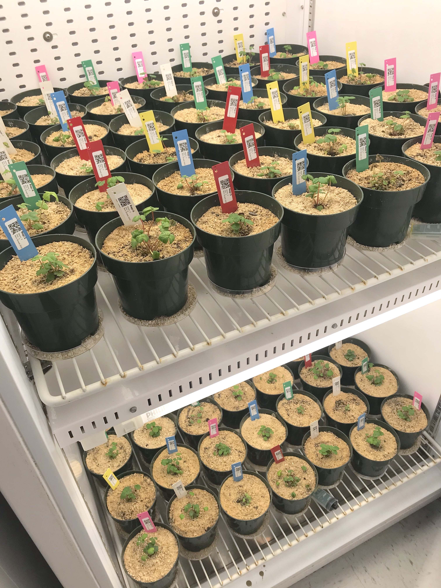

## Project overview
  
Our project tested the influence of microbial communities on plant performance and how "home advantages" and environmental pressures alter plant-microbe interactions across a resource gradient (dry, intermediate, wet soils). We used a natural elevation and precipitation gradient in a factorial design experiment where we collected soil inoculum  across three sites of a watershed that increased in precipitation and elevation (henceforth called low, middle, and high elevation/precipitation sites).   

We used axenically cloned model plant system (strawberry, *Fragaria virginiana*) grown in sterile soil, inoculated with soil slurries from each of those sites, and subjected to reciprocal water treatments imposed at three levels of watering (dry, intermediate, wet) based on the average precipitation of the inoculum home environment.   

<center>  
  
{width=50%}

</center>

We hypothesized that plants inoculated with soil microbes would outperform non-inoculated plants across all treatments and microbes from the low elevation site would be the most beneficial for plant growth under all water conditions. In testing the “home advantage” hypothesis, we expected plants from each inoculum treatment would perform best in their familiar water environment (e.g., low-inoculum plants would grow best under dry-water conditions, high-inoculum plants would grow best under wet-water conditions).

```{r setup chunk, include=FALSE, cache=FALSE, message=FALSE, warning=FALSE, collapse=TRUE}
knitr::opts_chunk$set(echo = TRUE)

# load packages
if (!require("pacman")) install.packages("pacman") # for rapid install if not in library

# use pacman to load all the packages you are missing!
pacman::p_load("car", "lme4", "lmerTest", "pbkrtest", "emmeans", "ggplot2", "tidyverse", "dplyr", "labdsv", "grid", "gridExtra", "patchwork", "plyr", "mctoolsr", "vegan", "car", "metacoder", "multcompView", "patchwork", "pairwiseAdonis", "labdsv", "eulerr", "ggthemes", "remotes", "mctoolsr")
```

### Plant Biomass
* ADD root/shoot graph codes here
* Make root/shoot weight graphs:  
* Read in the raw data and pair it down to what we're looking for.  

```{r plant biomass load, message=FALSE, warning=FALSE, results='hide'}
### Pair down raw data 
# raw data import
shootrootwithcontrol<-read.csv('data/strawberries_raw_full_data.csv',header=TRUE)
shootrootwithcontrol %>% drop_na()

#### # subset everything unnecessary

shootroot_step1removal<-subset(shootrootwithcontrol,TimePoint!="T0"&TimePoint!="Control"&Type!="Control")
shootroot_final<-shootroot_step1removal %>% drop_na()
shootroot_inoc23removed<-subset(shootroot_final,Inoculation!="2"&Inoculation!="3")
shootroot_inoc23removed$Inoculation<-as.factor(shootroot_inoc23removed$Inoculation)
shootroot_inoc23removed$Inoculation<-factor(shootroot_inoc23removed$Inoculation,levels=c("Dry Inoculation","Medium Inoculation","Wet Inoculation","No Inoculation"))

# rename levels
levels(shootroot_inoc23removed$Inoculation) <- list(
  Dry="Dry Inoculation", Moderate="Medium Inoculation", Wet="Wet Inoculation", Control="No Inoculation")

shootroot_inoc23removed$Water<-as.factor(shootroot_inoc23removed$Water)
shootroot_inoc23removed$Water<-factor(shootroot_inoc23removed$Water,levels=c("Low","Medium","High"))

# rename one level
levels(shootroot_inoc23removed$Water)[levels(shootroot_inoc23removed$Water)=="Medium"] <- "Moderate"

shootsonlywithcontrol<-subset(shootroot_inoc23removed,Type!="Root")
rootsonlywithcontrol<-subset(shootroot_inoc23removed,Type!="Shoot")

# export the final subset data
write.csv(shootsonlywithcontrol, "output/shootsonlywithcontrol.csv")
write.csv(rootsonlywithcontrol, "output/rootsonlywithcontrol.csv")
```

### Biomass proportion  
We take the root biomass (g) and the shoot biomass (g) to = total biomass, then express the proportion of the biomass for the roots and the shoots relative to total biomass of the plant. 

Stats for proportion above and belowground plant biomass
Run models linear models (Type III SS) for *proportion root or shoot biomass*  
* First we will run the linear model as `lm(mass ~ Water*Inoculation)`
* Then run post-hoc contrasts through `emmeans` (if significant effects observed)

```{r proportion graph p1, fig.show='hide'}

shootsonlywithcontrol <- shootsonlywithcontrol %>% 
       dplyr::rename("shoot.mass..g" = "WeightGrams")
rootsonlywithcontrol <- rootsonlywithcontrol %>% 
       dplyr::rename("root.mass..g" = "WeightGrams")
shootsonly_premerge<-subset(shootsonlywithcontrol,select = -c(SampleID,TimePoint,Type,SampleNotes,Water,Inoculation,Replicate,PlantNotes,SampleType,Sample_or_Control))
rootshoot_merge <- merge(shootsonly_premerge,rootsonlywithcontrol,by="PlantID")

#View(rootshoot_merge)
rootshoot_merge <-subset(rootshoot_merge, select = -c(Type,SampleNotes,PlantNotes))
rootshoot_merge$total.biomass..g<-rootshoot_merge$shoot.mass..g+rootshoot_merge$root.mass..g
rootshoot_merge$shoot.prop<-rootshoot_merge$shoot.mass..g/rootshoot_merge$total.biomass..g
rootshoot_merge$root.prop<-rootshoot_merge$root.mass..g/rootshoot_merge$total.biomass..g

#########
### From here with rootshoot_merge, you can redo all the above to see what the data looks like

hist(rootshoot_merge$root.prop)
hist(rootshoot_merge$shoot.prop)
```

Make a graph of the proportion of root and shoot biomass. *This is FIGURE 1.*
* For shoots : `shoot biomass (g) / total biomass (g)`
* For roots : `root biomass (g) / total biomass (g)` 
```{r proportion graph, width=20}

#View(rootshoot_merge)
longer_data <- rootshoot_merge %>%
  pivot_longer(shoot.prop:root.prop, names_to = "Type", values_to = "response")

prop.biomass.Inoc<-ggplot(longer_data,aes(Inoculation,response,fill=Inoculation)) +
  facet_wrap(.~Type)+
  geom_boxplot(outlier.size = 0.7, alpha=0.8)+
  ylab("Proportion of total biomass (g/g)") +
  scale_fill_brewer(palette="Dark2")+
  theme(
    axis.text = element_text(color='black',size=10),
    axis.title = element_text(color='black',size=12),
    axis.ticks = element_line(color='black'),
    legend.title = element_text(size=18),
    panel.background = element_rect(fill=NA,color='black'),
    legend.key = element_rect(fill=NA),
    panel.grid = element_blank(),
    plot.title=element_text(size=20,face="bold",vjust=2))

prop.biomass.Water<-ggplot(longer_data,aes(Water,response,fill=Water)) +
  facet_wrap(.~Type)+
  geom_boxplot(outlier.size = 0.7)+
  ylab("Proportion of total biomass (g/g)") +
  scale_fill_brewer(palette="Blues")+
  theme(
    axis.text = element_text(color='black',size=10),
    axis.title = element_text(color='black',size=12),
    axis.ticks = element_line(color='black'),
    legend.title = element_text(size=18),
    panel.background = element_rect(fill=NA,color='black'),
    legend.key = element_rect(fill=NA),
    panel.grid = element_blank(),
    plot.title=element_text(size=20,face="bold",vjust=2))

prop.plots<- prop.biomass.Inoc + prop.biomass.Water

prop.plots
ggsave("figures/Fig1.prop.biomass.pdf", height=6, width=15)

#ggsave(filename = "mainfigstawberries.pdf",
      #plot = prop.biomass.plot,
      #bg = "transparent",
      #width = 10, height = 6, units = "in",
      #dpi = 600)

```

Run models linear models (Type III SS) for proportion of total biomass as shoots and roots
* First we will run the linear model as `lm(prop mass ~ Inoculation * Water)`
* Then run post-hoc contrasts through `emmeans`

**Table S1A. Model and post-hocs for inoculation and water effects on proportion of *root* biomass**  
* Effect of inoculation and water
```{r prop roots}
## This is table S1A
root.prop.mod<-lm(root.prop~Water*Inoculation,data=rootshoot_merge)
Anova(root.prop.mod,type=3)

root.posthoc.Wat<-emmeans(root.prop.mod, pairwise~Water)
multcomp::cld(root.posthoc.Wat, Letters=letters)

root.posthoc.Inoc<-emmeans(root.prop.mod, ~Inoculation)
multcomp::cld(root.posthoc.Inoc, Letters=letters)

#posthoc with letters
multcomp::cld(typeIIIModelrootpropem, Letters=letters)
```

**Table S1B. Model and post-hocs for inoculation and water effects on proportion of *shoot* biomass**  
* Effect of inoculation and water
```{r prop shoots}
## This is table S1B
typeIIIModelshootprop<-lm(shoot.prop~Water*Inoculation,data=rootshoot_merge)
Anova(typeIIIModelshootprop,type=3)
typeIIIModelshootpropem<-emmeans(typeIIIModelshootprop,pairwise~Inoculation|Water)

#posthoc with letters
multcomp::cld(typeIIIModelshootpropem, Letters=letters)
```


### Fungal microbiome
```{r, message=FALSE, warning=FALSE, results='hide'}
input <- load_taxa_table("data/ASV_table_postfiltering.txt", "data/map_loaded_strawberries.txt")
```

Then let's start with just looking at the basic NMDS plot between the
inoculations after the stress. Let's do a lot of filtering first.

```{r, message=FALSE, warning=FALSE, results='hide'}
#keep only time point1
inputtimepoint1only = filter_data(input, 'TimePoint', keep_vals = 'T1')
#remove inoculum that we're not using
inputstep2 =filter_data(inputtimepoint1only, 'Inoculation', filter_vals = '2')
inputstep3 =filter_data(inputstep2, 'Inoculation', filter_vals = '3')
#Let's separate into roots and shoots
roots_post_stress = filter_data(inputstep3, 'Type', keep_vals = 'Root')
shoots_post_stress = filter_data(inputstep3, 'Type', keep_vals = 'Shoot')
```

Hellinger Transformation only works after you've filterd the samples you
want (not sure why!). But be sure to filter first and then do the
transformation

```{r,results='hide', message=FALSE, warning=FALSE}
#using pack: labdsv

otuTAB<-roots_post_stress$data_loaded
otuTAB <- as.data.frame (otuTAB)
otuTABtranspose<-t(otuTAB)
hell<-hellinger(otuTABtranspose)
#View(hell)

roots_post_stress$data_loaded<-t(hell)
otuTAB<-shoots_post_stress$data_loaded
otuTAB <- as.data.frame (otuTAB)
otuTABtranspose<-t(otuTAB)
hell<-hellinger(otuTABtranspose)
#View(hell)

shoots_post_stress$data_loaded<-t(hell)
```

Finally it is NMDS time yay! Permanova first

*Table S2* PERMANOVA testing inoculation sources and water treatment effects on plant-associated fungal microbiomes in root and shoot biomass.
```{r}
#roots first
#you need to first load the data and make it a data frame. Then transpose the data frame. Add the map loaded too
otuTAB<-roots_post_stress$data_loaded
otuTAB <- as.data.frame (otuTAB)
otuTABtranspose<-t(otuTAB)
mta<-roots_post_stress$map_loaded

#do as factor
mta$Water <- as.factor(mta$Water)
mta$Inoculation <- as.factor(mta$Inoculation)

#make the model
model1<-adonis2(otuTABtranspose~Water*Inoculation,data=mta,permutations=999,method="bray")
model1

mtapairwise<-unite(mta,c='water_inoculation',c('Water','Inoculation'),sep='-')

# water pairwise
pair.mod.water<-pairwise.adonis(otuTABtranspose,
                          factors=c(mta$Water))
pair.mod.water

# inoc pairwise
pair.mod.inoc<-pairwise.adonis(otuTABtranspose,
                          factors=c(mta$Inoculation))
pair.mod.inoc

# interaction pairwise
pair.mod.wat.inoc<-pairwise.adonis(otuTABtranspose,
                          factors=c(mtapairwise$water_inoculation))
pair.mod.wat.inoc


#shoots second
#you need to first load the data and make it a data frame. Then transpose the data frame. Add the map loaded too
otuTAB<-shoots_post_stress$data_loaded
otuTAB <- as.data.frame (otuTAB)
otuTABtranspose<-t(otuTAB)
mta<-shoots_post_stress$map_loaded

#do as factor
mta$Water <- as.factor(mta$Water)
mta$Inoculation <- as.factor(mta$Inoculation)

## using vegan
#make the model
model1<-adonis2(otuTABtranspose~Water*Inoculation,data=mta,permutations=999,method="bray")
model1

mtapairwise<-unite(mta,c='water_inoculation',c('Water','Inoculation'),sep='-')
#use pack pairwiseAdonis

pair.mod<-pairwise.adonis(otuTABtranspose,factors=mtapairwise$water_inoculation)
pair.mod

```

Everything is significant including pairwise adonis.

Let's make the plot:

```{r, results='hide', message=FALSE, warning=FALSE}
shoot.mds<-metaMDS(t(shoots_post_stress$data_loaded))
shoot<-scores(shoot.mds)
data.scoresshoot <- as.data.frame(shoot$sites) 
data.scoresshoot$Water <- shoots_post_stress$map_loaded$Water
data.scoresshoot$Inoculation <- shoots_post_stress$map_loaded$Inoculation


root.mds<-metaMDS(t(roots_post_stress$data_loaded))
root<-scores(root.mds)
data.scoresroot <- as.data.frame(root$sites) 
data.scoresroot$Water <- roots_post_stress$map_loaded$Water
data.scoresroot$Inoculation <- roots_post_stress$map_loaded$Inoculation

```

```{r, fig.height=5, fig.width=10, message=FALSE, warning=FALSE}

Shoots.T1.NMDS<-ggplot(data=data.scoresshoot,
                  aes(x=NMDS1,y=NMDS2,shape=factor(Water),color=factor(Inoculation))) + 
  scale_color_brewer(palette="Dark2")+
  ggtitle("Shoots T1")+
  geom_point(data=data.scoresshoot,
             aes(x=NMDS1,y=NMDS2,shape=factor(Water),color=factor(Inoculation)), alpha=0.8) + 
  # add the point markers
  stat_ellipse(data=data.scoresshoot,aes(x=NMDS1,y=NMDS2,lty=factor(Water),color=factor(Inoculation)))+
  scale_linetype_manual(values=c(1,2,3)) +
   theme(
    axis.text = element_text(color='black',size=10),
    axis.title = element_text(color='black',size=12),
    axis.ticks = element_line(color='black'),
    legend.title = element_text(size=8),
    panel.background = element_rect(fill=NA,color='black'),
    panel.grid = element_blank(),
    legend.position = "none",
    plot.title=element_text(size=20,face="bold",vjust=2))


Roots.T1.NMDS<-ggplot(data=data.scoresroot,
                      aes(x=NMDS1,y=NMDS2,shape=factor(Water),color=factor(Inoculation))) + 
  scale_color_brewer(palette="Dark2")+
  stat_ellipse(data=data.scoresroot,aes(x=NMDS1,y=NMDS2,lty=factor(Water),color=factor(Inoculation)))+
  scale_linetype_manual(values=c(1,2,3)) +
  ggtitle("Roots T1")+
  geom_point(data=data.scoresroot,
             aes(x=NMDS1,y=NMDS2,shape=factor(Water),color=factor(Inoculation)), alpha=0.8) + 
  # add the point markers
 theme(
    axis.text = element_text(color='black',size=10),
    axis.title = element_text(color='black',size=12),
    axis.ticks = element_line(color='black'),
    legend.title = element_text(size=8),
    legend.key = element_rect(fill=NA),
    panel.background = element_rect(fill=NA,color='black'),
    panel.grid = element_blank(),
    plot.title=element_text(size=20,face="bold",vjust=2))

both_plots<-Shoots.T1.NMDS+Roots.T1.NMDS
both_plots

ggsave("figures/Fig2.Shoot.Root.T1.NMDS.pdf", height=6, width=12)

#ggsave(filename = "both_plots.pdf",
      #plot = both_plots,
      #bg = "transparent",
      #width = 12, height = 6, units = "in",
      #dpi = 600)

```

Refilter time.

```{r, results='hide'}
#Let's view the original input map first
#View(input$map_loaded)
#Start by removing all roots. We can only do a time one with shoots
inputshootsonly = filter_data(input, 'Type', keep_vals = 'Shoot')
inputshootsonlyminus2 =filter_data(inputshootsonly, 'Inoculation', filter_vals = '2')
inputshootsonlyminus3 =filter_data(inputshootsonlyminus2, 'Inoculation', filter_vals = '3')
finalNMDSmovement = filter_data(inputshootsonlyminus3, 'TimePoint', filter_vals = 'Control')
```

Then, let's set up the data for the NMDS plot:

```{r, results='hide', message=FALSE, warning=FALSE}
#View(finalNMDSmovement$map_loaded)
time.mds<-metaMDS(t(finalNMDSmovement$data_loaded))
data.time <- as.data.frame(scores(time.mds)$sites) 
data.time$Water <- finalNMDSmovement$map_loaded$Water
data.time$Inoculation <- finalNMDSmovement$map_loaded$Inoculation
data.time$TimePoint <- finalNMDSmovement$map_loaded$TimePoint
data.time$PlantID <- finalNMDSmovement$map_loaded$PlantID
#envfit
finalNMDSmovement$map_loaded<-subset(finalNMDSmovement$map_loaded, select = -c(WeightGrams,SampleNotes, PlantNotes))
finalNMDSmovement$map_loaded$Water<-as.factor(finalNMDSmovement$map_loaded$Water)
finalNMDSmovement$map_loaded$Inoculation<-as.factor(finalNMDSmovement$map_loaded$Inoculation)
finalNMDSmovement$map_loaded$TimeWater <- paste(finalNMDSmovement$map_loaded$TimePoint,finalNMDSmovement$map_loaded$Water)
finalNMDSmovement$map_loaded$TimeInoculation <- paste(finalNMDSmovement$map_loaded$TimePoint,finalNMDSmovement$map_loaded$Inoculation)

waterfinalvf <- envfit(time.mds~TimeWater, data=finalNMDSmovement$map_loaded, perm = 999)
water.scrs.final <- as.data.frame(scores(waterfinalvf, display = "factors"))

inocfinalvf <- envfit(time.mds~TimeInoculation, data=finalNMDSmovement$map_loaded, perm = 999)
inoc.scrs.final <- as.data.frame(scores(inocfinalvf, display = "factors"))
```

```{r fig.height=5, fig.width=10}
NMDS1.mean.data.time<-aggregate(NMDS1~ Water*TimePoint, data=data.time, FUN=mean)
NMDS2.mean.data.time<-aggregate(NMDS2~ Water*TimePoint, data=data.time, FUN=mean)
centroid.data.time<-as.data.frame(cbind(NMDS1.mean.data.time, NMDS2.mean.data.time[3]))


timewater<-ggplot(data=data.time,
                  aes(x=NMDS1,y=NMDS2,color=factor(Water),shape=factor(TimePoint)), alpha=0.8) + 
  ggtitle("Water Treatment")+
  scale_color_manual(values=c("paleturquoise3", "steelblue2", "slategray4"))+
  geom_point(data=data.time,aes(x=NMDS1,y=NMDS2,color=factor(Water),shape=factor(TimePoint))) +
  geom_segment(aes(x = centroid.data.time[1,3], xend = centroid.data.time[4,3], 
                   y = centroid.data.time[1,4], yend = centroid.data.time[4,4]),
               arrow = arrow(length = unit(0.25, "cm")), colour = "paleturquoise3") +
  geom_segment(aes(x = centroid.data.time[2,3], xend = centroid.data.time[5,3], 
                   y = centroid.data.time[2,4], yend = centroid.data.time[5,4]),
               arrow = arrow(length = unit(0.25, "cm")), colour = "steelblue2") +
  geom_segment(aes(x = centroid.data.time[3,3], xend = centroid.data.time[6,3], 
                   y = centroid.data.time[3,4], yend = centroid.data.time[6,4]),
               arrow = arrow(length = unit(0.25, "cm")), colour = "slategray4") +
 
  theme(
    axis.text = element_text(color='black',size=10),
    axis.title = element_text(color='black',size=12),
    axis.ticks = element_line(color='black'),
    legend.title = element_text(size=8),
    panel.background = element_rect(fill=NA,color='black'),
    panel.grid = element_blank(),
    
    plot.title=element_text(size=20,face="bold",vjust=2))

####
NMDS1.mean.data.inoc<-aggregate(NMDS1~ Inoculation*TimePoint, data=data.time, FUN=mean)
NMDS2.mean.data.inoc<-aggregate(NMDS2~ Inoculation*TimePoint, data=data.time, FUN=mean)
centroid.data.inoc<-as.data.frame(cbind(NMDS1.mean.data.inoc, NMDS2.mean.data.inoc[3]))


timeinoculation<-ggplot(data=data.time,
                        aes(x=NMDS1,y=NMDS2,color=factor(Inoculation),shape=factor(TimePoint))) + 
  scale_color_brewer(palette="Dark2")+ 
  ggtitle("Inoculation")+
  geom_point(data=data.time,aes(x=NMDS1,y=NMDS2,color=factor(Inoculation),shape=factor(TimePoint)), alpha=0.8) + # add the point markers
  geom_segment(aes(x = centroid.data.inoc[1,3], xend = centroid.data.inoc[5,3], 
                   y = centroid.data.inoc[1,4], yend = centroid.data.inoc[5,4])
               ,arrow = arrow(length = unit(0.25, "cm")), colour = "#1B9E77") +
  geom_segment(aes(x = centroid.data.inoc[2,3], xend = centroid.data.inoc[6,3], 
                   y = centroid.data.inoc[2,4], yend = centroid.data.inoc[6,4]),
               arrow = arrow(length = unit(0.25, "cm")), colour = "#D95F02") +
  geom_segment(aes(x = centroid.data.inoc[3,3], xend = centroid.data.inoc[7,3], 
                   y = centroid.data.inoc[3,4], yend = centroid.data.inoc[7,4]),
               arrow = arrow(length = unit(0.25, "cm")), colour = "#7570B3") +
  geom_segment(aes(x = centroid.data.inoc[4,3], xend = centroid.data.inoc[8,3], 
                   y = centroid.data.inoc[4,4], yend = centroid.data.inoc[8,4]),
               arrow = arrow(length = unit(0.25, "cm")), colour = "#E7298A") +
  theme(
    axis.text = element_text(color='black',size=10),
    axis.title = element_text(color='black',size=12),
    axis.ticks = element_line(color='black'),
    legend.title = element_text(size=8),
    panel.background = element_rect(fill=NA,color='black'),
    panel.grid = element_blank(),
    
    plot.title=element_text(size=20,face="bold",vjust=2))

# use packages patchwork
both_plots_move<-timewater+timeinoculation
both_plots_move

ggsave("figures/timeinoculation.pdf", height=6, width=8)


#ggsave(filename = "timeinoculation.pdf",
      #plot = timeinoculation,
      #bg = "transparent",
      #width = 8, height = 6, units = "in",
      #dpi = 600)
#geom_path(aes(color=Trt), show.legend = F)

```

Let's see if these are significant:

```{r}
#shoots first
#you need to first load the data and make it a data frame. Then transpose the data frame. Add the map loaded too
otuTAB<-finalNMDSmovement$data_loaded
otuTAB <- as.data.frame (otuTAB)
otuTABtranspose<-t(otuTAB)
mta<-finalNMDSmovement$map_loaded
#do as factor
mta$Water <- as.factor(mta$Water)
mta$Inoculation <- as.factor(mta$Inoculation)
mta$TimePoint <- as.factor(mta$TimePoint)

#make the model
model1<-adonis2(otuTABtranspose~Water*TimePoint,data=mta,permutations=999,method="bray")
model1
model3<-adonis2(otuTABtranspose~Water*TimePoint,data=mta,permutations=999,method="jaccard")
model3

model2<-adonis2(otuTABtranspose~Inoculation*TimePoint,data=mta,permutations=999,method="bray")
model2
model4<-adonis2(otuTABtranspose~Inoculation*TimePoint,data=mta,permutations=999,method="jaccard")
model4
```

Let's look at T0 only
```{r, results='hide',echo=FALSE}
#Let's view the original input map first
#View(input$map_loaded)
#Start by removing all roots. We can only do a time one with shoots
inputshootsonly = filter_data(input, 'Type', keep_vals = 'Shoot')
inputshootsonlyminus2 =filter_data(inputshootsonly, 'Inoculation', filter_vals = '2')
inputshootsonlyminus3 =filter_data(inputshootsonlyminus2, 'Inoculation', filter_vals = '3')
finalNMDSmovement = filter_data(inputshootsonlyminus3, 'TimePoint', keep_vals = 'T0')
```

```{r,results='hide', message=FALSE, warning=FALSE, echo=FALSE}
#use package labdsv
otuTAB<-finalNMDSmovement$data_loaded
otuTAB <- as.data.frame (otuTAB)
otuTABtranspose<-t(otuTAB)
hell<-hellinger(otuTABtranspose)

#View(hell)
finalNMDSmovement$data_loaded<-t(hell)
```

```{r, results='hide',echo=FALSE}
time.mds<-metaMDS(t(finalNMDSmovement$data_loaded))
data.time <- as.data.frame(scores(time.mds)$sites) 
data.time$Water <- finalNMDSmovement$map_loaded$Water
data.time$Inoculation <- finalNMDSmovement$map_loaded$Inoculation
data.time$Water<-as.factor(data.time$Water)
data.time$Inoculation<-as.factor(data.time$Inoculation)
```

#### T0 Graph Only

Shoot fungal microbiomes prior to the start of water stress
*Figure S1: shoots T0 NMDS*
```{r, message=FALSE, warning=FALSE}

Shoots.T0.NMDS<-ggplot(data=data.time,aes(x=NMDS1,y=NMDS2,color=factor(Inoculation))) + 
  ggtitle("T0 Shoots")+
  scale_color_brewer(palette="Dark2")+
  geom_point(data=data.time,
             aes(x=NMDS1,y=NMDS2,shape=factor(Water),color=factor(Inoculation)), alpha=0.8) + 
  stat_ellipse(data=data.time,aes(x=NMDS1,y=NMDS2,color=factor(Inoculation)))+
  theme(
    axis.text = element_text(color='black',size=10),
    axis.title = element_text(color='black',size=12),
    axis.ticks = element_line(color='black'),
    legend.title = element_text(size=8),
    panel.background = element_rect(fill=NA,color='black'),
    panel.grid = element_blank(),
    
    plot.title=element_text(size=20,face="bold",vjust=2))

Shoots.T0.NMDS
ggsave("figures/FigS1.Shoots.T0.NMDS.pdf", height=6, width=8)


```

*Table S3. T0 shoot fungal microbiome*
```{r shoot T0 microbiome}
library(vegan)

#make the model
otuTAB<-finalNMDSmovement$data_loaded
otuTAB <- as.data.frame (otuTAB)
otuTABtranspose<-t(otuTAB)
mta<-finalNMDSmovement$map_loaded
#do as factor
mta$Water <- as.factor(mta$Water)
mta$Inoculation <- as.factor(mta$Inoculation)

set.seed(138)
model1<-adonis2(otuTABtranspose~Water*Inoculation,data=mta,permutations=999,method="bray")
model1
```

re-filter
```{r, results='hide',echo=FALSE}
inputshootsonly = filter_data(input, 'Type', keep_vals = 'Shoot')
inputshootsonlyminus2 =filter_data(inputshootsonly, 'Inoculation', filter_vals = '2')
inputshootsonlyminus3 =filter_data(inputshootsonlyminus2, 'Inoculation', filter_vals = '3')
inocNMDSmovement = filter_data(inputshootsonlyminus3, 'TimePoint', filter_vals = 'Control')
inoc1NMDSmovement =filter_data(inocNMDSmovement, 'Inoculation', keep_vals = '1')
inoc4NMDSmovement =filter_data(inocNMDSmovement, 'Inoculation', keep_vals = '4')
inoc5NMDSmovement =filter_data(inocNMDSmovement, 'Inoculation', keep_vals = '5')
inoc6NMDSmovement =filter_data(inocNMDSmovement, 'Inoculation', keep_vals = '6')
```

```{r,results='hide',echo=FALSE}
otuTAB<-inoc1NMDSmovement$data_loaded
otuTAB <- as.data.frame (otuTAB)
otuTABtranspose<-t(otuTAB)
hell<-hellinger(otuTABtranspose)
inoc1NMDSmovement$data_loaded<-t(hell)

otuTAB<-inoc4NMDSmovement$data_loaded
otuTAB <- as.data.frame (otuTAB)
otuTABtranspose<-t(otuTAB)
hell<-hellinger(otuTABtranspose)
inoc4NMDSmovement$data_loaded<-t(hell)

otuTAB<-inoc5NMDSmovement$data_loaded
otuTAB <- as.data.frame (otuTAB)
otuTABtranspose<-t(otuTAB)
hell<-hellinger(otuTABtranspose)
inoc5NMDSmovement$data_loaded<-t(hell)

otuTAB<-inoc6NMDSmovement$data_loaded
otuTAB <- as.data.frame (otuTAB)
otuTABtranspose<-t(otuTAB)
hell<-hellinger(otuTABtranspose)
inoc6NMDSmovement$data_loaded<-t(hell)
```

```{r, results='hide',echo=FALSE}
inoc1.mds<-metaMDS(t(inoc1NMDSmovement$data_loaded))
inoc1<-scores(inoc1.mds)
data.scoresinoc1 <- as.data.frame(inoc1$sites) 
data.scoresinoc1$Water <- inoc1NMDSmovement$map_loaded$Water
data.scoresinoc1$Inoculation <- inoc1NMDSmovement$map_loaded$Inoculation
data.scoresinoc1$TimePoint <- inoc1NMDSmovement$map_loaded$TimePoint
data.scoresinoc1$PlantID <- inoc1NMDSmovement$map_loaded$PlantID
inoc1NMDSmovement$map_loaded$TimeWater <- paste(inoc1NMDSmovement$map_loaded$TimePoint,inoc1NMDSmovement$map_loaded$Water)
inoc1vf <- envfit(inoc1.mds~TimeWater, data=inoc1NMDSmovement$map_loaded, perm = 999)
inoc1.scrs <- as.data.frame(scores(inoc1vf, display = "factors"))

inoc4.mds<-metaMDS(t(inoc4NMDSmovement$data_loaded))
inoc4<-scores(inoc4.mds)
data.scoresinoc4 <- as.data.frame(inoc4$sites) 
data.scoresinoc4$Water <- inoc4NMDSmovement$map_loaded$Water
data.scoresinoc4$Inoculation <- inoc4NMDSmovement$map_loaded$Inoculation
data.scoresinoc4$TimePoint <- inoc4NMDSmovement$map_loaded$TimePoint
data.scoresinoc4$PlantID <- inoc4NMDSmovement$map_loaded$PlantID
inoc4NMDSmovement$map_loaded$TimeWater <- paste(inoc4NMDSmovement$map_loaded$TimePoint,inoc4NMDSmovement$map_loaded$Water)
inoc4vf <- envfit(inoc4.mds~TimeWater, data=inoc4NMDSmovement$map_loaded, perm = 999)
inoc4.scrs <- as.data.frame(scores(inoc4vf, display = "factors"))

inoc5.mds<-metaMDS(t(inoc5NMDSmovement$data_loaded))
inoc5<-scores(inoc5.mds)
data.scoresinoc5 <- as.data.frame(inoc5$sites) 
data.scoresinoc5$Water <- inoc5NMDSmovement$map_loaded$Water
data.scoresinoc5$Inoculation <- inoc5NMDSmovement$map_loaded$Inoculation
data.scoresinoc5$TimePoint <- inoc5NMDSmovement$map_loaded$TimePoint
data.scoresinoc5$PlantID <- inoc5NMDSmovement$map_loaded$PlantID
inoc5NMDSmovement$map_loaded$TimeWater <- paste(inoc5NMDSmovement$map_loaded$TimePoint,inoc5NMDSmovement$map_loaded$Water)
inoc5vf <- envfit(inoc5.mds~TimeWater, data=inoc5NMDSmovement$map_loaded, perm = 999)
inoc5.scrs <- as.data.frame(scores(inoc5vf, display = "factors"))

inoc6.mds<-metaMDS(t(inoc6NMDSmovement$data_loaded))
inoc6<-scores(inoc6.mds)
data.scoresinoc6 <- as.data.frame(inoc6$sites) 
data.scoresinoc6$Water <- inoc6NMDSmovement$map_loaded$Water
data.scoresinoc6$Inoculation <- inoc6NMDSmovement$map_loaded$Inoculation
data.scoresinoc6$TimePoint <- inoc6NMDSmovement$map_loaded$TimePoint
data.scoresinoc6$PlantID <- inoc6NMDSmovement$map_loaded$PlantID
inoc6NMDSmovement$map_loaded$TimeWater <- paste(inoc6NMDSmovement$map_loaded$TimePoint,inoc6NMDSmovement$map_loaded$Water)
inoc6vf <- envfit(inoc6.mds~TimeWater, data=inoc6NMDSmovement$map_loaded, perm = 999)
inoc6.scrs <- as.data.frame(scores(inoc6vf, display = "factors"))
```

```{r fig.height=15, fig.width=15, message=FALSE, warning=FALSE}
NMDS1.mean.inoc1<-aggregate(NMDS1~ Water*TimePoint, data=data.scoresinoc1, FUN=mean)
NMDS2.mean.inoc1<-aggregate(NMDS2~ Water*TimePoint, data=data.scoresinoc1, FUN=mean)
centroid.inoc1<-as.data.frame(cbind(NMDS1.mean.inoc1, NMDS2.mean.inoc1[3]))
centroid.inoc1$TimePoint<-factor(centroid.inoc1$TimePoint, levels=c("T0", "T1"))

data.scoresinoc1$TimePoint<-factor(data.scoresinoc1$TimePoint,levels=c("T1","T0"))
data.scoresinoc4$TimePoint<-factor(data.scoresinoc4$TimePoint,levels=c("T1","T0"))
data.scoresinoc5$TimePoint<-factor(data.scoresinoc5$TimePoint,levels=c("T1","T0"))
data.scoresinoc6$TimePoint<-factor(data.scoresinoc6$TimePoint,levels=c("T1","T0"))

inoc1.trajectory<-ggplot(data=data.scoresinoc1,aes(x=NMDS1,y=NMDS2,shape=factor(TimePoint),color=factor(Water))) + 
  ggtitle("Inoculation 1")+
  geom_point(data=data.scoresinoc1,aes(x=NMDS1,y=NMDS2,shape=factor(TimePoint),color=factor(Water))) + 
  stat_ellipse(data=data.scoresinoc1,aes(x=NMDS1,y=NMDS2,color=factor(Water),linetype=factor(TimePoint)))+
  scale_color_manual(values=c("red", "#E69F00", "#56B4E9"))+  # for water 1,2,3
  geom_segment(aes(x = centroid.inoc1[1,3], xend = centroid.inoc1[4,3], 
                   y = centroid.inoc1[1,4], yend = centroid.inoc1[4,4]),arrow = arrow(), colour = "red") +
  geom_segment(aes(x = centroid.inoc1[2,3], xend = centroid.inoc1[5,3], 
                   y = centroid.inoc1[2,4], yend = centroid.inoc1[5,4]),arrow = arrow(), colour = "#E69F00") +
  geom_segment(aes(x = centroid.inoc1[3,3], xend = centroid.inoc1[6,3], 
                   y = centroid.inoc1[3,4], yend = centroid.inoc1[6,4]),arrow = arrow(), colour = "#56B4E9") +
  theme(
    axis.text = element_text(color='black',size=10),
    axis.title = element_text(color='black',size=12),
    axis.ticks = element_line(color='black'),
    legend.title = element_text(size=8),
    panel.background = element_rect(fill=NA,color='black'),
    panel.grid = element_blank(),
    legend.position = "none",
    plot.title=element_text(size=20,face="bold",vjust=2))
###

NMDS1.mean.inoc4<-aggregate(NMDS1~ Water*TimePoint, data=data.scoresinoc4, FUN=mean)
NMDS2.mean.inoc4<-aggregate(NMDS2~ Water*TimePoint, data=data.scoresinoc4, FUN=mean)
centroid.inoc4<-as.data.frame(cbind(NMDS1.mean.inoc4, NMDS2.mean.inoc4[3]))


data.scoresinoc4$TimePoint<-factor(data.scoresinoc4$TimePoint,levels=c("T1","T0"))
inoc4.trajectory<-ggplot(data=data.scoresinoc4,aes(x=NMDS1,y=NMDS2,shape=factor(TimePoint),color=factor(Water))) + 
  ggtitle("Inoculation 4")+
  geom_point(data=data.scoresinoc4,aes(x=NMDS1,y=NMDS2,shape=factor(TimePoint),color=factor(Water))) + 
  stat_ellipse(data=data.scoresinoc4,aes(x=NMDS1,y=NMDS2,color=factor(Water),linetype=factor(TimePoint)))+
  scale_color_manual(values=c("red", "#E69F00", "#56B4E9"))+ 
  geom_segment(aes(x = centroid.inoc4[4,3], xend = centroid.inoc4[1,3], 
                   y = centroid.inoc4[4,4], yend = centroid.inoc4[1,4]),arrow = arrow(), colour = "red") +
  geom_segment(aes(x = centroid.inoc4[5,3], xend = centroid.inoc4[2,3], 
                   y = centroid.inoc4[5,4], yend = centroid.inoc4[2,4]),arrow = arrow(), colour = "#E69F00") +
  geom_segment(aes(x = centroid.inoc4[6,3], xend = centroid.inoc4[3,3], 
                   y = centroid.inoc4[6,4], yend = centroid.inoc4[3,4]),arrow = arrow(), colour = "#56B4E9") +
  theme(
    axis.text = element_text(color='black',size=10),
    axis.title = element_text(color='black',size=12),
    axis.ticks = element_line(color='black'),
    legend.title = element_text(size=8),
    panel.background = element_rect(fill=NA,color='black'),
    panel.grid = element_blank(),
   
    plot.title=element_text(size=20,face="bold",vjust=2))

###

NMDS1.mean.inoc5<-aggregate(NMDS1~ Water*TimePoint, data=data.scoresinoc5, FUN=mean)
NMDS2.mean.inoc5<-aggregate(NMDS2~ Water*TimePoint, data=data.scoresinoc5, FUN=mean)
centroid.inoc5<-as.data.frame(cbind(NMDS1.mean.inoc5, NMDS2.mean.inoc5[3]))


data.scoresinoc5$TimePoint<-factor(data.scoresinoc5$TimePoint,levels=c("T1","T0"))
inoc5.trajectory<-ggplot(data=data.scoresinoc5,aes(x=NMDS1,y=NMDS2,shape=factor(TimePoint),color=factor(Water))) + 
  ggtitle("Inoculation 5")+
  geom_point(data=data.scoresinoc5,aes(x=NMDS1,y=NMDS2,shape=factor(TimePoint),color=factor(Water))) + 
  stat_ellipse(data=data.scoresinoc5,aes(x=NMDS1,y=NMDS2,color=factor(Water),linetype=factor(TimePoint)))+
  scale_color_manual(values=c("red", "#E69F00", "#56B4E9"))+ 
  geom_segment(aes(x = centroid.inoc5[4,3], xend = centroid.inoc5[1,3], 
                   y = centroid.inoc5[4,4], yend = centroid.inoc5[1,4]),arrow = arrow(), colour = "red") +
  geom_segment(aes(x = centroid.inoc5[5,3], xend = centroid.inoc5[2,3], 
                   y = centroid.inoc5[5,4], yend = centroid.inoc5[2,4]),arrow = arrow(), colour = "#E69F00") +
  geom_segment(aes(x = centroid.inoc5[6,3], xend = centroid.inoc5[3,3], 
                   y = centroid.inoc5[6,4], yend = centroid.inoc5[3,4]),arrow = arrow(), colour = "#56B4E9") +
  theme(
    axis.text = element_text(color='black',size=10),
    axis.title = element_text(color='black',size=12),
    axis.ticks = element_line(color='black'),
    legend.title = element_text(size=8),
    panel.background = element_rect(fill=NA,color='black'),
    panel.grid = element_blank(),
    legend.position = "none",
    plot.title=element_text(size=20,face="bold",vjust=2))

##

NMDS1.mean.inoc6<-aggregate(NMDS1~ Water*TimePoint, data=data.scoresinoc6, FUN=mean)
NMDS2.mean.inoc6<-aggregate(NMDS2~ Water*TimePoint, data=data.scoresinoc6, FUN=mean)
centroid.inoc6<-as.data.frame(cbind(NMDS1.mean.inoc6, NMDS2.mean.inoc6[3]))

data.scoresinoc6$TimePoint<-factor(data.scoresinoc6$TimePoint,levels=c("T1","T0"))

inoc6.trajectory<-ggplot(data=data.scoresinoc6,aes(x=NMDS1,y=NMDS2,shape=factor(TimePoint),color=factor(Water))) + 
  ggtitle("Inoculation 6")+
  geom_point(data=data.scoresinoc6,aes(x=NMDS1,y=NMDS2,shape=factor(TimePoint),color=factor(Water))) + 
  stat_ellipse(data=data.scoresinoc6,aes(x=NMDS1,y=NMDS2,color=factor(Water),linetype=factor(TimePoint)))+
  scale_color_manual(values=c("red", "#E69F00", "#56B4E9"))+ 
  geom_segment(aes(x = centroid.inoc6[4,3], xend = centroid.inoc6[1,3], 
                   y = centroid.inoc6[4,4], yend = centroid.inoc6[1,4]),arrow = arrow(), colour = "red") +
  geom_segment(aes(x = centroid.inoc6[5,3], xend = centroid.inoc6[2,3], 
                   y = centroid.inoc6[5,4], yend = centroid.inoc6[2,4]),arrow = arrow(), colour = "#E69F00") +
  geom_segment(aes(x = centroid.inoc6[6,3], xend = centroid.inoc6[3,3], 
                   y = centroid.inoc6[6,4], yend = centroid.inoc6[3,4]),arrow = arrow(), colour = "#56B4E9") +
  theme(
    axis.text = element_text(color='black',size=10),
    axis.title = element_text(color='black',size=12),
    axis.ticks = element_line(color='black'),
    legend.title = element_text(size=8),
    panel.background = element_rect(fill=NA,color='black'),
    panel.grid = element_blank(),
    legend.position = "none",
    plot.title=element_text(size=20,face="bold",vjust=2))


library(patchwork)
inocalone<-(inoc1.trajectory+inoc4.trajectory)/(inoc5.trajectory+inoc6.trajectory)
inocalone

inocalone
ggsave("figures/timebyinoc.pdf", height=8, width=10)

#ggsave(filename = "timebyinoc.pdf",
#      plot = inocalone,
#      bg = "transparent",
#      width = 10, height = 8, units = "in",
#      dpi = 600)

```


beta dispersion:
```{r}
inoc1.dataframe <- as.data.frame(t(inoc1NMDSmovement$data_loaded))
groups <- inoc1NMDSmovement$map_loaded$TimePoint
disinoc1 <- vegdist(inoc1.dataframe,method="bray")
bdinoc1<-betadisper(disinoc1,groups)
anova(bdinoc1)
pairwise.beta.disper.results.inoc1 <- permutest(bdinoc1, pairwise = TRUE, iter=9999)
pairwise.beta.disper.results.inoc1

inoc4.dataframe <- as.data.frame(t(inoc4NMDSmovement$data_loaded))
groups <- inoc4NMDSmovement$map_loaded$TimePoint
disinoc4 <- vegdist(inoc4.dataframe,method="bray")
bdinoc4<-betadisper(disinoc4,groups)
anova(bdinoc4)
pairwise.beta.disper.results.inoc4 <- permutest(bdinoc4, pairwise = TRUE, iter=9999)
pairwise.beta.disper.results.inoc4

inoc5.dataframe <- as.data.frame(t(inoc5NMDSmovement$data_loaded))
groups <- inoc5NMDSmovement$map_loaded$TimePoint
disinoc5 <- vegdist(inoc5.dataframe,method="bray")
bdinoc5<-betadisper(disinoc5,groups)
anova(bdinoc5)
pairwise.beta.disper.results.inoc5 <- permutest(bdinoc5, pairwise = TRUE, iter=9999)
pairwise.beta.disper.results.inoc5

bdinoc1
bdinoc4
bdinoc5
```


beta dispersion and mantel test. Let's do this with shoots and roots:

```{r, message=FALSE, warning=FALSE, results='hide',echo=FALSE}

library(labdsv)

#keep only time point1
inputtimepoint1only = filter_data(input, 'TimePoint', keep_vals = 'T1')
#remove inoculum that we're not using
inputstep2 =filter_data(inputtimepoint1only, 'Inoculation', filter_vals = '2')
inputstep3 =filter_data(inputstep2, 'Inoculation', filter_vals = '3')
#Let's separate into roots and shoots
roots_post_stress = filter_data(inputstep3, 'Type', keep_vals = 'Root')
shoots_post_stress = filter_data(inputstep3, 'Type', keep_vals = 'Shoot')


otuTAB<-roots_post_stress$data_loaded
otuTAB <- as.data.frame (otuTAB)
otuTABtranspose<-t(otuTAB)
hell<-hellinger(otuTABtranspose)
#View(hell)
roots_post_stress$data_loaded<-t(hell)

otuTAB<-shoots_post_stress$data_loaded
otuTAB <- as.data.frame (otuTAB)
otuTABtranspose<-t(otuTAB)
hell<-hellinger(otuTABtranspose)
#View(hell)
shoots_post_stress$data_loaded<-t(hell)
```


mantel test: (significant across inoculum, but not water treatment)
```{r, mantel test roots}
roots.dataframe<-as.data.frame(t(roots_post_stress$data_loaded))
dist.abund.root = vegdist(roots.dataframe, method = "bray")
inoc <- roots_post_stress$map_loaded$Inoculation
water <- roots_post_stress$map_loaded$Water
dist.inoc = dist(inoc, method = "euclidean")
dist.water = dist(water, method = "euclidean")
abund_inoc = mantel(dist.abund.root, dist.inoc, method = "spearman", permutations = 9999, na.rm = TRUE)
abund_inoc
abund_water = mantel(dist.abund.root, dist.water, method = "spearman", permutations = 9999, na.rm = TRUE)
abund_water


```

```{r, mantel test shoots}
shoots.dataframe<-as.data.frame(t(shoots_post_stress$data_loaded))
dist.abund.shoot = vegdist(shoots.dataframe, method = "bray")
inoc <- shoots_post_stress$map_loaded$Inoculation
water <- shoots_post_stress$map_loaded$Water
dist.inoc = dist(inoc, method = "euclidean")
dist.water = dist(water, method = "euclidean")
abund_inoc = mantel(dist.abund.shoot, dist.inoc, method = "spearman", permutations = 9999, na.rm = TRUE)
abund_inoc
abund_water = mantel(dist.abund.shoot, dist.water, method = "spearman", permutations = 9999, na.rm = TRUE)
abund_water


```

Let's make the shannon's diversity plots next: 
```{r, shannon diversity, results='hide'}
#inputraw has the slurry data so let's take that first. Then we will need to transform it too. 
input <- load_taxa_table("data/ASV_table_postfiltering.txt", "data/map_loaded_strawberries.txt")
inputstep5 = filter_data(input, 'TimePoint', keep_vals = 'T1')
roott1 = filter_data(inputstep5, 'Type', keep_vals = 'Root')
roott1water1 = filter_data(roott1, 'Water', keep_vals = '1')
roott1inoc1water1 = filter_data(roott1water1, 'Inoculation', keep_vals = '1')
roott1inoc4water1 = filter_data(roott1water1, 'Inoculation', keep_vals = '4')
roott1inoc5water1 = filter_data(roott1water1, 'Inoculation', keep_vals = '5')
roott1inoc6water1 = filter_data(roott1water1, 'Inoculation', keep_vals = '6')
roott1water2 = filter_data(roott1, 'Water', keep_vals = '2')
roott1inoc1water2 = filter_data(roott1water2, 'Inoculation', keep_vals = '1')
roott1inoc4water2 = filter_data(roott1water2, 'Inoculation', keep_vals = '4')
roott1inoc5water2 = filter_data(roott1water2, 'Inoculation', keep_vals = '5')
roott1inoc6water2 = filter_data(roott1water2, 'Inoculation', keep_vals = '6')
roott1water3 = filter_data(roott1, 'Water', keep_vals = '3')
roott1inoc1water3 = filter_data(roott1water3, 'Inoculation', keep_vals = '1')
roott1inoc4water3 = filter_data(roott1water3, 'Inoculation', keep_vals = '4')
roott1inoc5water3 = filter_data(roott1water3, 'Inoculation', keep_vals = '5')
roott1inoc6water3 = filter_data(roott1water3, 'Inoculation', keep_vals = '6')
shoott1 = filter_data(inputstep5, 'Type', keep_vals = 'Shoot')
shoott1water1 = filter_data(shoott1, 'Water', keep_vals = '1')
shoott1inoc1water1 = filter_data(shoott1water1, 'Inoculation', keep_vals = '1')
shoott1inoc4water1 = filter_data(shoott1water1, 'Inoculation', keep_vals = '4')
shoott1inoc5water1 = filter_data(shoott1water1, 'Inoculation', keep_vals = '5')
shoott1inoc6water1 = filter_data(shoott1water1, 'Inoculation', keep_vals = '6')
shoott1water2 = filter_data(shoott1, 'Water', keep_vals = '2')
shoott1inoc1water2 = filter_data(shoott1water2, 'Inoculation', keep_vals = '1')
shoott1inoc4water2 = filter_data(shoott1water2, 'Inoculation', keep_vals = '4')
shoott1inoc5water2 = filter_data(shoott1water2, 'Inoculation', keep_vals = '5')
shoott1inoc6water2 = filter_data(shoott1water2, 'Inoculation', keep_vals = '6')
shoott1water3 = filter_data(shoott1, 'Water', keep_vals = '3')
shoott1inoc1water3 = filter_data(shoott1water3, 'Inoculation', keep_vals = '1')
shoott1inoc4water3 = filter_data(shoott1water3, 'Inoculation', keep_vals = '4')
shoott1inoc5water3 = filter_data(shoott1water3, 'Inoculation', keep_vals = '5')
shoott1inoc6water3 = filter_data(shoott1water3, 'Inoculation', keep_vals = '6')

t0 = filter_data(input, 'TimePoint', keep_vals = 'T0')
shoott0 = filter_data(t0, 'Type', keep_vals = 'Shoot')
shoott0inoc1 = filter_data(shoott0, 'Inoculation', keep_vals = '1')
shoott0inoc4 = filter_data(shoott0, 'Inoculation', keep_vals = '4')
shoott0inoc5 = filter_data(shoott0, 'Inoculation', keep_vals = '5')
shoott0inoc6 = filter_data(shoott0, 'Inoculation', keep_vals = '6')

#Now that we have all three ready, let's transform them to match our other data:
otuTAB<-roott1inoc1water1$data_loaded
otuTAB <- as.data.frame (otuTAB)
otuTABtranspose<-t(otuTAB)
hell<-hellinger(otuTABtranspose)
#View(hell)
otuTAB<-roott1inoc1water1$data_loaded
otuTAB <- as.data.frame (otuTAB)
otuTABtranspose<-t(otuTAB)
hell<-hellinger(otuTABtranspose)
#View(hell)
roott1inoc1water1$data_loaded<-t(hell)

otuTAB<-roott1inoc4water1$data_loaded
otuTAB <- as.data.frame (otuTAB)
otuTABtranspose<-t(otuTAB)
hell<-hellinger(otuTABtranspose)
#View(hell)
roott1inoc4water1$data_loaded<-t(hell)

otuTAB<-roott1inoc5water1$data_loaded
otuTAB <- as.data.frame (otuTAB)
otuTABtranspose<-t(otuTAB)
hell<-hellinger(otuTABtranspose)
#View(hell)
roott1inoc5water1$data_loaded<-t(hell)

otuTAB<-roott1inoc6water1$data_loaded
otuTAB <- as.data.frame (otuTAB)
otuTABtranspose<-t(otuTAB)
hell<-hellinger(otuTABtranspose)
#View(hell)
roott1inoc6water1$data_loaded<-t(hell)

otuTAB<-roott1inoc1water2$data_loaded
otuTAB <- as.data.frame (otuTAB)
otuTABtranspose<-t(otuTAB)
hell<-hellinger(otuTABtranspose)
#View(hell)
roott1inoc1water2$data_loaded<-t(hell)

otuTAB<-roott1inoc4water2$data_loaded
otuTAB <- as.data.frame (otuTAB)
otuTABtranspose<-t(otuTAB)
hell<-hellinger(otuTABtranspose)
#View(hell)
roott1inoc4water2$data_loaded<-t(hell)

otuTAB<-roott1inoc5water2$data_loaded
otuTAB <- as.data.frame (otuTAB)
otuTABtranspose<-t(otuTAB)
hell<-hellinger(otuTABtranspose)
#View(hell)
roott1inoc5water2$data_loaded<-t(hell)

otuTAB<-roott1inoc6water2$data_loaded
otuTAB <- as.data.frame (otuTAB)
otuTABtranspose<-t(otuTAB)
hell<-hellinger(otuTABtranspose)
#View(hell)
roott1inoc6water2$data_loaded<-t(hell)

otuTAB<-roott1inoc1water3$data_loaded
otuTAB <- as.data.frame (otuTAB)
otuTABtranspose<-t(otuTAB)
hell<-hellinger(otuTABtranspose)
#View(hell)
roott1inoc1water3$data_loaded<-t(hell)

otuTAB<-roott1inoc4water3$data_loaded
otuTAB <- as.data.frame (otuTAB)
otuTABtranspose<-t(otuTAB)
hell<-hellinger(otuTABtranspose)
#View(hell)
roott1inoc4water3$data_loaded<-t(hell)

otuTAB<-roott1inoc5water3$data_loaded
otuTAB <- as.data.frame (otuTAB)
otuTABtranspose<-t(otuTAB)
hell<-hellinger(otuTABtranspose)
#View(hell)
roott1inoc5water3$data_loaded<-t(hell)

otuTAB<-roott1inoc6water3$data_loaded
otuTAB <- as.data.frame (otuTAB)
otuTABtranspose<-t(otuTAB)
hell<-hellinger(otuTABtranspose)
#View(hell)
roott1inoc6water3$data_loaded<-t(hell)

otuTAB<-shoott1inoc1water1$data_loaded
otuTAB <- as.data.frame (otuTAB)
otuTABtranspose<-t(otuTAB)
hell<-hellinger(otuTABtranspose)
#View(hell)
shoott1inoc1water1$data_loaded<-t(hell)

otuTAB<-shoott1inoc4water1$data_loaded
otuTAB <- as.data.frame (otuTAB)
otuTABtranspose<-t(otuTAB)
hell<-hellinger(otuTABtranspose)
#View(hell)
shoott1inoc4water1$data_loaded<-t(hell)

otuTAB<-shoott1inoc5water1$data_loaded
otuTAB <- as.data.frame (otuTAB)
otuTABtranspose<-t(otuTAB)
hell<-hellinger(otuTABtranspose)
#View(hell)
shoott1inoc5water1$data_loaded<-t(hell)

otuTAB<-shoott1inoc6water1$data_loaded
otuTAB <- as.data.frame (otuTAB)
otuTABtranspose<-t(otuTAB)
hell<-hellinger(otuTABtranspose)
#View(hell)
shoott1inoc6water1$data_loaded<-t(hell)

otuTAB<-shoott1inoc1water2$data_loaded
otuTAB <- as.data.frame (otuTAB)
otuTABtranspose<-t(otuTAB)
hell<-hellinger(otuTABtranspose)
#View(hell)
shoott1inoc1water2$data_loaded<-t(hell)

otuTAB<-shoott1inoc4water2$data_loaded
otuTAB <- as.data.frame (otuTAB)
otuTABtranspose<-t(otuTAB)
hell<-hellinger(otuTABtranspose)
#View(hell)
shoott1inoc4water2$data_loaded<-t(hell)

otuTAB<-shoott1inoc5water2$data_loaded
otuTAB <- as.data.frame (otuTAB)
otuTABtranspose<-t(otuTAB)
hell<-hellinger(otuTABtranspose)
#View(hell)
shoott1inoc5water2$data_loaded<-t(hell)

otuTAB<-shoott1inoc6water2$data_loaded
otuTAB <- as.data.frame (otuTAB)
otuTABtranspose<-t(otuTAB)
hell<-hellinger(otuTABtranspose)
#View(hell)
shoott1inoc6water2$data_loaded<-t(hell)

otuTAB<-shoott1inoc1water3$data_loaded
otuTAB <- as.data.frame (otuTAB)
otuTABtranspose<-t(otuTAB)
hell<-hellinger(otuTABtranspose)
#View(hell)
shoott1inoc1water3$data_loaded<-t(hell)

otuTAB<-shoott1inoc4water3$data_loaded
otuTAB <- as.data.frame (otuTAB)
otuTABtranspose<-t(otuTAB)
hell<-hellinger(otuTABtranspose)
#View(hell)
shoott1inoc4water3$data_loaded<-t(hell)

otuTAB<-shoott1inoc5water3$data_loaded
otuTAB <- as.data.frame (otuTAB)
otuTABtranspose<-t(otuTAB)
hell<-hellinger(otuTABtranspose)
#View(hell)
shoott1inoc5water3$data_loaded<-t(hell)

otuTAB<-shoott1inoc6water3$data_loaded
otuTAB <- as.data.frame (otuTAB)
otuTABtranspose<-t(otuTAB)
hell<-hellinger(otuTABtranspose)
#View(hell)
shoott1inoc6water3$data_loaded<-t(hell)

otuTAB<-shoott0inoc1$data_loaded
otuTAB <- as.data.frame (otuTAB)
otuTABtranspose<-t(otuTAB)
hell<-hellinger(otuTABtranspose)
#View(hell)
shoott0inoc1$data_loaded<-t(hell)

otuTAB<-shoott0inoc4$data_loaded
otuTAB <- as.data.frame (otuTAB)
otuTABtranspose<-t(otuTAB)
hell<-hellinger(otuTABtranspose)
#View(hell)
shoott0inoc4$data_loaded<-t(hell)

otuTAB<-shoott0inoc5$data_loaded
otuTAB <- as.data.frame (otuTAB)
otuTABtranspose<-t(otuTAB)
hell<-hellinger(otuTABtranspose)
#View(hell)
shoott0inoc5$data_loaded<-t(hell)

otuTAB<-shoott0inoc6$data_loaded
otuTAB <- as.data.frame (otuTAB)
otuTABtranspose<-t(otuTAB)
hell<-hellinger(otuTABtranspose)
#View(hell)
shoott0inoc6$data_loaded<-t(hell)
```

Now that we have the data, we can do shannon's diversity:
```{r,results='hide'}
#all shannon's diversity
library(vegan)
roott1inoc1water1<-diversity(t(roott1inoc1water1$data_loaded), index = "shannon")
roott1inoc4water1<-diversity(t(roott1inoc4water1$data_loaded), index = "shannon")
roott1inoc5water1<-diversity(t(roott1inoc5water1$data_loaded), index = "shannon")
roott1inoc6water1<-diversity(t(roott1inoc6water1$data_loaded), index = "shannon")
roott1inoc1water2<-diversity(t(roott1inoc1water2$data_loaded), index = "shannon")
roott1inoc4water2<-diversity(t(roott1inoc4water2$data_loaded), index = "shannon")
roott1inoc5water2<-diversity(t(roott1inoc5water2$data_loaded), index = "shannon")
roott1inoc6water2<-diversity(t(roott1inoc6water2$data_loaded), index = "shannon")
roott1inoc1water3<-diversity(t(roott1inoc1water3$data_loaded), index = "shannon")
roott1inoc4water3<-diversity(t(roott1inoc4water3$data_loaded), index = "shannon")
roott1inoc5water3<-diversity(t(roott1inoc5water3$data_loaded), index = "shannon")
roott1inoc6water3<-diversity(t(roott1inoc6water3$data_loaded), index = "shannon")

shoott1inoc1water1<-diversity(t(shoott1inoc1water1$data_loaded), index = "shannon")
shoott1inoc4water1<-diversity(t(shoott1inoc4water1$data_loaded), index = "shannon")
shoott1inoc5water1<-diversity(t(shoott1inoc5water1$data_loaded), index = "shannon")
shoott1inoc6water1<-diversity(t(shoott1inoc6water1$data_loaded), index = "shannon")
shoott1inoc1water2<-diversity(t(shoott1inoc1water2$data_loaded), index = "shannon")
shoott1inoc4water2<-diversity(t(shoott1inoc4water2$data_loaded), index = "shannon")
shoott1inoc5water2<-diversity(t(shoott1inoc5water2$data_loaded), index = "shannon")
shoott1inoc6water2<-diversity(t(shoott1inoc6water2$data_loaded), index = "shannon")
shoott1inoc1water3<-diversity(t(shoott1inoc1water3$data_loaded), index = "shannon")
shoott1inoc4water3<-diversity(t(shoott1inoc4water3$data_loaded), index = "shannon")
shoott1inoc5water3<-diversity(t(shoott1inoc5water3$data_loaded), index = "shannon")
shoott1inoc6water3<-diversity(t(shoott1inoc6water3$data_loaded), index = "shannon")

shoott0inoc1<-diversity(t(shoott0inoc1$data_loaded), index = "shannon")
shoott0inoc4<-diversity(t(shoott0inoc4$data_loaded), index = "shannon")
shoott0inoc5<-diversity(t(shoott0inoc5$data_loaded), index = "shannon")
shoott0inoc6<-diversity(t(shoott0inoc6$data_loaded), index = "shannon")
```

Next, lets make the dataframe for the ggplot - shannon's (violin plot). We need to make sure we can panel it out too.
```{r,results='hide'}
#roott1inoc1water1
roott1inoc1water1df<-as.data.frame(roott1inoc1water1)
colnames(roott1inoc1water1df)[1] ="shannon"
water<-rep("water1",times=nrow(roott1inoc1water1df))
inoculation<-rep("inoc1",times=nrow(roott1inoc1water1df))
type<-rep("root",times=nrow(roott1inoc1water1df))
roott1inoc1water1dffinal<-cbind(roott1inoc1water1df,water,inoculation,type)
#roott1inoc4water1
roott1inoc4water1df<-as.data.frame(roott1inoc4water1)
colnames(roott1inoc4water1df)[1] ="shannon"
water<-rep("water1",times=nrow(roott1inoc4water1df))
inoculation<-rep("inoc4",times=nrow(roott1inoc4water1df))
type<-rep("root",times=nrow(roott1inoc4water1df))
roott1inoc4water1dffinal<-cbind(roott1inoc4water1df,water,inoculation,type)
#roott1inoc5water1
roott1inoc5water1df<-as.data.frame(roott1inoc5water1)
colnames(roott1inoc5water1df)[1] ="shannon"
water<-rep("water1",times=nrow(roott1inoc5water1df))
inoculation<-rep("inoc5",times=nrow(roott1inoc5water1df))
type<-rep("root",times=nrow(roott1inoc5water1df))
roott1inoc5water1dffinal<-cbind(roott1inoc5water1df,water,inoculation,type)
#roott1inoc6water1
roott1inoc6water1df<-as.data.frame(roott1inoc6water1)
colnames(roott1inoc6water1df)[1] ="shannon"
water<-rep("water1",times=nrow(roott1inoc6water1df))
inoculation<-rep("inoc6",times=nrow(roott1inoc6water1df))
type<-rep("root",times=nrow(roott1inoc6water1df))
roott1inoc6water1dffinal<-cbind(roott1inoc6water1df,water,inoculation,type)
#roott1inoc1water2
roott1inoc1water2df<-as.data.frame(roott1inoc1water2)
colnames(roott1inoc1water2df)[1] ="shannon"
water<-rep("water2",times=nrow(roott1inoc1water2df))
inoculation<-rep("inoc1",times=nrow(roott1inoc1water2df))
type<-rep("root",times=nrow(roott1inoc1water2df))
roott1inoc1water2dffinal<-cbind(roott1inoc1water2df,water,inoculation,type)
#roott1inoc4water2
roott1inoc4water2df<-as.data.frame(roott1inoc4water2)
colnames(roott1inoc4water2df)[1] ="shannon"
water<-rep("water2",times=nrow(roott1inoc4water2df))
inoculation<-rep("inoc4",times=nrow(roott1inoc4water2df))
type<-rep("root",times=nrow(roott1inoc4water2df))
roott1inoc4water2dffinal<-cbind(roott1inoc4water2df,water,inoculation,type)
#roott1inoc5water2
roott1inoc5water2df<-as.data.frame(roott1inoc5water2)
colnames(roott1inoc5water2df)[1] ="shannon"
water<-rep("water2",times=nrow(roott1inoc5water2df))
inoculation<-rep("inoc5",times=nrow(roott1inoc5water2df))
type<-rep("root",times=nrow(roott1inoc5water2df))
roott1inoc5water2dffinal<-cbind(roott1inoc5water2df,water,inoculation,type)
#roott1inoc6water2
roott1inoc6water2df<-as.data.frame(roott1inoc6water2)
colnames(roott1inoc6water2df)[1] ="shannon"
water<-rep("water2",times=nrow(roott1inoc6water2df))
inoculation<-rep("inoc6",times=nrow(roott1inoc6water2df))
type<-rep("root",times=nrow(roott1inoc6water2df))
roott1inoc6water2dffinal<-cbind(roott1inoc6water2df,water,inoculation,type)
#roott1inoc1water3
roott1inoc1water3df<-as.data.frame(roott1inoc1water3)
colnames(roott1inoc1water3df)[1] ="shannon"
water<-rep("water3",times=nrow(roott1inoc1water3df))
inoculation<-rep("inoc1",times=nrow(roott1inoc1water3df))
type<-rep("root",times=nrow(roott1inoc1water3df))
roott1inoc1water3dffinal<-cbind(roott1inoc1water3df,water,inoculation,type)
#roott1inoc4water3
roott1inoc4water3df<-as.data.frame(roott1inoc4water3)
colnames(roott1inoc4water3df)[1] ="shannon"
water<-rep("water3",times=nrow(roott1inoc4water3df))
inoculation<-rep("inoc4",times=nrow(roott1inoc4water3df))
type<-rep("root",times=nrow(roott1inoc4water3df))
roott1inoc4water3dffinal<-cbind(roott1inoc4water3df,water,inoculation,type)
#roott1inoc5water3
roott1inoc5water3df<-as.data.frame(roott1inoc5water3)
colnames(roott1inoc5water3df)[1] ="shannon"
water<-rep("water3",times=nrow(roott1inoc5water3df))
inoculation<-rep("inoc5",times=nrow(roott1inoc5water3df))
type<-rep("root",times=nrow(roott1inoc5water3df))
roott1inoc5water3dffinal<-cbind(roott1inoc5water3df,water,inoculation,type)
#roott1inoc6water3
roott1inoc6water3df<-as.data.frame(roott1inoc6water3)
colnames(roott1inoc6water3df)[1] ="shannon"
water<-rep("water3",times=nrow(roott1inoc6water3df))
inoculation<-rep("inoc6",times=nrow(roott1inoc6water3df))
type<-rep("root",times=nrow(roott1inoc6water3df))
roott1inoc6water3dffinal<-cbind(roott1inoc6water3df,water,inoculation,type)
#shoott1inoc1water1
shoott1inoc1water1df<-as.data.frame(shoott1inoc1water1)
colnames(shoott1inoc1water1df)[1] ="shannon"
water<-rep("water1",times=nrow(shoott1inoc1water1df))
inoculation<-rep("inoc1",times=nrow(shoott1inoc1water1df))
type<-rep("shoot",times=nrow(shoott1inoc1water1df))
shoott1inoc1water1dffinal<-cbind(shoott1inoc1water1df,water,inoculation,type)
#shoott1inoc4water1
shoott1inoc4water1df<-as.data.frame(shoott1inoc4water1)
colnames(shoott1inoc4water1df)[1] ="shannon"
water<-rep("water1",times=nrow(shoott1inoc4water1df))
inoculation<-rep("inoc4",times=nrow(shoott1inoc4water1df))
type<-rep("shoot",times=nrow(shoott1inoc4water1df))
shoott1inoc4water1dffinal<-cbind(shoott1inoc4water1df,water,inoculation,type)
#shoott1inoc5water1
shoott1inoc5water1df<-as.data.frame(shoott1inoc5water1)
colnames(shoott1inoc5water1df)[1] ="shannon"
water<-rep("water1",times=nrow(shoott1inoc5water1df))
inoculation<-rep("inoc5",times=nrow(shoott1inoc5water1df))
type<-rep("shoot",times=nrow(shoott1inoc5water1df))
shoott1inoc5water1dffinal<-cbind(shoott1inoc5water1df,water,inoculation,type)
#shoott1inoc6water1
shoott1inoc6water1df<-as.data.frame(shoott1inoc6water1)
colnames(shoott1inoc6water1df)[1] ="shannon"
water<-rep("water1",times=nrow(shoott1inoc6water1df))
inoculation<-rep("inoc6",times=nrow(shoott1inoc6water1df))
type<-rep("shoot",times=nrow(shoott1inoc6water1df))
shoott1inoc6water1dffinal<-cbind(shoott1inoc6water1df,water,inoculation,type)
#shoott1inoc1water2
shoott1inoc1water2df<-as.data.frame(shoott1inoc1water2)
colnames(shoott1inoc1water2df)[1] ="shannon"
water<-rep("water2",times=nrow(shoott1inoc1water2df))
inoculation<-rep("inoc1",times=nrow(shoott1inoc1water2df))
type<-rep("shoot",times=nrow(shoott1inoc1water2df))
shoott1inoc1water2dffinal<-cbind(shoott1inoc1water2df,water,inoculation,type)
#shoott1inoc4water2
shoott1inoc4water2df<-as.data.frame(shoott1inoc4water2)
colnames(shoott1inoc4water2df)[1] ="shannon"
water<-rep("water2",times=nrow(shoott1inoc4water2df))
inoculation<-rep("inoc4",times=nrow(shoott1inoc4water2df))
type<-rep("shoot",times=nrow(shoott1inoc4water2df))
shoott1inoc4water2dffinal<-cbind(shoott1inoc4water2df,water,inoculation,type)
#shoott1inoc5water2
shoott1inoc5water2df<-as.data.frame(shoott1inoc5water2)
colnames(shoott1inoc5water2df)[1] ="shannon"
water<-rep("water2",times=nrow(shoott1inoc5water2df))
inoculation<-rep("inoc5",times=nrow(shoott1inoc5water2df))
type<-rep("shoot",times=nrow(shoott1inoc5water2df))
shoott1inoc5water2dffinal<-cbind(shoott1inoc5water2df,water,inoculation,type)
#shoott1inoc6water2
shoott1inoc6water2df<-as.data.frame(shoott1inoc6water2)
colnames(shoott1inoc6water2df)[1] ="shannon"
water<-rep("water2",times=nrow(shoott1inoc6water2df))
inoculation<-rep("inoc6",times=nrow(shoott1inoc6water2df))
type<-rep("shoot",times=nrow(shoott1inoc6water2df))
shoott1inoc6water2dffinal<-cbind(shoott1inoc6water2df,water,inoculation,type)
#shoott1inoc1water3
shoott1inoc1water3df<-as.data.frame(shoott1inoc1water3)
colnames(shoott1inoc1water3df)[1] ="shannon"
water<-rep("water3",times=nrow(shoott1inoc1water3df))
inoculation<-rep("inoc1",times=nrow(shoott1inoc1water3df))
type<-rep("shoot",times=nrow(shoott1inoc1water3df))
shoott1inoc1water3dffinal<-cbind(shoott1inoc1water3df,water,inoculation,type)
#shoott1inoc4water3
shoott1inoc4water3df<-as.data.frame(shoott1inoc4water3)
colnames(shoott1inoc4water3df)[1] ="shannon"
water<-rep("water3",times=nrow(shoott1inoc4water3df))
inoculation<-rep("inoc4",times=nrow(shoott1inoc4water3df))
type<-rep("shoot",times=nrow(shoott1inoc4water3df))
shoott1inoc4water3dffinal<-cbind(shoott1inoc4water3df,water,inoculation,type)
#shoott1inoc5water3
shoott1inoc5water3df<-as.data.frame(shoott1inoc5water3)
colnames(shoott1inoc5water3df)[1] ="shannon"
water<-rep("water3",times=nrow(shoott1inoc5water3df))
inoculation<-rep("inoc5",times=nrow(shoott1inoc5water3df))
type<-rep("shoot",times=nrow(shoott1inoc5water3df))
shoott1inoc5water3dffinal<-cbind(shoott1inoc5water3df,water,inoculation,type)
#shoott1inoc6water3
shoott1inoc6water3df<-as.data.frame(shoott1inoc6water3)
colnames(shoott1inoc6water3df)[1] ="shannon"
water<-rep("water3",times=nrow(shoott1inoc6water3df))
inoculation<-rep("inoc6",times=nrow(shoott1inoc6water3df))
type<-rep("shoot",times=nrow(shoott1inoc6water3df))
shoott1inoc6water3dffinal<-cbind(shoott1inoc6water3df,water,inoculation,type)

#shoottinoc1
shoott0inoc1df<-as.data.frame(shoott0inoc1)
colnames(shoott0inoc1df)[1] ="shannon"
inoculation<-rep("inoc1",times=nrow(shoott0inoc1df))
shoott0inoc1dffinal<-cbind(shoott0inoc1df,inoculation)

#shoottinoc4
shoott0inoc4df<-as.data.frame(shoott0inoc4)
colnames(shoott0inoc4df)[1] ="shannon"
inoculation<-rep("inoc4",times=nrow(shoott0inoc4df))
shoott0inoc4dffinal<-cbind(shoott0inoc4df,inoculation)

#shoottinoc5
shoott0inoc5df<-as.data.frame(shoott0inoc5)
colnames(shoott0inoc5df)[1] ="shannon"
inoculation<-rep("inoc5",times=nrow(shoott0inoc5df))
shoott0inoc5dffinal<-cbind(shoott0inoc5df,inoculation)

#shoottinoc6
shoott0inoc6df<-as.data.frame(shoott0inoc6)
colnames(shoott0inoc6df)[1] ="shannon"
inoculation<-rep("inoc6",times=nrow(shoott0inoc6df))
shoott0inoc6dffinal<-cbind(shoott0inoc6df,inoculation)

#now rbind them together
shanfinalbindt0<-do.call("rbind",list(shoott0inoc1dffinal,shoott0inoc4dffinal,shoott0inoc5dffinal,shoott0inoc6dffinal))
shanfinalbindt1<-do.call("rbind",list(roott1inoc1water1dffinal,roott1inoc4water1dffinal,roott1inoc5water1dffinal,roott1inoc6water1dffinal,roott1inoc1water2dffinal,roott1inoc4water2dffinal,roott1inoc5water2dffinal,roott1inoc6water2dffinal,roott1inoc1water3dffinal,roott1inoc4water3dffinal,roott1inoc5water3dffinal,roott1inoc6water3dffinal,shoott1inoc1water1dffinal,shoott1inoc4water1dffinal,shoott1inoc5water1dffinal,shoott1inoc6water1dffinal,shoott1inoc1water2dffinal,shoott1inoc4water2dffinal,shoott1inoc5water2dffinal,shoott1inoc6water2dffinal,shoott1inoc1water3dffinal,shoott1inoc4water3dffinal,shoott1inoc5water3dffinal,shoott1inoc6water3dffinal))
```


# Shoots T0 Shannon's Diversity
```{r}
shannonviolint0<-ggplot(shanfinalbindt0,aes(x=inoculation,y=shannon,color=factor(inoculation))) + 
  ggtitle("T0 Shannon's Diversity Shoots Only")+
  geom_violin()+
  geom_point()+

  theme(
    axis.text = element_text(color='black',size=10),
    axis.title = element_text(color='black',size=12),
    axis.ticks = element_line(color='black'),
    legend.title = element_text(size=8),
    panel.background = element_rect(fill=NA,color='black'),
    panel.grid = element_blank(),
    plot.title=element_text(size=20,face="bold",vjust=2))

shannonviolint0
ggsave("figures/shannonviolint0.pdf", height=6, width=12)

#ggsave(filename = "shannonviolint0.pdf",
#      plot = shannonviolint0,
#      bg = "transparent",
#      width = 12, height = 6, units = "in",
#      dpi = 600)
```

# T1 Shannon's Diversity
```{r}
shannonviolint1<-ggplot(shanfinalbindt1,aes(x=inoculation,y=shannon,color=factor(type))) + 
  ggtitle("T1 Shannon's Diversity Shoots and Roots")+
  geom_violin(position=position_dodge(width = 0.5))+
  geom_point(position=position_dodge(width = 0.5))+
  facet_grid(.~water,scales ="free",space="free")+
  theme(
    axis.text = element_text(color='black',size=10),
    axis.title = element_text(color='black',size=12),
    axis.ticks = element_line(color='black'),
    legend.title = element_text(size=8),
    panel.background = element_rect(fill=NA,color='black'),
    panel.grid = element_blank(),
    plot.title=element_text(size=20,face="bold",vjust=2))

shannonviolint1
ggsave("figures/shannonviolint1.pdf", height=6, width=12)

#ggsave(filename = "shannonviolint1.pdf",
#      plot = shannonviolint1,
#      bg = "transparent",
#      width = 12, height = 6, units = "in",
#      dpi = 600)
```

#Stats of T0 to T1
```{r}
time<-rep("t0",times=nrow(shanfinalbindt0))
shanfinalbindt0_time<-cbind(shanfinalbindt0,time)
shanfinalbindt1_time<-subset(shanfinalbindt1,type!="root")
time<-rep("t1",times=nrow(shanfinalbindt1_time))
shanfinalbindt1_time_final<-cbind(shanfinalbindt1_time,time)
shanfinalbindt1_time_final<-shanfinalbindt1_time_final[-c(2,4)]
statsdf<-rbind(shanfinalbindt0_time,shanfinalbindt1_time_final)
timemodel<-lm(shannon~time,statsdf)
library(car)
anova(timemodel)
```

# Stats of T1 graphs
```{r}
#View(shanfinalbindt1)
shanfinalbindt1water1<-subset(shanfinalbindt1,water!="water2"&water!="water3")
shanfinalbindt1water2<-subset(shanfinalbindt1,water!="water1"&water!="water3")
shanfinalbindt1water3<-subset(shanfinalbindt1,water!="water2"&water!="water1")

```

# Water 1 stats
```{r}
water1model<-lm(shannon~type*inoculation,shanfinalbindt1water1)
Anova(water1model,type=3)
emmeans(water1model,pairwise~inoculation|type)
emmeans(water1model,pairwise~type|inoculation)
```

# Water 2 stats
```{r}
water2model<-lm(shannon~type*inoculation,shanfinalbindt1water2)
Anova(water2model,type=3)
emmeans(water2model,pairwise~inoculation|type)
emmeans(water2model,pairwise~type|inoculation)
```

# Water 3 stats
```{r}
water3model<-lm(shannon~type*inoculation,shanfinalbindt1water3)
Anova(water3model,type=3)
emmeans(water3model,pairwise~inoculation|type)
emmeans(water3model,pairwise~type|inoculation)
```

Let's make some stacked bar plots too:

```{r,results='hide'}
#let's refilter again to just root t1, shoot t1, and shoot t0
#Pair down the other data. We will have to hellinger transform this data too
input <- load_taxa_table("data/ASV_table_postfiltering.txt", "data/map_loaded_strawberries.txt")
inputstep5 = filter_data(input, 'TimePoint', keep_vals = 'T1')
roott1 = filter_data(inputstep5, 'Type', keep_vals = 'Root')
roott1 = filter_data(roott1, 'Inoculation', filter_vals = '2')
roott1 = filter_data(roott1, 'Inoculation', filter_vals = '3')
shoott1 = filter_data(inputstep5, 'Type', keep_vals = 'Shoot')
shoott1 = filter_data(shoott1, 'Inoculation', filter_vals = '2')
shoott1 = filter_data(shoott1, 'Inoculation', filter_vals = '3')
time0 = filter_data(input,'TimePoint',keep_vals = 'T0')
shoott0 = filter_data(time0, 'Type', keep_vals = 'Shoot')
shoott0 = filter_data(shoott0, 'Inoculation', filter_vals = '2')
shoott0 = filter_data(shoott0, 'Inoculation', filter_vals = '3')

#transformation
library(labdsv)
otuTAB<-shoott1$data_loaded
otuTAB <- as.data.frame (otuTAB)
otuTABtranspose<-t(otuTAB)
hell<-hellinger(otuTABtranspose)
shoott1$data_loaded<-t(hell)

otuTAB<-roott1$data_loaded
otuTAB <- as.data.frame (otuTAB)
otuTABtranspose<-t(otuTAB)
hell<-hellinger(otuTABtranspose)
roott1$data_loaded<-t(hell)

otuTAB<-shoott0$data_loaded
otuTAB <- as.data.frame (otuTAB)
otuTABtranspose<-t(otuTAB)
hell<-hellinger(otuTABtranspose)
shoott0$data_loaded<-t(hell)
```

We will need to make a large dataframe here. View after melting to see
how many columns to make. This will be family level

```{r,results='hide'}
library(reshape2)
#level=5 is family. 
shoott1_tax_sum_family = summarize_taxonomy(shoott1, level = 5, report_higher_tax = FALSE)
shoott1_tax_sum_family$family <-row.names(shoott1_tax_sum_family)
shoott1_melt<- melt(shoott1_tax_sum_family, id.var="family")
nrow(shoott1_melt)
treatment<-rep("shoot_t1",times=nrow(shoott1_melt))
shoott1_melt<-cbind(shoott1_melt,treatment)

roott1_tax_sum_family = summarize_taxonomy(roott1, level = 5, report_higher_tax = FALSE)
roott1_tax_sum_family$family <-row.names(roott1_tax_sum_family)
roott1_melt<- melt(roott1_tax_sum_family, id.var="family")
nrow(roott1_melt)
treatment<-rep("root_t1",times=nrow(roott1_melt))
roott1_melt<-cbind(roott1_melt,treatment)

shoott0_tax_sum_family = summarize_taxonomy(shoott0, level = 5, report_higher_tax = FALSE)
shoott0_tax_sum_family$family <-row.names(shoott0_tax_sum_family)
shoott0_melt<- melt(shoott0_tax_sum_family, id.var="family")
nrow(shoott0_melt)
treatment<-rep("shoot_t0",times=nrow(shoott0_melt))
shoott0_melt<-cbind(shoott0_melt,treatment)

familyfinalbind<-do.call("rbind",list(shoott1_melt,roott1_melt,shoott0_melt))
```

family graph

```{r}
library(ggthemes)
library(ggplot2)
familygraph<-ggplot(familyfinalbind, aes(x = treatment, y = value, fill = family)) + 
  geom_bar(stat="identity",position = "fill") + 
  scale_y_continuous(labels = scales::percent) +
  scale_fill_manual(values = colorRampPalette(solarized_pal()(8))(92)) + 
  ggtitle("Family Graphs")+

  theme(
    axis.text = element_text(color='black',size=10),
    axis.title.y= element_blank(),
    axis.title.x= element_blank(),
    axis.title = element_text(color='black',size=12),
    axis.ticks = element_line(color='black'),
    legend.title = element_text(size=18),
    panel.background = element_rect(fill=NA,color='black'),
    panel.grid = element_blank(),
    legend.key.size = unit(0.1, 'mm'),
    plot.title=element_text(size=20,face="bold",vjust=2))

familygraph
ggsave("figures/familygraph.pdf", height=8, width=17)

#ggsave(filename = "familygraph.pdf",
#       plot = familygraph,
#       bg = "transparent",
#       width = 17, height = 8, units = "in",
#       dpi = 600)
```


Let's try class
```{r,results='hide'}
library(reshape2)
#level=4 is class. 
shoott1_tax_sum_class = summarize_taxonomy(shoott1, level = 4, report_higher_tax = FALSE)
shoott1_tax_sum_class$class <-row.names(shoott1_tax_sum_class)
shoott1_melt<- melt(shoott1_tax_sum_class, id.var="class")
nrow(shoott1_melt)
treatment<-rep("shoot_t1",times=nrow(shoott1_melt))
shoott1_melt<-cbind(shoott1_melt,treatment)

roott1_tax_sum_class = summarize_taxonomy(roott1, level = 4, report_higher_tax = FALSE)
roott1_tax_sum_class$class <-row.names(roott1_tax_sum_class)
roott1_melt<- melt(roott1_tax_sum_class, id.var="class")
nrow(roott1_melt)
treatment<-rep("root_t1",times=nrow(roott1_melt))
roott1_melt<-cbind(roott1_melt,treatment)

shoott0_tax_sum_class = summarize_taxonomy(shoott0, level = 4, report_higher_tax = FALSE)
shoott0_tax_sum_class$class <-row.names(shoott0_tax_sum_class)
shoott0_melt<- melt(shoott0_tax_sum_class, id.var="class")
nrow(shoott0_melt)
treatment<-rep("shoot_t0",times=nrow(shoott0_melt))
shoott0_melt<-cbind(shoott0_melt,treatment)

classfinalbind<-do.call("rbind",list(shoott1_melt,roott1_melt,shoott0_melt))
```

class graph

```{r}
library(ggthemes)
library(ggplot2)
classgraph<-ggplot(classfinalbind, aes(x = treatment, y = value, fill = class)) + 
  geom_bar(stat="identity",position = "fill") + 
  scale_y_continuous(labels = scales::percent) +
  scale_fill_manual(values = colorRampPalette(solarized_pal()(8))(51)) + 
  ggtitle("class Graphs")+

  theme(
    axis.text = element_text(color='black',size=10),
    axis.title.y= element_blank(),
    axis.title.x= element_blank(),
    axis.title = element_text(color='black',size=12),
    axis.ticks = element_line(color='black'),
    legend.title = element_text(size=18),
    panel.background = element_rect(fill=NA,color='black'),
    panel.grid = element_blank(),
    legend.key.size = unit(0.5, 'mm'),
    plot.title=element_text(size=20,face="bold",vjust=2))

classgraph
ggsave("figures/classgraph.pdf", height=6, width=10)

#ggsave(filename = "classgraph.pdf",
#       plot = classgraph,
#       bg = "transparent",
#      width = 10, height = 6, units = "in",
#       dpi = 600)
```

Now we can make t1 shoots by inoculation and water treatment
```{r,results='hide'}
#let's refilter again just in case but include the control too
#Pair down the other data. We will have to hellinger transform this data too
library(mctoolsr)
library(ggplot2)
library(labdsv)
inputstep5 = filter_data(input, 'TimePoint', keep_vals = 'T1')
shoots = filter_data(inputstep5, 'Type', keep_vals = 'Shoot')
water1 = filter_data(shoots, 'Water', keep_vals = '1')
water1inoc1 = filter_data(water1, 'Inoculation', keep_vals = '1')
water1inoc4 = filter_data(water1, 'Inoculation', keep_vals = '4')
water1inoc5 = filter_data(water1, 'Inoculation', keep_vals = '5')
water1inoc6 = filter_data(water1, 'Inoculation', keep_vals = '6')
water2 = filter_data(inputstep5, 'Water', keep_vals = '2')
water2inoc1 = filter_data(water2, 'Inoculation', keep_vals = '1')
water2inoc4 = filter_data(water2, 'Inoculation', keep_vals = '4')
water2inoc5 = filter_data(water2, 'Inoculation', keep_vals = '5')
water2inoc6 = filter_data(water2, 'Inoculation', keep_vals = '6')

water3 = filter_data(inputstep5, 'Water', keep_vals = '3')
water3inoc1 = filter_data(water3, 'Inoculation', keep_vals = '1')
water3inoc4 = filter_data(water3, 'Inoculation', keep_vals = '4')
water3inoc5 = filter_data(water3, 'Inoculation', keep_vals = '5')
water3inoc6 = filter_data(water3, 'Inoculation', keep_vals = '6')

#transformation
otuTAB<-water1inoc1$data_loaded
otuTAB <- as.data.frame (otuTAB)
otuTABtranspose<-t(otuTAB)
hell<-hellinger(otuTABtranspose)
water1inoc1$data_loaded<-t(hell)
otuTAB<-water1inoc4$data_loaded
otuTAB <- as.data.frame (otuTAB)
otuTABtranspose<-t(otuTAB)
hell<-hellinger(otuTABtranspose)
water1inoc4$data_loaded<-t(hell)
otuTAB<-water1inoc5$data_loaded
otuTAB <- as.data.frame (otuTAB)
otuTABtranspose<-t(otuTAB)
hell<-hellinger(otuTABtranspose)
water1inoc5$data_loaded<-t(hell)
otuTAB<-water1inoc6$data_loaded
otuTAB <- as.data.frame (otuTAB)
otuTABtranspose<-t(otuTAB)
hell<-hellinger(otuTABtranspose)
water1inoc6$data_loaded<-t(hell)

otuTAB<-water2inoc1$data_loaded
otuTAB <- as.data.frame (otuTAB)
otuTABtranspose<-t(otuTAB)
hell<-hellinger(otuTABtranspose)
water2inoc1$data_loaded<-t(hell)
otuTAB<-water2inoc4$data_loaded
otuTAB <- as.data.frame (otuTAB)
otuTABtranspose<-t(otuTAB)
hell<-hellinger(otuTABtranspose)
water2inoc4$data_loaded<-t(hell)
otuTAB<-water2inoc5$data_loaded
otuTAB <- as.data.frame (otuTAB)
otuTABtranspose<-t(otuTAB)
hell<-hellinger(otuTABtranspose)
water2inoc5$data_loaded<-t(hell)
otuTAB<-water2inoc6$data_loaded
otuTAB <- as.data.frame (otuTAB)
otuTABtranspose<-t(otuTAB)
hell<-hellinger(otuTABtranspose)
water2inoc6$data_loaded<-t(hell)

otuTAB<-water3inoc1$data_loaded
otuTAB <- as.data.frame (otuTAB)
otuTABtranspose<-t(otuTAB)
hell<-hellinger(otuTABtranspose)
water3inoc1$data_loaded<-t(hell)
otuTAB<-water3inoc4$data_loaded
otuTAB <- as.data.frame (otuTAB)
otuTABtranspose<-t(otuTAB)
hell<-hellinger(otuTABtranspose)
water3inoc4$data_loaded<-t(hell)
otuTAB<-water3inoc5$data_loaded
otuTAB <- as.data.frame (otuTAB)
otuTABtranspose<-t(otuTAB)
hell<-hellinger(otuTABtranspose)
water3inoc5$data_loaded<-t(hell)
otuTAB<-water3inoc6$data_loaded
otuTAB <- as.data.frame (otuTAB)
otuTABtranspose<-t(otuTAB)
hell<-hellinger(otuTABtranspose)
water3inoc6$data_loaded<-t(hell)

```

We will need to make a large dataframe here. View after melting to see how many columns to make. This will be family for shoots
```{r,results='hide'}
library(reshape2)
water1inoc1_tax_sum_family = summarize_taxonomy(water1inoc1, level = 5, report_higher_tax = FALSE)
water1inoc1_tax_sum_family$family <-row.names(water1inoc1_tax_sum_family)
water1inoc1_melt<- melt(water1inoc1_tax_sum_family, id.var="family")
nrow(water1inoc1_melt)
inoculation<-rep("inoc1",times=nrow(water1inoc1_melt))
water<-rep("water1",times=nrow(water1inoc1_melt))
water1inoc1_melt<-cbind(water1inoc1_melt,inoculation,water)

water1inoc4_tax_sum_family = summarize_taxonomy(water1inoc4, level = 5, report_higher_tax = FALSE)
water1inoc4_tax_sum_family$family <-row.names(water1inoc4_tax_sum_family)
water1inoc4_melt<- melt(water1inoc4_tax_sum_family, id.var="family")
nrow(water1inoc4_melt)
inoculation<-rep("inoc4",times=nrow(water1inoc4_melt))
water<-rep("water1",times=nrow(water1inoc4_melt))
water1inoc4_melt<-cbind(water1inoc4_melt,inoculation,water)

water1inoc5_tax_sum_family = summarize_taxonomy(water1inoc5, level = 5, report_higher_tax = FALSE)
water1inoc5_tax_sum_family$family <-row.names(water1inoc5_tax_sum_family)
water1inoc5_melt<- melt(water1inoc5_tax_sum_family, id.var="family")
nrow(water1inoc5_melt)
inoculation<-rep("inoc5",times=nrow(water1inoc5_melt))
water<-rep("water1",times=nrow(water1inoc5_melt))
water1inoc5_melt<-cbind(water1inoc5_melt,inoculation,water)

water1inoc6_tax_sum_family = summarize_taxonomy(water1inoc6, level = 5, report_higher_tax = FALSE)
water1inoc6_tax_sum_family$family <-row.names(water1inoc6_tax_sum_family)
water1inoc6_melt<- melt(water1inoc6_tax_sum_family, id.var="family")
nrow(water1inoc6_melt)
inoculation<-rep("inoc6",times=nrow(water1inoc6_melt))
water<-rep("water1",times=nrow(water1inoc6_melt))
water1inoc6_melt<-cbind(water1inoc6_melt,inoculation,water)

water2inoc1_tax_sum_family = summarize_taxonomy(water2inoc1, level = 5, report_higher_tax = FALSE)
water2inoc1_tax_sum_family$family <-row.names(water2inoc1_tax_sum_family)
water2inoc1_melt<- melt(water2inoc1_tax_sum_family, id.var="family")
nrow(water2inoc1_melt)
inoculation<-rep("inoc1",times=nrow(water2inoc1_melt))
water<-rep("water2",times=nrow(water2inoc1_melt))
water2inoc1_melt<-cbind(water2inoc1_melt,inoculation,water)

water2inoc4_tax_sum_family = summarize_taxonomy(water2inoc4, level = 5, report_higher_tax = FALSE)
water2inoc4_tax_sum_family$family <-row.names(water2inoc4_tax_sum_family)
water2inoc4_melt<- melt(water2inoc4_tax_sum_family, id.var="family")
nrow(water2inoc4_melt)
inoculation<-rep("inoc4",times=nrow(water2inoc4_melt))
water<-rep("water2",times=nrow(water2inoc4_melt))
water2inoc4_melt<-cbind(water2inoc4_melt,inoculation,water)

water2inoc5_tax_sum_family = summarize_taxonomy(water2inoc5, level = 5, report_higher_tax = FALSE)
water2inoc5_tax_sum_family$family <-row.names(water2inoc5_tax_sum_family)
water2inoc5_melt<- melt(water2inoc5_tax_sum_family, id.var="family")
nrow(water2inoc5_melt)
inoculation<-rep("inoc5",times=nrow(water2inoc5_melt))
water<-rep("water2",times=nrow(water2inoc5_melt))
water2inoc5_melt<-cbind(water2inoc5_melt,inoculation,water)

water2inoc6_tax_sum_family = summarize_taxonomy(water2inoc6, level = 5, report_higher_tax = FALSE)
water2inoc6_tax_sum_family$family <-row.names(water2inoc6_tax_sum_family)
water2inoc6_melt<- melt(water2inoc6_tax_sum_family, id.var="family")
nrow(water2inoc6_melt)
inoculation<-rep("inoc6",times=nrow(water2inoc6_melt))
water<-rep("water2",times=nrow(water2inoc6_melt))
water2inoc6_melt<-cbind(water2inoc6_melt,inoculation,water)

water3inoc1_tax_sum_family = summarize_taxonomy(water3inoc1, level = 5, report_higher_tax = FALSE)
water3inoc1_tax_sum_family$family <-row.names(water3inoc1_tax_sum_family)
water3inoc1_melt<- melt(water3inoc1_tax_sum_family, id.var="family")
nrow(water3inoc1_melt)
inoculation<-rep("inoc1",times=nrow(water3inoc1_melt))
water<-rep("water3",times=nrow(water3inoc1_melt))
water3inoc1_melt<-cbind(water3inoc1_melt,inoculation,water)

water3inoc4_tax_sum_family = summarize_taxonomy(water3inoc4, level = 5, report_higher_tax = FALSE)
water3inoc4_tax_sum_family$family <-row.names(water3inoc4_tax_sum_family)
water3inoc4_melt<- melt(water3inoc4_tax_sum_family, id.var="family")
nrow(water3inoc4_melt)
inoculation<-rep("inoc4",times=nrow(water3inoc4_melt))
water<-rep("water3",times=nrow(water3inoc4_melt))
water3inoc4_melt<-cbind(water3inoc4_melt,inoculation,water)

water3inoc5_tax_sum_family = summarize_taxonomy(water3inoc5, level = 5, report_higher_tax = FALSE)
water3inoc5_tax_sum_family$family <-row.names(water3inoc5_tax_sum_family)
water3inoc5_melt<- melt(water3inoc5_tax_sum_family, id.var="family")
nrow(water3inoc5_melt)
inoculation<-rep("inoc5",times=nrow(water3inoc5_melt))
water<-rep("water3",times=nrow(water3inoc5_melt))
water3inoc5_melt<-cbind(water3inoc5_melt,inoculation,water)

water3inoc6_tax_sum_family = summarize_taxonomy(water3inoc6, level = 5, report_higher_tax = FALSE)
water3inoc6_tax_sum_family$family <-row.names(water3inoc6_tax_sum_family)
water3inoc6_melt<- melt(water3inoc6_tax_sum_family, id.var="family")
nrow(water3inoc6_melt)
inoculation<-rep("inoc6",times=nrow(water3inoc6_melt))
water<-rep("water3",times=nrow(water3inoc6_melt))
water3inoc6_melt<-cbind(water3inoc6_melt,inoculation,water)

familyfinalbind<-do.call("rbind",list(water1inoc1_melt,water1inoc4_melt,water1inoc5_melt,water1inoc6_melt,water2inoc1_melt,water2inoc4_melt,water2inoc5_melt,water2inoc6_melt,water3inoc1_melt,water3inoc4_melt,water3inoc5_melt,water3inoc6_melt))
```


# Shoots family graph
```{r}
library(ggthemes)
shootsfamily<-ggplot(familyfinalbind, aes(x = inoculation, y = value, fill = family)) + 
  geom_bar(stat="identity",position = "fill") + 
  scale_y_continuous(labels = scales::percent) +
  scale_fill_manual(values = colorRampPalette(solarized_pal()(8))(90)) + 
  ggtitle("Shoots Family Graphs")+
  facet_grid(.~water,scales ="free",space="free")+
  theme(
    axis.text = element_text(color='black',size=10),
    axis.title.y= element_blank(),
    axis.title.x= element_blank(),
    axis.title = element_text(color='black',size=12),
    axis.ticks = element_line(color='black'),
    legend.title = element_text(size=18),
    panel.background = element_rect(fill=NA,color='black'),
    panel.grid = element_blank(),
    legend.key.size = unit(1, 'mm'),
    legend.text = element_text(color='black',size=4),
    plot.title=element_text(size=20,face="bold",vjust=2))

shootsfamily
ggsave("figures/shootsfamily.pdf", height=8, width=17)

#ggsave(filename = "shootsfamily.pdf",
#       plot = shootsfamily,
#       bg = "transparent",
#       width = 17, height = 8, units = "in",
#       dpi = 600)
```
Now we can make t1 roots by inoculation and water treatment
```{r,results='hide'}
#let's refilter again just in case but include the control too
#Pair down the other data. We will have to hellinger transform this data too

inputstep5 = filter_data(input, 'TimePoint', keep_vals = 'T1')
roots = filter_data(inputstep5, 'Type', keep_vals = 'Root')
water1 = filter_data(roots, 'Water', keep_vals = '1')
water1inoc1 = filter_data(water1, 'Inoculation', keep_vals = '1')
water1inoc4 = filter_data(water1, 'Inoculation', keep_vals = '4')
water1inoc5 = filter_data(water1, 'Inoculation', keep_vals = '5')
water1inoc6 = filter_data(water1, 'Inoculation', keep_vals = '6')
water2 = filter_data(inputstep5, 'Water', keep_vals = '2')
water2inoc1 = filter_data(water2, 'Inoculation', keep_vals = '1')
water2inoc4 = filter_data(water2, 'Inoculation', keep_vals = '4')
water2inoc5 = filter_data(water2, 'Inoculation', keep_vals = '5')
water2inoc6 = filter_data(water2, 'Inoculation', keep_vals = '6')

water3 = filter_data(inputstep5, 'Water', keep_vals = '3')
water3inoc1 = filter_data(water3, 'Inoculation', keep_vals = '1')
water3inoc4 = filter_data(water3, 'Inoculation', keep_vals = '4')
water3inoc5 = filter_data(water3, 'Inoculation', keep_vals = '5')
water3inoc6 = filter_data(water3, 'Inoculation', keep_vals = '6')

#transformation
otuTAB<-water1inoc1$data_loaded
otuTAB <- as.data.frame (otuTAB)
otuTABtranspose<-t(otuTAB)
hell<-hellinger(otuTABtranspose)
water1inoc1$data_loaded<-t(hell)
otuTAB<-water1inoc4$data_loaded
otuTAB <- as.data.frame (otuTAB)
otuTABtranspose<-t(otuTAB)
hell<-hellinger(otuTABtranspose)
water1inoc4$data_loaded<-t(hell)
otuTAB<-water1inoc5$data_loaded
otuTAB <- as.data.frame (otuTAB)
otuTABtranspose<-t(otuTAB)
hell<-hellinger(otuTABtranspose)
water1inoc5$data_loaded<-t(hell)
otuTAB<-water1inoc6$data_loaded
otuTAB <- as.data.frame (otuTAB)
otuTABtranspose<-t(otuTAB)
hell<-hellinger(otuTABtranspose)
water1inoc6$data_loaded<-t(hell)

otuTAB<-water2inoc1$data_loaded
otuTAB <- as.data.frame (otuTAB)
otuTABtranspose<-t(otuTAB)
hell<-hellinger(otuTABtranspose)
water2inoc1$data_loaded<-t(hell)
otuTAB<-water2inoc4$data_loaded
otuTAB <- as.data.frame (otuTAB)
otuTABtranspose<-t(otuTAB)
hell<-hellinger(otuTABtranspose)
water2inoc4$data_loaded<-t(hell)
otuTAB<-water2inoc5$data_loaded
otuTAB <- as.data.frame (otuTAB)
otuTABtranspose<-t(otuTAB)
hell<-hellinger(otuTABtranspose)
water2inoc5$data_loaded<-t(hell)
otuTAB<-water2inoc6$data_loaded
otuTAB <- as.data.frame (otuTAB)
otuTABtranspose<-t(otuTAB)
hell<-hellinger(otuTABtranspose)
water2inoc6$data_loaded<-t(hell)

otuTAB<-water3inoc1$data_loaded
otuTAB <- as.data.frame (otuTAB)
otuTABtranspose<-t(otuTAB)
hell<-hellinger(otuTABtranspose)
water3inoc1$data_loaded<-t(hell)
otuTAB<-water3inoc4$data_loaded
otuTAB <- as.data.frame (otuTAB)
otuTABtranspose<-t(otuTAB)
hell<-hellinger(otuTABtranspose)
water3inoc4$data_loaded<-t(hell)
otuTAB<-water3inoc5$data_loaded
otuTAB <- as.data.frame (otuTAB)
otuTABtranspose<-t(otuTAB)
hell<-hellinger(otuTABtranspose)
water3inoc5$data_loaded<-t(hell)
otuTAB<-water3inoc6$data_loaded
otuTAB <- as.data.frame (otuTAB)
otuTABtranspose<-t(otuTAB)
hell<-hellinger(otuTABtranspose)
water3inoc6$data_loaded<-t(hell)

```

We will need to make a large dataframe here. View after melting to see how many columns to make. This will be family for shoots
```{r,results='hide'}
library(reshape2)
water1inoc1_tax_sum_family = summarize_taxonomy(water1inoc1, level = 5, report_higher_tax = FALSE)
water1inoc1_tax_sum_family$family <-row.names(water1inoc1_tax_sum_family)
water1inoc1_melt<- melt(water1inoc1_tax_sum_family, id.var="family")
nrow(water1inoc1_melt)
inoculation<-rep("inoc1",times=nrow(water1inoc1_melt))
water<-rep("water1",times=nrow(water1inoc1_melt))
water1inoc1_melt<-cbind(water1inoc1_melt,inoculation,water)

water1inoc4_tax_sum_family = summarize_taxonomy(water1inoc4, level = 5, report_higher_tax = FALSE)
water1inoc4_tax_sum_family$family <-row.names(water1inoc4_tax_sum_family)
water1inoc4_melt<- melt(water1inoc4_tax_sum_family, id.var="family")
nrow(water1inoc4_melt)
inoculation<-rep("inoc4",times=nrow(water1inoc4_melt))
water<-rep("water1",times=nrow(water1inoc4_melt))
water1inoc4_melt<-cbind(water1inoc4_melt,inoculation,water)

water1inoc5_tax_sum_family = summarize_taxonomy(water1inoc5, level = 5, report_higher_tax = FALSE)
water1inoc5_tax_sum_family$family <-row.names(water1inoc5_tax_sum_family)
water1inoc5_melt<- melt(water1inoc5_tax_sum_family, id.var="family")
nrow(water1inoc5_melt)
inoculation<-rep("inoc5",times=nrow(water1inoc5_melt))
water<-rep("water1",times=nrow(water1inoc5_melt))
water1inoc5_melt<-cbind(water1inoc5_melt,inoculation,water)

water1inoc6_tax_sum_family = summarize_taxonomy(water1inoc6, level = 5, report_higher_tax = FALSE)
water1inoc6_tax_sum_family$family <-row.names(water1inoc6_tax_sum_family)
water1inoc6_melt<- melt(water1inoc6_tax_sum_family, id.var="family")
nrow(water1inoc6_melt)
inoculation<-rep("inoc6",times=nrow(water1inoc6_melt))
water<-rep("water1",times=nrow(water1inoc6_melt))
water1inoc6_melt<-cbind(water1inoc6_melt,inoculation,water)

water2inoc1_tax_sum_family = summarize_taxonomy(water2inoc1, level = 5, report_higher_tax = FALSE)
water2inoc1_tax_sum_family$family <-row.names(water2inoc1_tax_sum_family)
water2inoc1_melt<- melt(water2inoc1_tax_sum_family, id.var="family")
nrow(water2inoc1_melt)
inoculation<-rep("inoc1",times=nrow(water2inoc1_melt))
water<-rep("water2",times=nrow(water2inoc1_melt))
water2inoc1_melt<-cbind(water2inoc1_melt,inoculation,water)

water2inoc4_tax_sum_family = summarize_taxonomy(water2inoc4, level = 5, report_higher_tax = FALSE)
water2inoc4_tax_sum_family$family <-row.names(water2inoc4_tax_sum_family)
water2inoc4_melt<- melt(water2inoc4_tax_sum_family, id.var="family")
nrow(water2inoc4_melt)
inoculation<-rep("inoc4",times=nrow(water2inoc4_melt))
water<-rep("water2",times=nrow(water2inoc4_melt))
water2inoc4_melt<-cbind(water2inoc4_melt,inoculation,water)

water2inoc5_tax_sum_family = summarize_taxonomy(water2inoc5, level = 5, report_higher_tax = FALSE)
water2inoc5_tax_sum_family$family <-row.names(water2inoc5_tax_sum_family)
water2inoc5_melt<- melt(water2inoc5_tax_sum_family, id.var="family")
nrow(water2inoc5_melt)
inoculation<-rep("inoc5",times=nrow(water2inoc5_melt))
water<-rep("water2",times=nrow(water2inoc5_melt))
water2inoc5_melt<-cbind(water2inoc5_melt,inoculation,water)

water2inoc6_tax_sum_family = summarize_taxonomy(water2inoc6, level = 5, report_higher_tax = FALSE)
water2inoc6_tax_sum_family$family <-row.names(water2inoc6_tax_sum_family)
water2inoc6_melt<- melt(water2inoc6_tax_sum_family, id.var="family")
nrow(water2inoc6_melt)
inoculation<-rep("inoc6",times=nrow(water2inoc6_melt))
water<-rep("water2",times=nrow(water2inoc6_melt))
water2inoc6_melt<-cbind(water2inoc6_melt,inoculation,water)

water3inoc1_tax_sum_family = summarize_taxonomy(water3inoc1, level = 5, report_higher_tax = FALSE)
water3inoc1_tax_sum_family$family <-row.names(water3inoc1_tax_sum_family)
water3inoc1_melt<- melt(water3inoc1_tax_sum_family, id.var="family")
nrow(water3inoc1_melt)
inoculation<-rep("inoc1",times=nrow(water3inoc1_melt))
water<-rep("water3",times=nrow(water3inoc1_melt))
water3inoc1_melt<-cbind(water3inoc1_melt,inoculation,water)

water3inoc4_tax_sum_family = summarize_taxonomy(water3inoc4, level = 5, report_higher_tax = FALSE)
water3inoc4_tax_sum_family$family <-row.names(water3inoc4_tax_sum_family)
water3inoc4_melt<- melt(water3inoc4_tax_sum_family, id.var="family")
nrow(water3inoc4_melt)
inoculation<-rep("inoc4",times=nrow(water3inoc4_melt))
water<-rep("water3",times=nrow(water3inoc4_melt))
water3inoc4_melt<-cbind(water3inoc4_melt,inoculation,water)

water3inoc5_tax_sum_family = summarize_taxonomy(water3inoc5, level = 5, report_higher_tax = FALSE)
water3inoc5_tax_sum_family$family <-row.names(water3inoc5_tax_sum_family)
water3inoc5_melt<- melt(water3inoc5_tax_sum_family, id.var="family")
nrow(water3inoc5_melt)
inoculation<-rep("inoc5",times=nrow(water3inoc5_melt))
water<-rep("water3",times=nrow(water3inoc5_melt))
water3inoc5_melt<-cbind(water3inoc5_melt,inoculation,water)

water3inoc6_tax_sum_family = summarize_taxonomy(water3inoc6, level = 5, report_higher_tax = FALSE)
water3inoc6_tax_sum_family$family <-row.names(water3inoc6_tax_sum_family)
water3inoc6_melt<- melt(water3inoc6_tax_sum_family, id.var="family")
nrow(water3inoc6_melt)
inoculation<-rep("inoc6",times=nrow(water3inoc6_melt))
water<-rep("water3",times=nrow(water3inoc6_melt))
water3inoc6_melt<-cbind(water3inoc6_melt,inoculation,water)

familyrootfinalbind<-do.call("rbind",list(water1inoc1_melt,water1inoc4_melt,water1inoc5_melt,water1inoc6_melt,water2inoc1_melt,water2inoc4_melt,water2inoc5_melt,water2inoc6_melt,water3inoc1_melt,water3inoc4_melt,water3inoc5_melt,water3inoc6_melt))
```


# Roots family graph
```{r}
library(ggthemes)
Rootsfamily<-ggplot(familyrootfinalbind, aes(x = inoculation, y = value, fill = family)) + 
  geom_bar(stat="identity",position = "fill") + 
  scale_y_continuous(labels = scales::percent) +
  scale_fill_manual(values = colorRampPalette(solarized_pal()(8))(90)) + 
  ggtitle("Roots Family Graphs")+
  facet_grid(.~water,scales ="free",space="free")+
  theme(
    axis.text = element_text(color='black',size=10),
    axis.title.y= element_blank(),
    axis.title.x= element_blank(),
    axis.title = element_text(color='black',size=12),
    axis.ticks = element_line(color='black'),
    legend.title = element_text(size=18),
    panel.background = element_rect(fill=NA,color='black'),
    panel.grid = element_blank(),
    legend.key.size = unit(1, 'mm'),
    legend.text = element_text(color='black',size=4),
    plot.title=element_text(size=20,face="bold",vjust=2))

Rootsfamily
ggsave("figures/Rootsfamily.pdf", height=8, width=17)

#ggsave(filename = "Rootsfamily.pdf",
#       plot = Rootsfamily,
#       bg = "transparent",
#       width = 17, height = 8, units = "in",
#       dpi = 600)
```

Now we can make t0 shoots by inoculation and water treatment
```{r,results='hide'}
#let's refilter again just in case but include the control too
#Pair down the other data. We will have to hellinger transform this data too

inputstep5 = filter_data(input, 'TimePoint', keep_vals = 'T0')
shoots = filter_data(inputstep5, 'Type', keep_vals = 'Shoot')
water1inoc1 = filter_data(shoots, 'Inoculation', keep_vals = '1')
water1inoc4 = filter_data(shoots, 'Inoculation', keep_vals = '4')
water1inoc5 = filter_data(shoots, 'Inoculation', keep_vals = '5')
water1inoc6 = filter_data(shoots, 'Inoculation', keep_vals = '6')


#transformation
otuTAB<-water1inoc1$data_loaded
otuTAB <- as.data.frame (otuTAB)
otuTABtranspose<-t(otuTAB)
hell<-hellinger(otuTABtranspose)
water1inoc1$data_loaded<-t(hell)
otuTAB<-water1inoc4$data_loaded
otuTAB <- as.data.frame (otuTAB)
otuTABtranspose<-t(otuTAB)
hell<-hellinger(otuTABtranspose)
water1inoc4$data_loaded<-t(hell)
otuTAB<-water1inoc5$data_loaded
otuTAB <- as.data.frame (otuTAB)
otuTABtranspose<-t(otuTAB)
hell<-hellinger(otuTABtranspose)
water1inoc5$data_loaded<-t(hell)
otuTAB<-water1inoc6$data_loaded
otuTAB <- as.data.frame (otuTAB)
otuTABtranspose<-t(otuTAB)
hell<-hellinger(otuTABtranspose)
water1inoc6$data_loaded<-t(hell)
```

We will need to make a large dataframe here. View after melting to see how many columns to make. This will be family for shoots t0
```{r,results='hide'}
library(reshape2)
water1inoc1_tax_sum_family = summarize_taxonomy(water1inoc1, level = 5, report_higher_tax = FALSE)
water1inoc1_tax_sum_family$family <-row.names(water1inoc1_tax_sum_family)
water1inoc1_melt<- melt(water1inoc1_tax_sum_family, id.var="family")
nrow(water1inoc1_melt)
inoculation<-rep("inoc1",times=nrow(water1inoc1_melt))
water<-rep("water1",times=nrow(water1inoc1_melt))
water1inoc1_melt<-cbind(water1inoc1_melt,inoculation,water)

water1inoc4_tax_sum_family = summarize_taxonomy(water1inoc4, level = 5, report_higher_tax = FALSE)
water1inoc4_tax_sum_family$family <-row.names(water1inoc4_tax_sum_family)
water1inoc4_melt<- melt(water1inoc4_tax_sum_family, id.var="family")
nrow(water1inoc4_melt)
inoculation<-rep("inoc4",times=nrow(water1inoc4_melt))
water<-rep("water1",times=nrow(water1inoc4_melt))
water1inoc4_melt<-cbind(water1inoc4_melt,inoculation,water)

water1inoc5_tax_sum_family = summarize_taxonomy(water1inoc5, level = 5, report_higher_tax = FALSE)
water1inoc5_tax_sum_family$family <-row.names(water1inoc5_tax_sum_family)
water1inoc5_melt<- melt(water1inoc5_tax_sum_family, id.var="family")
nrow(water1inoc5_melt)
inoculation<-rep("inoc5",times=nrow(water1inoc5_melt))
water<-rep("water1",times=nrow(water1inoc5_melt))
water1inoc5_melt<-cbind(water1inoc5_melt,inoculation,water)

water1inoc6_tax_sum_family = summarize_taxonomy(water1inoc6, level = 5, report_higher_tax = FALSE)
water1inoc6_tax_sum_family$family <-row.names(water1inoc6_tax_sum_family)
water1inoc6_melt<- melt(water1inoc6_tax_sum_family, id.var="family")
nrow(water1inoc6_melt)
inoculation<-rep("inoc6",times=nrow(water1inoc6_melt))
water<-rep("water1",times=nrow(water1inoc6_melt))
water1inoc6_melt<-cbind(water1inoc6_melt,inoculation,water)

familyshoott0finalbind<-do.call("rbind",list(water1inoc1_melt,water1inoc4_melt,water1inoc5_melt,water1inoc6_melt))
```


# Shoots T0 family graph
```{r}
library(ggthemes)
Shootst0family<-ggplot(familyshoott0finalbind, aes(x = inoculation, y = value, fill = family)) + 
  geom_bar(stat="identity",position = "fill") + 
  scale_y_continuous(labels = scales::percent) +
  scale_fill_manual(values = colorRampPalette(solarized_pal()(8))(90)) + 
  ggtitle("Shoots T0 Family Graphs")+
  facet_grid(.~water,scales ="free",space="free")+
  theme(
    axis.text = element_text(color='black',size=10),
    axis.title.y= element_blank(),
    axis.title.x= element_blank(),
    axis.title = element_text(color='black',size=12),
    axis.ticks = element_line(color='black'),
    legend.title = element_text(size=18),
    panel.background = element_rect(fill=NA,color='black'),
    panel.grid = element_blank(),
    legend.key.size = unit(1, 'mm'),
    legend.text = element_text(color='black',size=4),
    plot.title=element_text(size=20,face="bold",vjust=2))

Shootst0family
ggsave("figures/Shootst0family.pdf", height=8, width=10)

#ggsave(filename = "Shootst0family.pdf",
#       plot = Shootst0family,
#       bg = "transparent",
#       width = 10, height = 8, units = "in",
#       dpi = 600)
```

Let's start with the raw data. The venn diagram we want is split into
the three water groups. Then we need original inoculum, leaves post-inoc
post stress, leaves post-inoc pre stress, roots post inoc post stress

Now we need to pair down the data. Then do nrows. Then merge by the rows
and then do nrows. Then we can make the euler diagrams

First let's split into inoculation 1, 2 and 3

Inoculation 1

```{r,results='hide'}
input <- load_taxa_table("data/ASV_table_postfiltering.txt", "data/map_loaded_strawberries.txt")
#inoc1
inputinoc1only = filter_data(input, 'Inoculation', keep_vals = '1')
#leaves post-inoc post stress
inputinoc1onlyshoot = filter_data(inputinoc1only, 'Type', keep_vals = 'Shoot')
inoc1shootpostinocpoststress = filter_data(inputinoc1onlyshoot, 'SampleType', keep_vals = 'post_inoc_post_stress')
i1spips<-as.data.frame(inoc1shootpostinocpoststress$data_loaded)
i1spips$ASV <-row.names(i1spips)
#roots post-inoc post-stress
inputinoc1onlyroot = filter_data(inputinoc1only, 'Type', keep_vals = 'Root')
inoc1rootpostinocpoststress = filter_data(inputinoc1onlyroot, 'SampleType', keep_vals = 'post_inoc_post_stress')
i1rpips<-as.data.frame(inoc1rootpostinocpoststress$data_loaded)
i1rpips$ASV <-row.names(i1rpips)
#leaves post-inoc pre-stress
inoc1shootpostinocprestress = filter_data(inputinoc1onlyshoot, 'SampleType', keep_vals = 'post_inoc_pre_stress')
i1spiprs<-as.data.frame(inoc1shootpostinocprestress$data_loaded)
i1spiprs$ASV <-row.names(i1spiprs)
#Then let's grab original inoculum. We will need to grab the original data frame again.
inputraw <- load_taxa_table("data/ASV_table_raw.txt", "data/strawberries_raw_full_data.txt")
slurryonly = filter_data(inputraw, 'SampleType', keep_vals = 'slurry')
slurryonlyinoc1 = filter_data(slurryonly, 'Type', keep_vals = 'Inoculum 1')
slurryinoc1<-as.data.frame(slurryonlyinoc1$data_loaded)
slurryinoc1$ASV <-row.names(slurryinoc1)

```

Let's count the number of rows:

```{r}
nrow(i1spips)
nrow(i1rpips)
nrow(i1spiprs)
nrow(slurryinoc1)
```

Let's see how these all overlap:

```{r, results='hide'}
i1spips_i1rpips <- inner_join(i1spips, i1rpips, 
                       c("ASV"))
nrow(i1spips_i1rpips)
i1spips_i1spiprs <- inner_join(i1spips, i1spiprs, 
                       c("ASV"))
nrow(i1spips_i1spiprs)
i1spips_slurry <- inner_join(i1spips, slurryinoc1, 
                       c("ASV"))
nrow(i1spips_slurry)
i1rpips_i1spiprs <- inner_join(i1spiprs, i1rpips, 
                       c("ASV"))
nrow(i1rpips_i1spiprs)
i1rpips_slurry <- inner_join(slurryinoc1, i1rpips, 
                       c("ASV"))
nrow(i1rpips_slurry)
i1spiprs_slurry <- inner_join(slurryinoc1, i1spiprs, 
                       c("ASV"))
nrow(i1spiprs_slurry)
all <- inner_join(i1spiprs_slurry, i1spips_i1rpips, 
                       c("ASV"))
nrow(all)
ABC <- inner_join(i1spips_i1rpips, i1spiprs, 
                       c("ASV"))
nrow(ABC)
ABD <- inner_join(i1spips_i1rpips, slurryinoc1, 
                       c("ASV"))
nrow(ABD)
BCD <- inner_join(i1spiprs_slurry, i1rpips, 
                       c("ASV"))
nrow(BCD)
```

i1spips = 308 = A i1rpips = 537 = B i1spiprs = 89 = C slurry = 20 = D

i1spips & i1rpips = 211 = A&B i1spips & i1spiprs = 63 = A&C i1spips &
slurry = 13 = A&D i1rpips & i1spiprs = 64 = B&C i1rpips & slurry = 12 =
B&D i1spiprs & slurry = 11 = C&D i1spips & i1rpips & i1spiprs & slurry =
10 = A&B&C&D i1spips & i1rpips & i1spiprs = = A&B&C = 58 i1spips &
i1rpips & slurry = = A&B&D = 12 i1rpips & i1spiprs & slurry = 10 = B&C&D

Inoculation 1 graph

```{r}
# use eulerr

inoc1 <-c("Shoot Post-Inoc Post-Stress" = 308, "Root Post-Inoc Post-Stress" = 537, "Shoot Post-Inoc Pre-Stress" = 89, "Slurry" = 20, 
                    "Shoot Post-Inoc Post-Stress&Root Post-Inoc Post-Stress" = 211, "Shoot Post-Inoc Post-Stress&Shoot Post-Inoc Pre-Stress" = 63, "Shoot Post-Inoc Post-Stress&Slurry" = 13, "Root Post-Inoc Post-Stress&Shoot Post-Inoc Pre-Stress" = 64,"Root Post-Inoc Post-Stress&Slurry" = 12,
                    "Shoot Post-Inoc Pre-Stress&Slurry" = 11, "Shoot Post-Inoc Post-Stress&Root Post-Inoc Post-Stress&Shoot Post-Inoc Pre-Stress&Slurry" = 10, "Shoot Post-Inoc Post-Stress&Root Post-Inoc Post-Stress&Shoot Post-Inoc Pre-Stress" = 58, "Shoot Post-Inoc Post-Stress&Root Post-Inoc Post-Stress&Slurry" = 12,
                    "Root Post-Inoc Post-Stress&Shoot Post-Inoc Pre-Stress&Slurry" = 10)
fitinoc1 <- euler(inoc1,shape="ellipse")

fitinoc1
ggsave("figures/inoc1venn.pdf", height=8, width=8)
```

Inoculation 4

```{r,results='hide'}
input <- load_taxa_table("data/ASV_table_postfiltering.txt", "data/map_loaded_strawberries.txt")
#inoc4
inputinoc4only = filter_data(input, 'Inoculation', keep_vals = '4')
#leaves post-inoc post stress
inputinoc4onlyshoot = filter_data(inputinoc4only, 'Type', keep_vals = 'Shoot')
inoc4shootpostinocpoststress = filter_data(inputinoc4onlyshoot, 'SampleType', keep_vals = 'post_inoc_post_stress')
i4spips<-as.data.frame(inoc4shootpostinocpoststress$data_loaded)
i4spips$ASV <-row.names(i4spips)
#roots post-inoc post-stress
inputinoc4onlyroot = filter_data(inputinoc4only, 'Type', keep_vals = 'Root')
inoc4rootpostinocpoststress = filter_data(inputinoc4onlyroot, 'SampleType', keep_vals = 'post_inoc_post_stress')
i4rpips<-as.data.frame(inoc4rootpostinocpoststress$data_loaded)
i4rpips$ASV <-row.names(i4rpips)
#leaves post-inoc pre-stress
inoc4shootpostinocprestress = filter_data(inputinoc4onlyshoot, 'SampleType', keep_vals = 'post_inoc_pre_stress')
i4spiprs<-as.data.frame(inoc4shootpostinocprestress$data_loaded)
i4spiprs$ASV <-row.names(i4spiprs)
#Then let's grab original inoculum. We will need to grab the original data frame again.
inputraw <- load_taxa_table("data/ASV_table_raw.txt", "data/strawberries_raw_full_data.txt")
slurryonly = filter_data(inputraw, 'SampleType', keep_vals = 'slurry')
slurryonlyinoc4 = filter_data(slurryonly, 'Type', keep_vals = 'Inoculum 4')
slurryinoc4<-as.data.frame(slurryonlyinoc4$data_loaded)
slurryinoc4$ASV <-row.names(slurryinoc4)

```

Let's count the number of rows:

```{r}
nrow(i4spips)
nrow(i4rpips)
nrow(i4spiprs)
nrow(slurryinoc4)
```

Let's see how these all overlap:

```{r,results='hide'}
i4spips_i4rpips <- inner_join(i4spips, i4rpips, 
                       c("ASV"))
nrow(i4spips_i4rpips)
i4spips_i4spiprs <- inner_join(i4spips, i4spiprs, 
                       c("ASV"))
nrow(i4spips_i4spiprs)
i4spips_slurry <- inner_join(i4spips, slurryinoc4, 
                       c("ASV"))
nrow(i4spips_slurry)
i4rpips_i4spiprs <- inner_join(i4spiprs, i4rpips, 
                       c("ASV"))
nrow(i4rpips_i4spiprs)
i4rpips_slurry <- inner_join(slurryinoc4, i4rpips, 
                       c("ASV"))
nrow(i4rpips_slurry)
i4spiprs_slurry <- inner_join(slurryinoc4, i4spiprs, 
                       c("ASV"))
nrow(i4spiprs_slurry)
all <- inner_join(i4spiprs_slurry, i4spips_i4rpips, 
                       c("ASV"))
nrow(all)
ABC <- inner_join(i4spips_i4rpips, i4spiprs, 
                       c("ASV"))
nrow(ABC)
ABD <- inner_join(i4spips_i4rpips, slurryinoc4, 
                       c("ASV"))
nrow(ABD)
BCD <- inner_join(i4spiprs_slurry, i4rpips, 
                       c("ASV"))
nrow(BCD)
```

i4spips = 290 = A i4rpips = 519 = B i4spiprs = 108 = C slurry = 9 = D

i4spips & i4rpips = 187 = A&B i4spips & i4spiprs = 67 = A&C i4spips &
slurry = 5 = A&D i4rpips & i4spiprs = 71 = B&C i4rpips & slurry = 5 =
B&D i4spiprs & slurry = 2 = C&D i4spips & i4rpips & i4spiprs & slurry =
2 = A&B&C&D i4spips & i4rpips & i4spiprs = = A&B&C = 60 i4spips &
i4rpips & slurry = = A&B&D = 4 i4rpips & i4spiprs & slurry = 2 = B&C&D

Inoculation 4 graph

```{r}

inoc4 <-c("Shoot Post-Inoc Post-Stress" = 290, "Root Post-Inoc Post-Stress" = 519, "Shoot Post-Inoc Pre-Stress" = 108, "Slurry" = 9, 
                    "Shoot Post-Inoc Post-Stress&Root Post-Inoc Post-Stress" = 187, "Shoot Post-Inoc Post-Stress&Shoot Post-Inoc Pre-Stress" = 67, "Shoot Post-Inoc Post-Stress&Slurry" = 5, "Root Post-Inoc Post-Stress&Shoot Post-Inoc Pre-Stress" = 71,"Root Post-Inoc Post-Stress&Slurry" = 5,
                    "Shoot Post-Inoc Pre-Stress&Slurry" = 2, "Shoot Post-Inoc Post-Stress&Root Post-Inoc Post-Stress&Shoot Post-Inoc Pre-Stress&Slurry" = 2, "Shoot Post-Inoc Post-Stress&Root Post-Inoc Post-Stress&Shoot Post-Inoc Pre-Stress" = 60, "Shoot Post-Inoc Post-Stress&Root Post-Inoc Post-Stress&Slurry" = 4,
                    "Root Post-Inoc Post-Stress&Shoot Post-Inoc Pre-Stress&Slurry" = 2)

fitinoc4 <- euler(inoc4,shape="ellipse")

fitinoc4
ggsave("figures/inoc4venn.pdf", height=8, width=8)
```

Inoculation 5

```{r,results='hide'}
input <- load_taxa_table("data/ASV_table_postfiltering.txt", "data/map_loaded_strawberries.txt")
#inoc5
inputinoc5only = filter_data(input, 'Inoculation', keep_vals = '5')
#leaves post-inoc post stress
inputinoc5onlyshoot = filter_data(inputinoc5only, 'Type', keep_vals = 'Shoot')
inoc5shootpostinocpoststress = filter_data(inputinoc5onlyshoot, 'SampleType', keep_vals = 'post_inoc_post_stress')
i5spips<-as.data.frame(inoc5shootpostinocpoststress$data_loaded)
i5spips$ASV <-row.names(i5spips)
#roots post-inoc post-stress
inputinoc5onlyroot = filter_data(inputinoc5only, 'Type', keep_vals = 'Root')
inoc5rootpostinocpoststress = filter_data(inputinoc5onlyroot, 'SampleType', keep_vals = 'post_inoc_post_stress')
i5rpips<-as.data.frame(inoc5rootpostinocpoststress$data_loaded)
i5rpips$ASV <-row.names(i5rpips)
#leaves post-inoc pre-stress
inoc5shootpostinocprestress = filter_data(inputinoc5onlyshoot, 'SampleType', keep_vals = 'post_inoc_pre_stress')
i5spiprs<-as.data.frame(inoc5shootpostinocprestress$data_loaded)
i5spiprs$ASV <-row.names(i5spiprs)
#Then let's grab original inoculum. We will need to grab the original data frame again.
inputraw <- load_taxa_table("data/ASV_table_raw.txt", "data/strawberries_raw_full_data.txt")
slurryonly = filter_data(inputraw, 'SampleType', keep_vals = 'slurry')
slurryonlyinoc5 = filter_data(slurryonly, 'Type', keep_vals = 'Inoculum 5')
slurryinoc5<-as.data.frame(slurryonlyinoc5$data_loaded)
slurryinoc5$ASV <-row.names(slurryinoc5)

```

Let's count the number of rows:

```{r}
nrow(i5spips)
nrow(i5rpips)
nrow(i5spiprs)
nrow(slurryinoc5)
```

Let's see how these all overlap:

```{r,results='hide'}
i5spips_i5rpips <- inner_join(i5spips, i5rpips, 
                       c("ASV"))
nrow(i5spips_i5rpips)
i5spips_i5spiprs <- inner_join(i5spips, i5spiprs, 
                       c("ASV"))
nrow(i5spips_i5spiprs)
i5spips_slurry <- inner_join(i5spips, slurryinoc5, 
                       c("ASV"))
nrow(i5spips_slurry)
i5rpips_i5spiprs <- inner_join(i5spiprs, i5rpips, 
                       c("ASV"))
nrow(i5rpips_i5spiprs)
i5rpips_slurry <- inner_join(slurryinoc5, i5rpips, 
                       c("ASV"))
nrow(i5rpips_slurry)
i5spiprs_slurry <- inner_join(slurryinoc5, i5spiprs, 
                       c("ASV"))
nrow(i5spiprs_slurry)
all <- inner_join(i5spiprs_slurry, i5spips_i5rpips, 
                       c("ASV"))
nrow(all)
ABC <- inner_join(i5spips_i5rpips, i5spiprs, 
                       c("ASV"))
nrow(ABC)
ABD <- inner_join(i5spips_i5rpips, slurryinoc5, 
                       c("ASV"))
nrow(ABD)
BCD <- inner_join(i5spiprs_slurry, i5rpips, 
                       c("ASV"))
nrow(BCD)
```

i5spips = 174 = A i5rpips = 263 = B i5spiprs = 64 = C slurry = 50 = D

i5spips & i5rpips = 115 = A&B i5spips & i5spiprs = 43 = A&C i5spips &
slurry = 12 = A&D i5rpips & i5spiprs = 49 = B&C i5rpips & slurry = 12 =
B&D i5spiprs & slurry = 10 = C&D i5spips & i5rpips & i5spiprs & slurry =
10 = A&B&C&D i5spips & i5rpips & i5spiprs = A&B&C = 39 i5spips & i5rpips
& slurry = A&B&D = 12 i5rpips & i5spiprs & slurry = 10 = B&C&D

Inoculation 5 graph

```{r}

inoc5 <-c("Shoot Post-Inoc Post-Stress" = 174, "Root Post-Inoc Post-Stress" = 263, "Shoot Post-Inoc Pre-Stress" = 64, "Slurry" = 50, 
                    "Shoot Post-Inoc Post-Stress&Root Post-Inoc Post-Stress" = 115, "Shoot Post-Inoc Post-Stress&Shoot Post-Inoc Pre-Stress" = 43, "Shoot Post-Inoc Post-Stress&Slurry" = 12, "Root Post-Inoc Post-Stress&Shoot Post-Inoc Pre-Stress" = 49,"Root Post-Inoc Post-Stress&Slurry" = 12,
                    "Shoot Post-Inoc Pre-Stress&Slurry" = 10, "Shoot Post-Inoc Post-Stress&Root Post-Inoc Post-Stress&Shoot Post-Inoc Pre-Stress&Slurry" = 10, "Shoot Post-Inoc Post-Stress&Root Post-Inoc Post-Stress&Shoot Post-Inoc Pre-Stress" = 39, "Shoot Post-Inoc Post-Stress&Root Post-Inoc Post-Stress&Slurry" = 12,
                    "Root Post-Inoc Post-Stress&Shoot Post-Inoc Pre-Stress&Slurry" = 10)
fitinoc5 <- euler(inoc5,shape="ellipse")

fitinoc5
ggsave("figures/inoc5venn.pdf", height=8, width=8)
```
